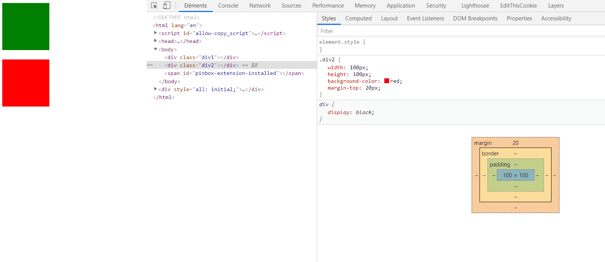
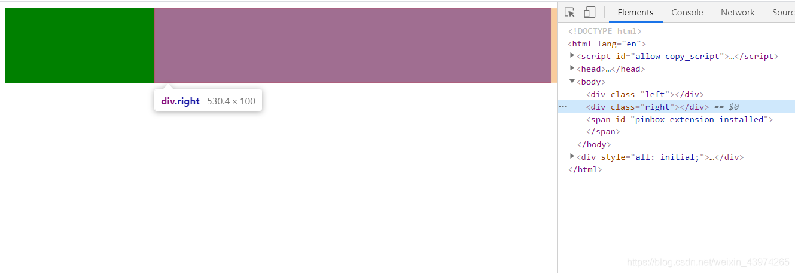
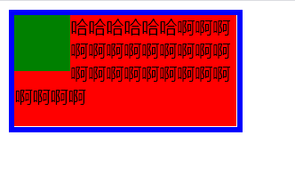
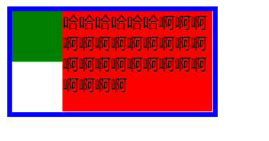
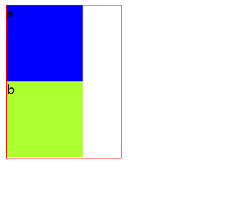

# CSS中的BFC是什么？怎么用？
[https://blog.csdn.net/weixin_43974265/article/details/115416184](https://blog.csdn.net/weixin_43974265/article/details/115416184)
[https://juejin.cn/post/7199913007216115749](https://juejin.cn/post/7199913007216115749)

## 一、什么是BFC

官方定义：**BFC（Block Formatting Context）块格式化上下文**， 是Web页面的可视CSS渲染的一部分，是块盒子的布局过程发生的区域，也是浮动元素与其他元素交互的区域。

说人话：**BFC就是页面上的一个隔离的独立容器，容器里面的子元素不会影响到外面的元素**。 我们经常使用到BFC，只不过不知道它是BFC而已。

## 二、如何创建一个BFC

常用的方式有以下几种：

1. 浮动元素（元素的float 不是`none`，指定float为left或者right就可以创建BFC）
2. 绝对定位元素（元素的`position`为`absolute`或者`fixed`）
3. display:inline-block, display:table-cell, display:flex, display: inline-flex
4. overflow指定除了visible的值

## 三、BFC有什么特点

1. 在BFC中，块级元素从顶端开始垂直地一个接一个排列（当然了，即便不在BFC里块级元素也会垂直排列）
2. 如果两个块级元素属于同一个BFC，它们的margin会重叠（或者说折叠），以较大的为准。但是如果两个块级元素分别在不同的BFC，它们的上下边距就不会重叠，而是两者之和
3. **BFC的区域不会与浮动的元素区域重叠**，也就是说不会与浮动盒子产生交集，而是紧贴浮动边缘
4. 计算BFC的高度时，浮动元素也参与计算。BFC可以包含浮动元素。（利用这个特性可以清除浮动）
5. BFC就是页面上的一个隔离的独立容器，容器里面的子元素不会影响到外面元素

## 四、BFC有什么用

### 1、解决外边距折叠问题

外边距折叠（margin collapsing）也只会发生在属于同一BFC的块级元素之间

html：

```html
<div class="div1"></div>
<div class="div2"></div>
```

Css:

```css
.div1 {
  width: 100px;
  height: 100px;
  background-color: green;
  margin-bottom: 10px;
}

.div2 {
  width: 100px;
  height: 100px;
  background-color: red;
  margin-top: 20px;
}
```

对第一个div的margin-bottom设置为10px，第二个div的margin-top设置为20px，我们可以看到两个盒子最终的边距是20px，是两者之中较大的一个。这就是外边距重叠的问题。



为了解决这个问题，我们可以让这两个div分属于不同的BFC，或者只要把其中一个div放到BFC中就可以。原因是：BFC就是页面上的一个隔离的独立容器，容器里面的元素不会对外边产生影响。

Html:

```html
<div class="wrapper">
  <div class="div1"></div>
</div>
<div class="div2"></div>
```

css:

```css
.wrapper {
  /* 开启BFC */
  overflow: hidden;
}

.div1 {
  width: 100px;
  height: 100px;
  background-color: green;
  margin-bottom: 10px;
}

.div2 {
  width: 100px;
  height: 100px;
  background-color: red;
  margin-top: 20px;
}
```

现在的代码可以解决外边距重叠的问题啦！但是注意，在我们这个案例中，虽然指定position属性为absolute和fixed，或者float指定为left、right也可以创建BFC，但是这个元素会从当前文档流中移除，不占据页面空间，并且可以和其它元素重叠。导致下边的div会把上边的div给覆盖掉。

### 2、制作两栏布局

**BFC的区域不会与浮动的元素区域重叠**

我们可以利用这个特性来创建CSS中常用的两栏布局（左边宽度固定，右边宽度自适应）。

html:

```html
<div class="left"></div>
<div class="right"></div>
```

Css:

```css
.left {
  width: 200px;
  height: 100px;
  background-color: green;
  float: left;
}

.right {
  height: 100px;
  background-color: red;
  overflow: hidden; /* 创建BFC 可以省略这句 默认就是BFC？ */
}
```



另一个案例：

html：

```html
<div class="father">
  <div class="left"></div>
  <div class="right">
    哈哈哈哈哈哈哈哈哈哈哈哈哈哈哈哈哈哈哈哈哈哈
  </div>
  </div>
</div>
```

css：

```css
.father {
  width: 200px;
  border: 5px solid blue;
}

.left {
  width: 50px;
  height: 50px;
  background-color: green;
  float: left;
}

.right {
  height: 100px;
  background-color: red;
}
```

当在父元素中只设定一个盒子浮动，另一个不浮动时，会造成第二个盒子在第一个盒子的下方，被覆盖掉一部分（但文字不会被覆盖）。效果如图：



给第二个元素设置BFC：

```css
 .right {
   height: 100px;
   background-color: red;
   overflow: hidden;
 }
```

效果如图：



### 3、清除元素内部的浮动

这里清除浮动的意思并不是清除你设置的元素的浮动属性，**而是清除设置了浮动属性之后给别的元素带来的影响**。例如我们给子元素设置浮动，那么父元素的高度就撑不开了。 

BFC有一个特性：计算BFC的高度时，浮动元素也参与计算，利用这个特性可以清除浮动。

Html:

```html
<div class="div1">
  <div class="son1">a</div>
  <div class="son2">b</div>
</div>
```

Css:

```css
.div1 {
  width: 150px;
  border: 1px solid red;
  
  /* 使用BFC来清除浮动 */
  overflow: hidden;
}

.son1, .son2 {
  width: 100px;
  height: 100px;
  background-color: blue;
  float: left;
}

.son2 {
  background-color: greenyellow;
}
```



## 五、参考资料

[块格式化上下文 | MDN](https://developer.mozilla.org/zh-CN/docs/Web/Guide/CSS/Block_formatting_context)

[CSS-BFC - 简书](https://www.jianshu.com/p/828023418450)

[CSS中的BFC详解 - Chen_cong - 博客园](https://www.cnblogs.com/chen-cong/p/7862832.html)