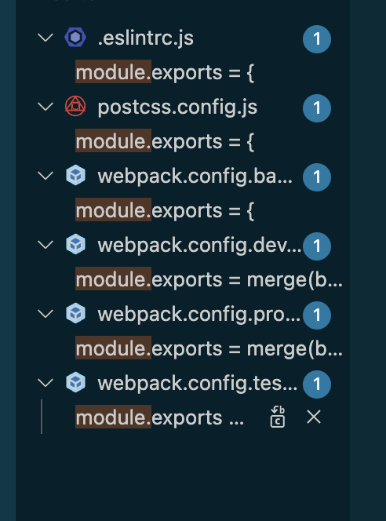
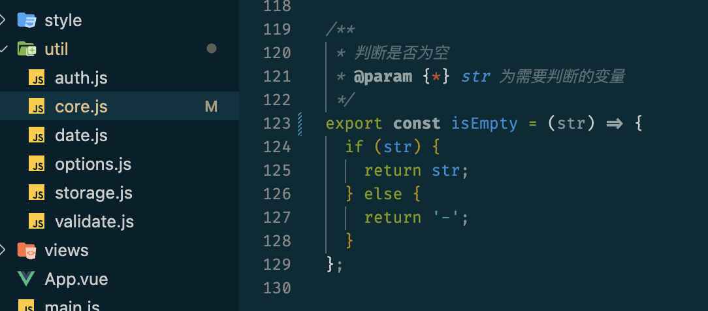
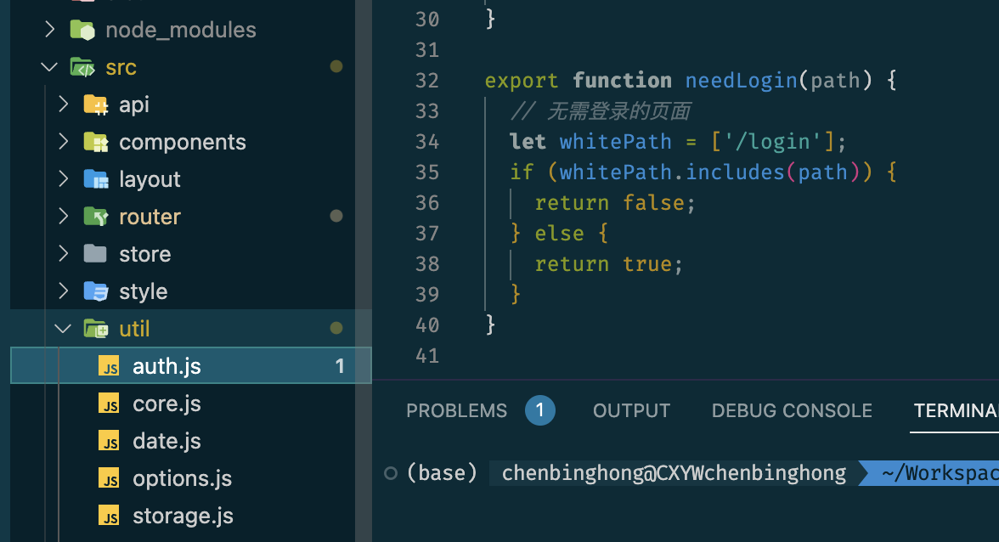
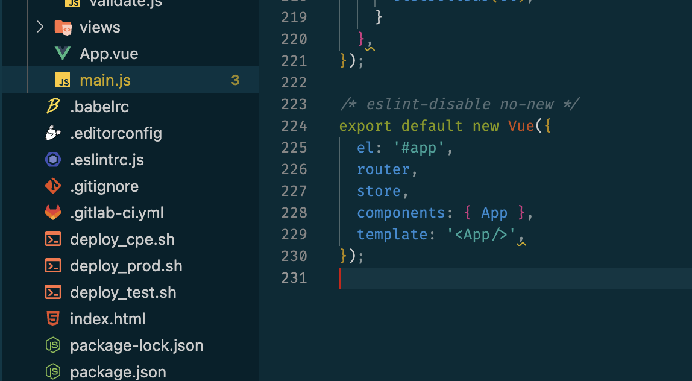
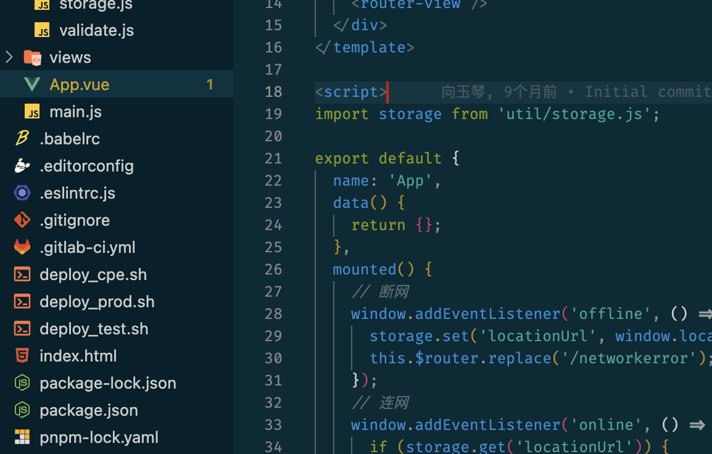
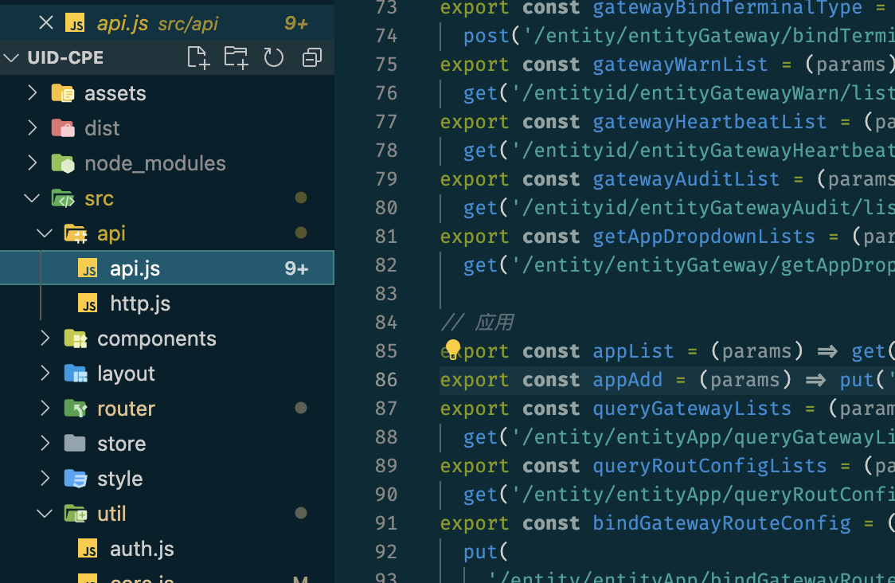
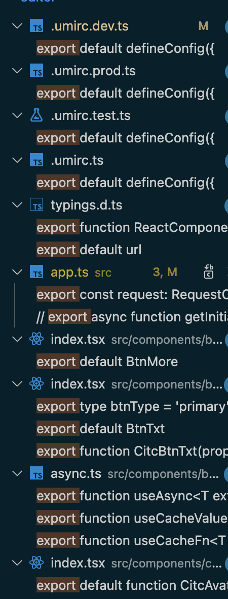
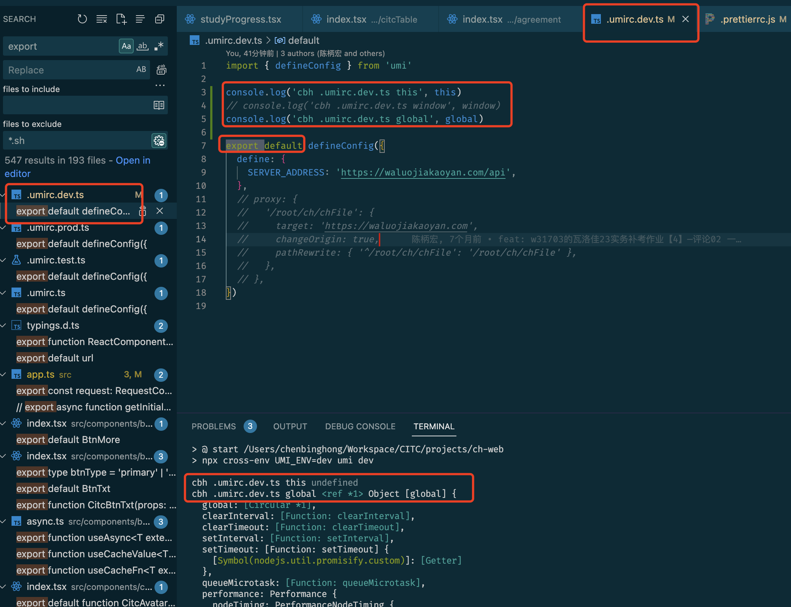

# 项目总结之 JS 模块化

CommonJS AMD UMD RequireJS Node ES5 ES6 ES2020 ES2022 esnext

## uid-cpe 项目

### CommonJS

```js
module.exports = xxx
```

它们会在node中运行，用于打包



### ES6

```js
export xxx
export default xxx
```

它们会编译成在浏览器中运行的js












ch-web项目

```js
module.exports = xxx
```


```js
export xxx
export default xxx
```




## 疑问🤔️

<font color=gold>umi的配置都是用的ES6的，会在node中运行</font>

在 ES6 中 this 是 undefined



可以参考：

[https://segmentfault.com/a/1190000017318527](https://segmentfault.com/a/1190000017318527)

让 `node` 运行 `es6` 模块文件的方式有两种：

1. 转码 `es6` 模块为 `commonjs` 模块
2. `hook` `node` 的 `require` 机制，直接让 `node` 的 `require` 加载 `import/export`