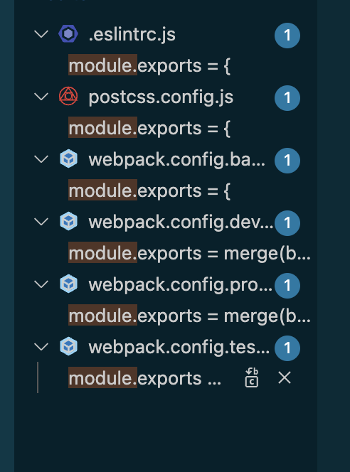
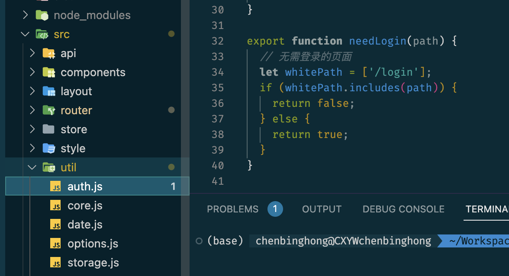
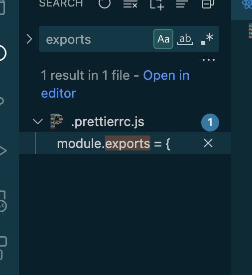
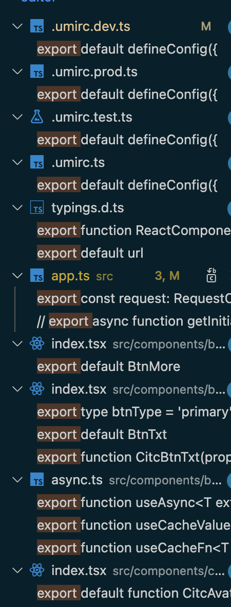

# 项目总结之 JS 模块化

CommonJS AMD UMD RequireJS Node ES5 ES6 ES2020 ES2022 esnext

## uid-cpe 项目

### CommonJS

```js
module.exports = xxx
```

它们会在node中运行，用于打包



### ES6

```js
export xxx
export default xxx
```

它们会编译成在浏览器中运行的js





ch-web项目

```js
module.exports = xxx
```



```js
export xxx
export default xxx
```




## 疑问🤔️

<font color=gold>umi的配置都是用的ES6的，会在node中运行</font>

