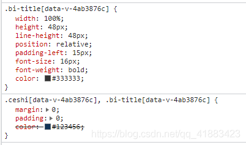

# 关于解决大段样式复用的两种思路（less的继承和混入）
[https://blog.csdn.net/qq_41883423/article/details/118335674](https://blog.csdn.net/qq_41883423/article/details/118335674)

## 1. 继承

```less
.ceshi {
    margin: 0;
    padding: 0;
    color: #123456;
}

.bi-title:extend(.ceshi) {
    width: 100%;
    height: 48px;
    line-height: 48px;
    position: relative;
    padding-left: 15px;
    font-size: 16px;
    // font-family: PingFang SC;
    font-weight: bold;
    color: @main_font_color;
}
```

编译结果



## 2. 抽取混入

```less
.ceshi(@color) {
    margin: 0;
    padding: 0;
    color: @color;
}

.bi-title {
    .ceshi(@main_font_color);

    width: 100%;
    height: 48px;
    line-height: 48px;
    position: relative;
    padding-left: 15px;
    font-size: 16px;
    // font-family: PingFang SC;
    font-weight: bold;
}
```


