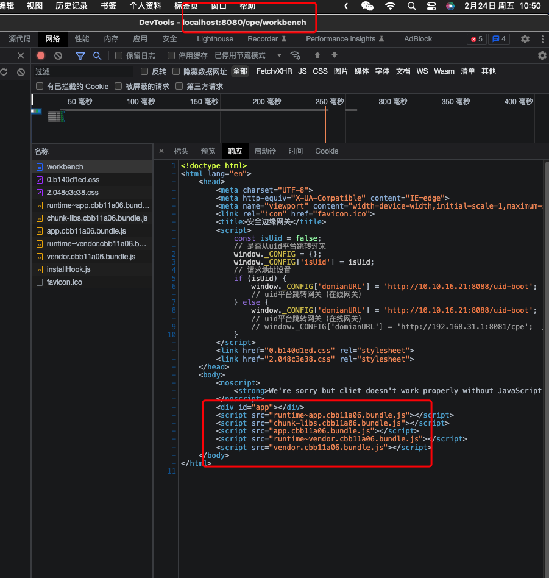
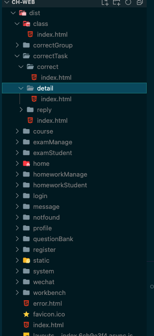
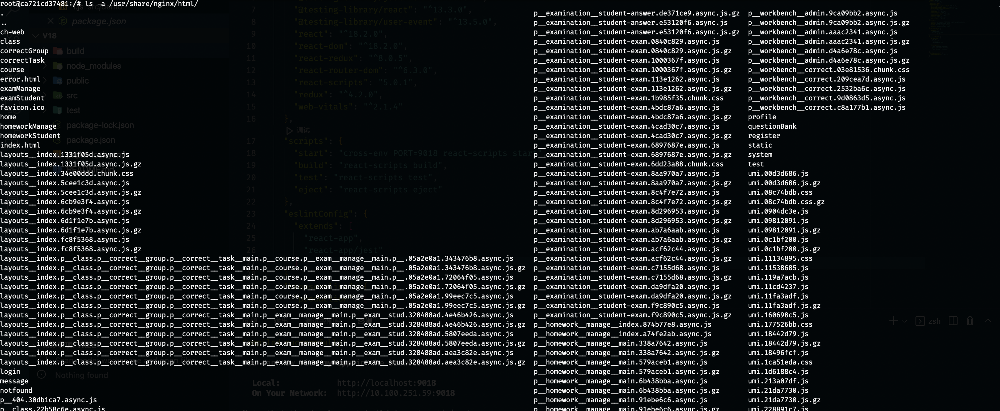

#  nginx路由和react、vue路由冲突

原因：nginx的路由和react的虚拟路由(就是react-router)产生了冲突，本来是想用react-router进行路由跳转，但nginx以为是nginx自己的路由，然而nginx目录下面不存在这个路由，所以报了404的错误。

nginx配置中添加

```nginx
location / {
	try_files $uri $uri/ /index.html;
}
```

[https://juejin.cn/post/6844903942942359560](https://juejin.cn/post/6844903942942359560)

[https://blog.csdn.net/qq_34817440/article/details/121501802](https://blog.csdn.net/qq_34817440/article/details/121501802)

[https://router.vuejs.org/zh/guide/essentials/history-mode.html](https://router.vuejs.org/zh/guide/essentials/history-mode.html)

[https://www.jianshu.com/p/51ba2bec00c7](https://www.jianshu.com/p/51ba2bec00c7)


遇到二级目录：

/cpe/workbench

会访问到index.html 但是由于打包引用的js、css的路径是用的index.html下的，nginx代理找不到




需要在head中使用base

```html
<base href="/">
```

把

```html
<script src="a.js"></srcipt>
```

定位到domain/下

```html
<base href="/uid-cpe/">
```

会定位到 domain/uid-cpe/下


批改项目是为每个子路由都生成了index.html，太浪费了






存在大量历史文件，以后发布时，需要注意清除原有文件
