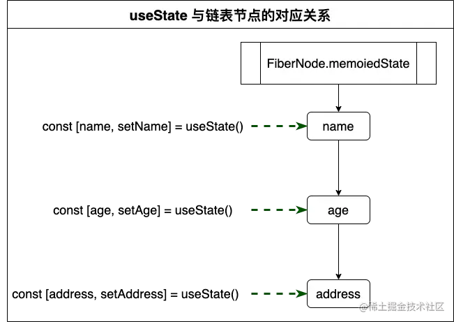
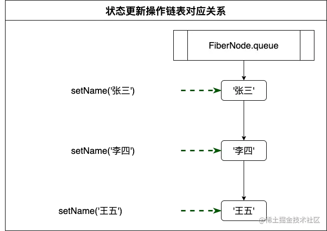

# React Hooks 原理剖析

https://juejin.cn/post/6844904205371588615

## React Hooks 如何保存状态

于类组件保存状态的位置是一致的

- 两者的状态值都被挂载在组件实例对象 `FiberNode` 的 `memoizedState`属性中。
  - 两者保存状态值的数据结构完全不同；类组件是直接把state属性中挂载的这个自定义对象保存到`memoizedState`属性中；而React Hooks 是用链表来保存状态的，`memoizedState`属性保存的实际上是这个链表的头指针。

链表节点——Hook对象：

```typescript
// react-reconciler/src/ReactFiberHooks.js
export type Hook = {
  memoizedState: any, // 最新的状态值
  baseState: any, // 初始状态值，如`useState(0)`，则初始值为0
  baseUpdate: Update<any, any> | null,
  queue: UpdateQueue<any, any> | null, // 临时保存对状态值的操作，更准确来说是一个链表数据结构中的一个指针
  next: Hook | null, // 指向下一个链表节点
};
```



官方文档一直强调 React Hooks的调用只能放在函数组件/自定义Hooks函数体的顶层（不能放在if、for、while、内部函数等分支下），这是应为我们只能通过Hooks调用的顺序来与实际保存的数据结构来关联。（不止useState，所有Hooks都是用这种链表关联的）

## React Hooks 如何更新状态

状态更新函数 setXXX （下文称 dispatcher）每次调用时，不会立即对状态值修改（状态值更新是异步的），而是创建一条修改操作——在对应的Hook对象的`queue`属性挂载的链表上加一个新节点：



在下次执行函数组件，再次调用useState时（**所以是异步更新的**），React才会根据每个Hook上挂载的操作链表来计算最新的状态值。

### 为何需要将所有更新操作保存起来？只保存最新的一次更新操作不就行了？

答案是：setXX 不光可以直接传递值，可以传函数

```javascript
const [name, setName] = useState('')
setName(name => name + 'a')
setName(name => name + 'b')
setName(name => name + 'c')
// 下次执行时，需要将所有操作顺序执行，才能得到正确的 abc
```

## useEffect

与 useState 类似，也是以链表形式挂载在`FiberNode.updateQueue`中。

### mount阶段：mountEffect

1. 根据函数组件中依次调用的useEffect语句，构建成一个链表并挂载在`FiberNode.updateQueue`中，链表节点的数据结构：

   ```typescript
   const effect: Effect = {
     tag, // 用来标识依赖项有没有变动
     create,	// 用户使用useEffect传入的函数体
     destroy,	// 上述函数体执行后生成的用来清除副作用的函数
     deps,	// 依赖项列表
     next: (null: any),
   };
   ```

   

2. 组件完成渲染后，遍历链表执行

### update阶段：updateEffect

1. 通用在依次调用useEffect语句时，判断此时传入的依赖列表，与链表节点`Effect.deps`中保存的是否一致（基本数据类型的值是否相同；对象引用是否相同），如果一致，则在`Effect.tag`标记上`NoHookEffect`。

### 执行阶段

每次组件渲染完成后，进入执行阶段：`function commitHookEffectList()`：

1. 遍历链表
2. 如果遇到`Effect.tag`被标记上`NoHookEffect`的节点则跳过
3. 如果`Effect.destroy`为函数类型，则需要执行该清除副作用的函数（至于这`Effect.destroy`是从哪来的，👇）
4. 执行`Effect.create`，并将执行结果保存到`Effect.destroy`（如果开发者没有配置`return`，那就得到`undefined`，也就是说，开发者认为对挡墙useEffect代码段，不存在需要清除的副作用）；注意由于闭包的缘故，`Effect.destroy`实际上可以访问到本次`Effect.create`函数作用域内的变量

**重点注意**：**先清除上一轮的副作用，再执行本轮的effect**。

## 其他React Hooks Api

也是差不多的原理，用链表结构来做全局的状态保持；判断依赖项来决定是否更新。