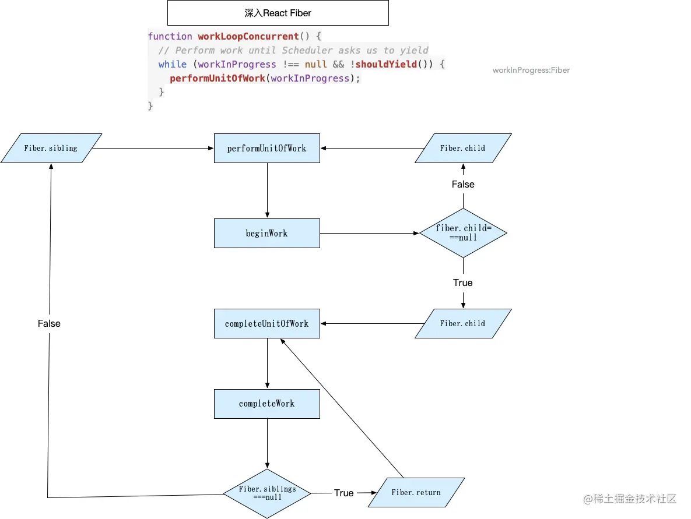

# React 进阶之 React Fiber

[https://juejin.cn/post/6959463412313096222](https://juejin.cn/post/6959463412313096222)

问题：

- 为何重构React
- Fiber 是什么
- Fiber 核心算法-react是如何中断、重启任务的

基于 React V17.0.2

## Why

### 浏览器渲染过程

浏览器多进程、多线程

多进程：

- 主进程
- 渲染进程 （前端主要关注）
  - 多线程
    - GUI线程
      - 解析HTML
      - 解析CSS
      - 布局绘制
    - JS线程
      - JS执行
- 插件进程
- GPU进程
- ...

GUI线程与JS线程是互斥的（因为JS可能会更改HTML或者CSS样式，如果同时执行会导致页面渲染混乱），所以JS线程执行时，GUI渲染线程被挂起，等JS引擎执行完成立即执行。

### GPU渲染

动画：FPS 60（每秒60帧），所以Chrome要在16ms的时间内执行完下图的渲染任务，才能让用户感觉不到掉帧


所以，js时间一般超过10ms后，就会感觉卡顿（下文中js执行时间都以16ms为分界点，不计算后续的渲染，实际的可执行时间肯定小于16ms）而React执行是要进行两棵树的diff，虽然做了优化，但是如果两颗树对比的层级较深，依旧会远超16ms。

## React Fiber

如何解决？优化js执行速度！！！最耗时的地方：diff算法，react已经对diff做了很好的优化，业界已经没有更好的算法可以缩短diff时间。

还有什么办法？注意上图的requestIdleCallback 这个接口，现代浏览器为了让开发者知道浏览器执行完当前帧所有操作后，还有多长时间可以使用，提供了该方法，可以知道还有多长时间可以执行。

### requestIdleCallback

```js
requestIdleCallback((deadline) => {
  while ((deadline.timeRemaining() > 0 || deadline.didTimeout) && nextComponent) {
    nextComponent = performWork(nextComponent);
  }
});
```

由于requestIdleCallback的一些不足（一些限制性原因），React源码中没有用requestIdleCallback，而是自己实现了一套类似的机制。

使用该方法我们就能知道每帧的剩余时间够不够，不够就将剩余工作放到下一帧中，这就是时间切片（Timing slicing）

需要把基于js<font color='red'>内置栈</font>(Stack)调用的同步递归遍历diff算法改为异步增量更新

> 如果仅仅依靠js的内置递归调用栈，它会一直执行到栈空，react fiber 可以任意中断并且手动操作栈。**Fiber是针对React Component的栈的重新实现**

## stack Reconciliation vs Fiber Reconciliation

### stack Reconciliation

假如我们有如下一个html结构


转换成类React组件到js对象如下

```js
const a1 = {name: 'a1'};
const b1 = {name: 'b1'};
const b2 = {name: 'b2'};
const b3 = {name: 'b3'};
const c1 = {name: 'c1'};
const c2 = {name: 'c2'};
const d1 = {name: 'd1'};
const d2 = {name: 'd2'};

a1.render = () => [b1, b2, b3];
b1.render = () => [];
b2.render = () => [c1];
b3.render = () => [c2];
c1.render = () => [d1, d2];
c2.render = () => [];
d1.render = () => [];
d2.render = () => [];
```

正常情况，我们会使用像下面这种方式递归来遍历这棵"树",在React最早的版本就是基于此来递归遍历dom树

```js
function walk(instance) {
  console.log(instance.name);
  let children = instance.render();
  children.forEach((child) => {
    walk(child);
  });
}
walk(a1);
```

可以看到，这种方式，是可以遍历完整棵树，可是它没办法做到我们之前所说的中断递归，如果你中途中断了递归这棵树，下次你要重新从根节点整个遍历。这显然是不行的，它只能不断递归遍历，直到stack调用栈为空。那React Fiber是如何中断重启任务呢？

<font color='red'>答案是单链表树遍历算法。简单来说就是把原来树本身的嵌套结构，改为单链表形式的树。</font>

### Fiber Reconciliation

React具体是如何使用链表遍历树呢？为了实现这种算法，定义这种数据结构：

- child，指向该节点第一个子节点
- sibling，下一个兄弟节点
- return 指向该节点的父节点


遍历算法（<font color=red>父节点优先</font>，<font color=green>深度优先</font>）

node:

a1--child-->b1--sibling-->b2--child-->c1--child-->d1--sibling-->d2--return-->(c1--return-->b2)--sibling-->b3---child-->c2(--return-->b3(b3.return  === root return))

```js
let root = fiber;
let node = fiber;
while(true) {
  if (node.child) {
    node = node.child;	// 深度优先
    continue;
  }
  if (node === root) {
    return;
  }
  // 好好想一下 为什么要在这里 一直向上找
  // 为什么 父节点优先 兄弟节点
  // 后面没有兄弟时，向上找父节点
  while(!node.sibling) {
    // 如果没有父节点 或者 父节点是跟节点 退出
    if (!node.return || node.return === root) {
      return;
    }
    // 向上找父节点
    // 如果父节点后面有兄弟节点，找父节点的兄弟节点
    // 如果父节点后面无兄弟节点，继续向上找父节点
    node = node.return;	// 父节点优先
  }
  // 兄弟节点 在 父节点 之后
  node = node.sibling;
  // 下一轮 遍历 从 兄弟节点的 子节点 开始
}
```

从跟节点开始，不断遍历子节点，知道最深节点。然后从最深的子节点开始便利兄弟节点，如果没有兄弟节点就返回父节点，如果有兄弟节点，把每个兄弟的子节点遍历完，直到最后一个子节点，然后返回父节点。这样不断遍历，直到返回跟节点。

Fiber数据对象，相较于element对象，多了一层数据结构来支撑上述的单链表遍历算法。

## Fiber 数据结构

```typescript
function FiberNode(
	tag: WorkTag,
   pendingProps: mixed,
   key: null | string,
   mode: TypeOfMode
) {
    // Instance
    this.tag = tag;	// Fiber标记是什么类型的Fiber/component，WorkTag 0-24
    this.key = key;	// 唯一标识
    this.elementType = null;
    this.type = null;
    this.stateNode = null;	// stateNode: class div
    
    // Fiber 数据结构
    this.return = null; // 父节点
    this.child = null; // 第一个子节点
    this.sibling = null; // 兄弟节点
    this.index = 0;
    
    this.ref = null;
    
    this.pednignProps = pendingProps;	// new props
    this.memoizedProps = null;	// old props
    // updateQueue 数据结构
   	/* {
      baseState: fiber.memoizedState,
      firstBaseUpdate: null,
      lastBaseUpdate: null,
      shared: {
        pending: null,
        interleaved: null,
        lanes: NoLanes,
      },
      effects: null,
    }; */
    this.updateQueue = null;	// 批处理队列
    
    this.memoizedState = null;	//old state
    this.dependencies = null;
    
    this.mode = mode;
    
    // Effects
    this.flags = NoFlags;	// 标记该 Fiber 变更方式
    this.subtreeFlags = NoFlags;
    this.deletions = null;
    // 优先级调度
    this.lanes = NoLanes;	// lane 跑道
    this.childLanes = NoLanes;
    
    this.alternate = null; // work-in-progress current 互为 alternate 候补
  }
```

## Fiber 带来的效果提升

1. 可以通过看下[重构前后的对比Demo](https://claudiopro.github.io/react-fiber-vs-stack-demo/)，体会一下带来的体验提升
2. 为后续React Concurrent模式做了基础

## Fiber 流转过程



### 图示说明：

react在performUnitOfWork和completeUnitOfWork两个方法中，处理上述Fiber遍历算法的逻辑，在beginwork和completeWork中完成处理组件的逻辑。 在beginwork中会处理state的更新，此阶段相应生命周期的调用，reconcile的过程（给Fiber节点打上新增，删除，移动等标记（[在这里可以看到所有的flags](https://link.juejin.cn?target=https%3A%2F%2Fgithub.com%2Ffacebook%2Freact%2Fblob%2Fv17.0.2%2Fpackages%2Freact-reconciler%2Fsrc%2FReactFiberFlags.js)））的过程。在completeWork阶段，会把所有flags的标记，冒泡到父节点。以便于在commit阶段更新。

## React 源码

