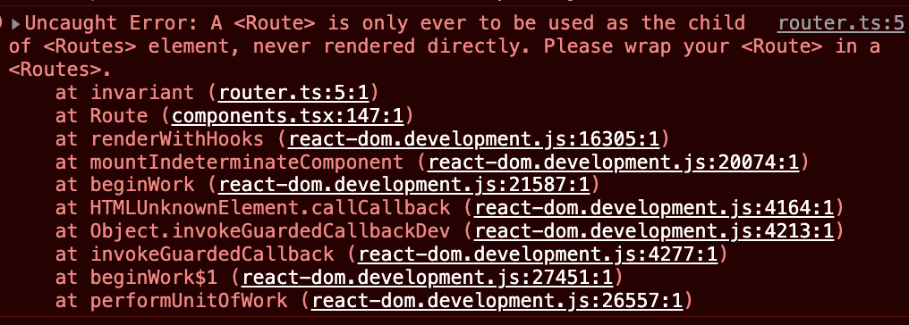

# React-Router-Dom 自学

## BrowserRouter

告诉React 里面可以放路由组件，如果没有的话，会报错

TODO 截图

## HashRouter


## Routes

路由列表（包裹多个Route，之前是Switch）

## Route 

单个路由，不可以不包在Routes中（v6之前是 Switch）



到此，用户可以在浏览器中输入路由，会自动调用组件渲染

## Link

会生成 a 标签 用户可以点击，没有的话，用户不好操作，只能在浏览器中输入

## NavLink

`<NavLink>` 是特殊类型的`<Link>`， 可以记录 "active" 状态。 可用于面包屑或者菜单的选中点亮。对于用户和读者来说也提供了上下文的导航说明。

默认的, `<NavLink>`激活时，会加上类名`active`，v5中也是这么做的. 不同的是，新版本`v6.0.0-beta.3` 中属性移除了 `activeClassName` 和 `activeStyle`，取而代之的是 `style` 或者 `className` 属性，用于自定义行内样式或者自定义类名，当然也可以穿一个函数作为属性给 `<NavLink>` 组件来自定义行为。


作者：小肚肚肚肚肚哦
链接：https://juejin.cn/post/7113416829875748895
来源：稀土掘金
著作权归作者所有。商业转载请联系作者获得授权，非商业转载请注明出处。

## 嵌套路由

一般都有<Outlet />，不然子组件显示不出来

### 默认路由

```jsx
function App() {
  return (
    <Routes>
      <Route path="/" element={<Layout />}>
        <Route index element={<Activity />} />
        <Route path="invoices" element={<Invoices />} />
        <Route path="activity" element={<Activity />} />
      </Route>
    </Routes>
  );
}
```


## 参数路由


## 为什么componet 变 element？

V5 component 不能传props，要传 需要用 render 这个 prop 现在统一成一个 element prop

## 路由钩子 before after 鉴权

## 懒加载

## Hooks

[https://codesandbox.io/s/reverent-wind-1fhuyu?file=/src/withRouter.js](https://codesandbox.io/s/reverent-wind-1fhuyu?file=/src/withRouter.js)

### useHref

返回一个完整的路由URL，指向参数to定位的地址，这个地址可以脱离React Router环境？？？

```tsx
declare function useHref(to: To): string;

// 深层路由中
useHref({ to: 'dashboard'})	/home/test/dashboard
```

### useInRouterContext

当组件使用了`<Router>`渲染时，该钩子返回true，否则返回false。对于一些需要知道组件是否在React Router上下文的第三方扩展非常有用

```tsx
declare function useInRouterContext(): boolean;
```

### useLinkClickHandler

返回一个能够实现`<Link>`标签功能的替代性函数，用于在自定义跳转时使用，参数同Link标签：

```tsx
declare function useLinkClickHandler<E extends Element = HTMLAnchorElement>(
	to: To,
  options?: {
    target?: React.HTMLAttributeAnchorTarget;
    replace?: boolean;
    sate?: any;
  }
): (event: React.MouseEvent<E, MouseEvent>) => void;

// 示例
import {useHref, useLinkClickHandler} from 'react-router-dom'

const StyledLink = styled('a', { color: 'fuchsia' })
const Link = Rect.forwardRef(({
  onClick,
  replace = false,
  state,
  target,
  to,
  ...rest
}, ref)=>{
  let href = useHref(to)
  // 调用handleClick 相当于点击了一次<Link>标签
  let handleClick = useLinkClickHandler(to, {
    replace,
    state,
    target,
  })
  
  return (
  	<StyledLink
      {...rest}
      href={href}
      onClick={event => {
        onClick?.(event)
        if (!event.defaultPrevented) {
          handleClick(event)
        }
      }}
      ref={ref}
      target={target}
      />
  )
})
```

### useLinkPressHandler

功能同useLinkClickHandler，只不过是在移动端使用的（常用于react-native)

```tsx
declare function useLinkPressHandler(
	to: To,
  options?: {
    replace?: boolean;
    state?: any;
  }
): (event: GestureResponderEvent) => void;

// 示例
import { TouchableHighlight } from 'react-native'
import { useLinkPressHandler } from 'react-router-native'

function Link({
  onPress,
  replace = false,
  state,
  to,
  ...rest
}) {
  let handlePress = useLinkPressHandler(to, {
    replace,
    state,
  })
  
  return (
  	<TouchableHighlight
      {...rest}
      onPress={event => {
        onPress?.(event)
        if (!event.defaultPrevented) {
          handlePress(event)
        }
      }}
      />
  )
}
```

### useLocation

比较常用，返回当前路由状态下的location信息，可用于路由传参

```tsx
declare function useLocation(): Location;
interface Location extends Path {
  state: unknown;
  key: Key;
}
// 示例
import { useLocation } from 'react-router-dom'

function App() {
  let location = useLocation() // hash, key, pathname, search, state
}
```

### useMatch

接受一个相对路由字符串，返回匹配到的路由表数据

```tsx
declare function useMatch<ParamKey extends string = string>(
	pattern: PathPattern | string
): PathMatch<ParamKey> | null;
// 示例
useMath('/')
// 返回值
{
 	paths:{},
  pathnaem: '/',
  pattern: {
    caseSensitive: false,
    end: true,
    path: '/'
  }
}
```

### useNavigate

返回一个可以用于路由导航的函数。有一个参数 replace，如果传入true，路由会在history stack中替换掉current，而不是push一个状态。

```tsx
declare function useNavigate(): NavigateFunction;
interface NavigateFunction {
  (
  	to: To,
    options?: { replace?: boolean; state?: any }
  ): void;
  (delta: number): void;
}
// 示例
import { useNavigate } from 'react-router-dom'
// 表单提交后跳转页面
function SignupForm() {
  let navigate = useNavigate()
  
  async function handleSubmit(event) {
    event.preventDefault()
    await submitForm(event.target)
    navigate('../success', { replace: true })
  }
  
  return <form onSubmit={handleSubmit}>{/* ... */}</form>
}

// 当然也可以不传路由的path，直接传数字
naviate(-1)
// 表示浏览器回退或者前进
```

### useNavigationType

返回路由跳转的状态，表示当前页面是怎么样被用户跳转过来的，可选参数：pop,push,replace

```tsx
declare function useNavigationType(): NavigationType;
type NavigationType = "POP" | "PUSH" | "REPLACE";
```

### useOutlet

返回嵌套路由中，被`<Outlet>`占位的子元素的路由对象(ReactElement)。通常在子路由内部使用

```tsx
declare function useOutlet(): React.ReactElement | null;
// 示例
function Dashboard() {
  console.log(useOutlet())
  return (
  	<div>
    	<h1>Dashboard</h1>
      <Outlet />
    </div>
  )
}

function DashboardMessages() {
  return 'DashboardMessages'
}

function DashboardTasks() {
  return 'DashboardTasks'
}

function App() {
  return (
  	<Routes>
    	<Route path="/" element={<Dashboard />}>
      	{/* 子路由 */}
       	<Route path="messages" element={<DashboardMessages />} />
        <Route path="tasks" element={<DashboardTasks />} />
      </Route>
    </Routes>
  )
}
```

### useOutletContext

用于父子路由共享状态

```tsx
declare function useOutletContext<Context= = unknow>(): Context;
// 示例
// 父
function Parent() {
  const [count, setCount] = useState(0)
  return <Outlet context={[count, setCount]} />
}
// 子
import { useOutletContext } from 'react-router-dom'
function Child() {
  const [count, setCount] = useState(0)
  const increment = () => setCount(c => c + 1)
  return <button onClick={increment}>{count}</button>
}

// 如果是在ts环境下，使用方式有所不同。推荐自定义一个context，这样方便类型定义：
// 父
import * as React from 'react'
import type { User } from './types'
import { Outlet, useOutletContext } from 'react-router-dom'

type ContextType = { user: User | null }

export default function Dashboard() {
  const [user, setUser] = React.useState<User | null>(null)
  
  return (
  	<div>
    	<h1>Dashboard</h1>
      <Outlet context={{ user }} />
    </div>
  )
}

// 自定义 hook
export function useUser() {
  return useOutletContext<ContextType>()
}

// 子
import { useUser } from '../dashboard'

export default function DashboardMessages() {
  const { user } = useUser()
  return (
  	<div>
    	<h2>Messages</h2>
      <p>Hello, {user.name}!</p>
    </div>
  )
}
```

### useParams

返回路由传参的键值对参数（不是问号传参，问号的在location的search里）。子路由也会继承父路由的所有参数。

```tsx
declare function useParams<K extends string = string>(): Readonly<Params<K>>;
// 示例
import * as React from 'react'
import { Routes, Route, useParams } from 'react-router-dom'

function ProfilePage() {
  // Get the userId param from the URL
  let { userId } = useParams()
  // ...
}

function App() {
  return (
  	<Routes>
    	<Route path="users">
      	<Route path=":userId" element={<ProfilePage />} />
        <Route path="me" element={...} />
      </Route>
    </Routes>
  )
}
```

### useResolvedPath

返回传入path的全路径，可以解析出path，hash，search（locatoin对象）

```tsx
declare function useResolvedPath(to: To): Path;
```

### useRoutes

是标签`<Routes>`的函数形式。使用时也不需要额外的JSX。它返回的值要么是React元素，要么是null。

```tsx
declare function useRoutes(
	routes: RouteObject[];
  location?: Partial<Location> | string;
): React.ReactElement | null;
// 示例
import * as React from 'react'
import { useRoutes } from 'react-router-dom'

function App() {
  let element = useRoutes([
    {
      path: '/',
      element: <Dashboard />,
      children: [
        {
          path: 'messages',
          element: <DashboardMessages />,
        },
        {
          path: 'tasks',
          element: <DashboardTasks />,
        },
      ]
    },
    {
      path: 'team',
      element: <AboutPage />,
    },
  ])
  
  return element
}
```

### useSearchParams

解析当前路径，返回location中search；并可以重新设置search并触发跳转

```tsx
declare function useSearchParams(
	defaultInit?: URLSearchParamsInit
): [URLSearchParams, SetURLSearchParams];

type ParamKeyValuePair = [string, string];

type URLSearchParamsInit = 
	| string
	| ParamKeyValuePair[]
	| Record<string, string | string[]>
	| URLSearchParams;

type SetURLSearchParams = (
	nextInit?: URLSearchParamsInit,
	navigateOpts?: { replace?: boolean; state?: any }
) => void;

// 示例
import * as React from 'react'
import { useSearchParams } from 'react-router-dom'

function App() {
  let [searchParams, setSearchParams] = useSearchParams()
  
  function handleSubmit(event) {
    event.preventDefault()
    let params = serializeFormQuery(event.target)
    setSearchParams(params)	// 类似navigate，但是仅仅传递search参数。
  }
  
  return (
  	<div>
    	<form onSubmit={handleSubmit}>{/* ... */}</form>
    </div>
  )
}
```

## ch-web中是怎么实现的（umijs、antd）

## 路由原理 那片 markdown 文章学习完善

## 路由相关  react-route react-route-dom 面试题