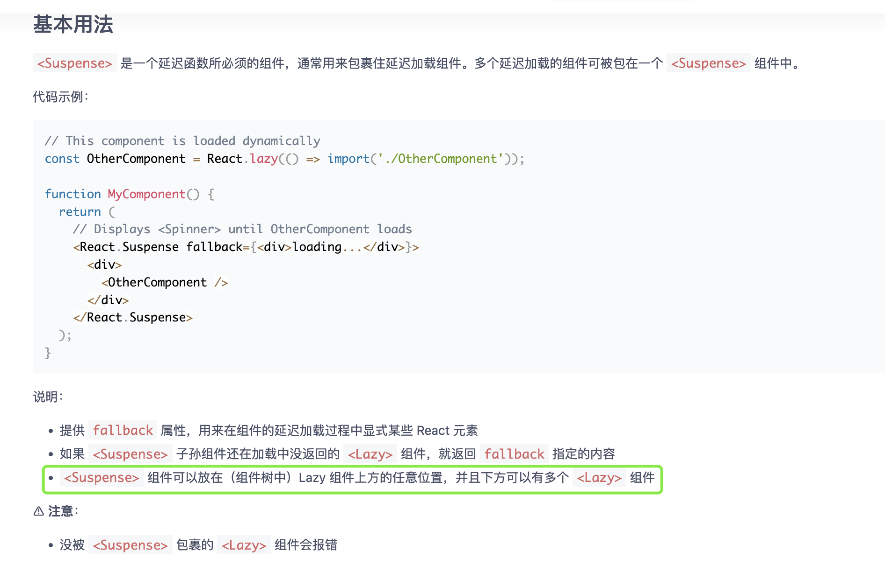
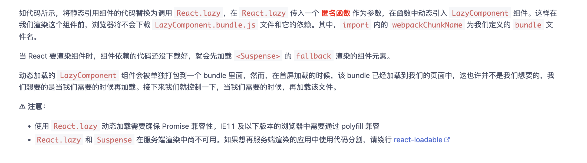

# React.lazy & React.Suspense

`React.lazy()` 允许你定义一个动态加载的组件。这有助于缩减 bundle 的体积，并延迟加载在初次渲染时未用到的组件。该方法把条件渲染细节挪到了框架层，允许把动态引入的组件当普通组件用，优雅地消除了这种侵入性。

请注意，渲染 `lazy` 组件依赖该组件渲染树上层的 [`<React.Suspense>`](https://tsejx.github.io/react-guidebook/api-reference/react/suspense) 组件。这是指定加载指示器（loading indicator）的方式。

使用的是Promise实现的

