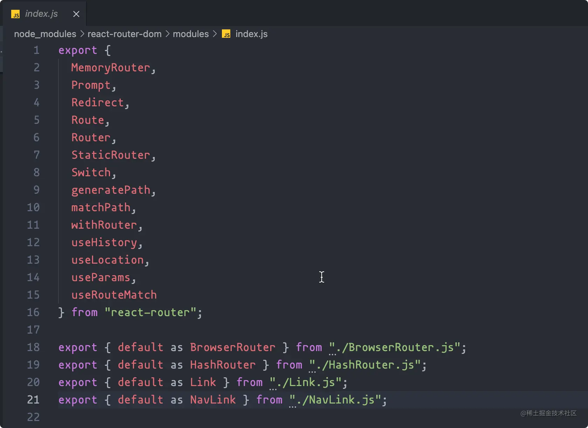
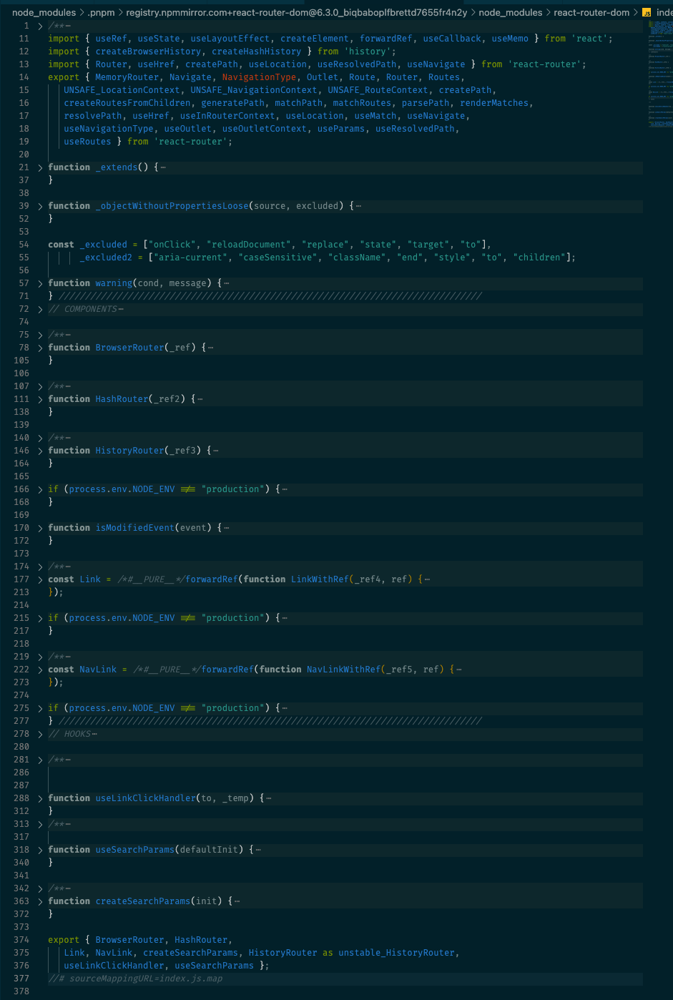
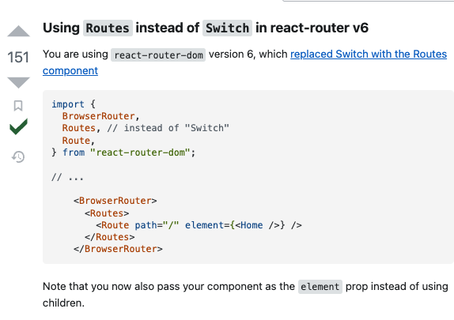

# react-router-dom和react-router的区别

https://juejin.cn/post/7023587613852303373

1. react-router-dom是在react-router的基础上开发的，react-router-dom中很多组件都是从react-dom中直接导出的。所以安装了react-router-dom后就不用安装react-router；
2. 在react-router的基础上，额外提供了BrowserRouter,HashRouter,Link,NavLink组件，可以用于路由跳转。其中BrowserRouter,HashRouter用于替代react-router中的Router组件；Link,NavLink的作用类似于a标签；
3. BrowserRouter和HashRouter
   1. BrowserRouter时history模式路由，路由长这样：http://abc.com/xxx，是通过浏览器的history.pushState和history.popState实现，可以会有一定兼容性问题，低版本的浏览器不支持，比如IE
   2. HashRouter时hash模式路由，路由长这样： http://abc.com#/xxx，浏览器通过监听hashchange来改变路由，兼容性好

在react-router-dom的modules源码中可以看到这些区别

👆这个图片已经过时了

## Switch已经没有了

https://www.jianshu.com/p/46219ae64bd6

React-router提供了核心api。如Router、Route、Switch等，但没有提供有关dom操作进行路由跳转的api

react-router-dom在react-router的基础上扩展了可操作dom的api

react-router-dom提供了BrowserRouter、HashRoute、Link等api，可以通过dom操作触发事件控制路由

Link组件 会渲染成一个a标签

BrowserRouter 使用 history.pushState history.popState

HashRouter 使用 hash hashchange

react-router-dom依赖react-router，安装时只用安装react-router-dom即可