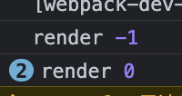
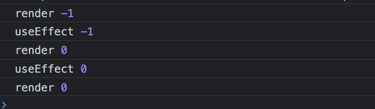

# useEffect会打印多少次？
```jsx
import { useEffect, useState } from "react"

export default function HowManyTimesRender (){
    const [count, setCount] = useState(-1)
    useEffect(()=>{
        setCount(0)
    })
    console.log('render', count)
    return <div>{count}</div>
}
```

会打印多少次？

答案是3次：



```jsx
import { useEffect, useState } from "react"

export default function HowManyTimesRender (){
    const [count, setCount] = useState(-1)
    useEffect(()=>{
        console.log('useEffect', count)
        setCount(0)
    })
    console.log('render', count)
    return <div>{count}</div>
}
```



```jsx
const count = -1
console.log('render', count)		// render -1
!shadowEqual(oldCount = undefined, count = -1)	// 判断是否触发 useEffect
// 渲染后执行 useEffect
console.log('useEffect', count)	// useEffect -1
setCount(0)	// 触发 re-render
console.log('render', count)		// render 0
!shadowEqual(oldCount = -1, count = 0)	// 判断是否触发 useEffect
// 渲染后执行 useEffect
console.log('useEffect', count)	// useEffect 0
setCount(0)	// 触发 re-render
console.log('render', count)		// render 0
!shadowEqual(oldCount = 0, count = 0)	// 判断是否触发 useEffect
```

