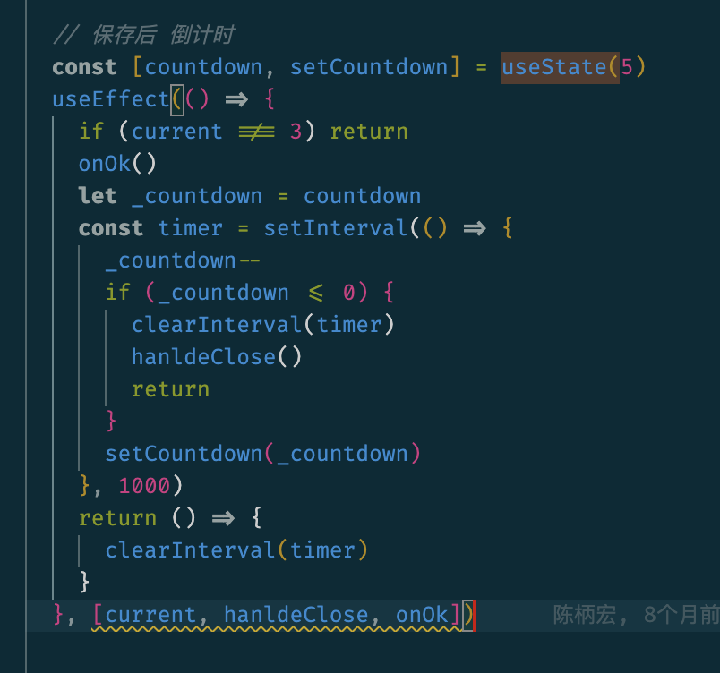
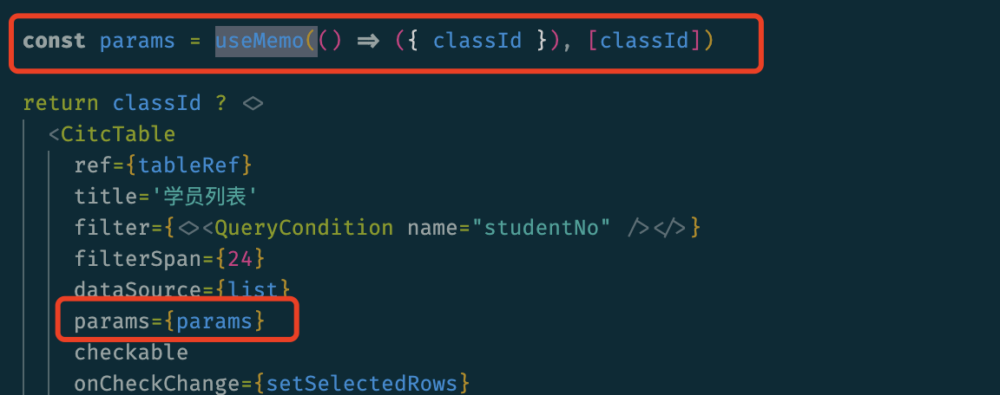

# 项目中hooks总结

## useState

使用271次

## useCallback

使用180次

## useEffect

使用138次



这里没有 传入 countdown 依赖，否则的话，setCountdown 会造成 countdown改变，造成多次setInterval。

这里只会一次 setInterval

更加优雅的写法：

```jsx
useEffect(()=>{
	if (current === 3) return
  onOk()
  if (countdown <= 0) {
    handleClose()
    return
  }
  setTimeout(setCountdown(pre => pre - 1), 1000)
}, [current, handleClose, onOk, countdown])
```

## useRef

使用40次

## useForm

使用36次

## useMemo

使用31次



如果不用useMemo, classId虽然未改变，但是 props传入时候的对象 {classId}与原来的不同，会造成组件的重新渲染（会造成多次请求后端数据）

## useContext

使用4次

## useReactToPrint

使用4次

## useQuery

使用3次

```typescript
import { useEffect, useState } from 'react'

export function useQuery<T extends Record<string, string> = Record<string, string>>() {
  const [query, setQuery] = useState<T>()
  useEffect(() => {
    const params = new URLSearchParams(window.location.search.slice(1))
    const newQuery: T = {} as any
    params.forEach((v, k) => {
      // @ts-ignore
      newQuery[k] = v
    })
    setQuery(newQuery)
  }, [])
  return query
}

```


## useRequest

使用3次

## useAsync

使用2次

## useHover

使用1次

## useAntdTable

使用1次

## useLocation

使用1次