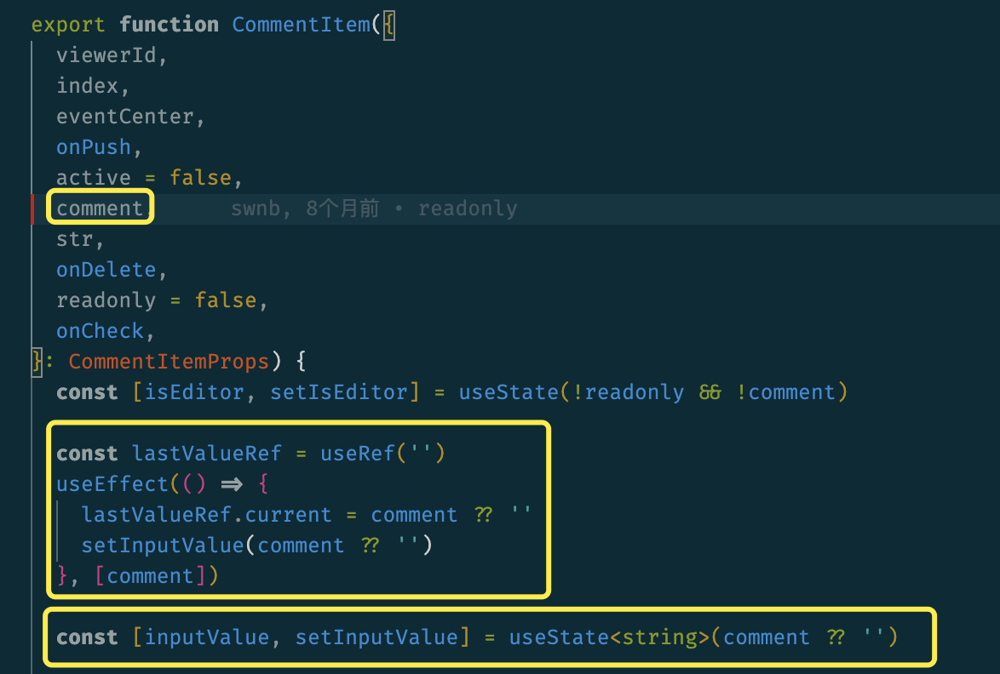
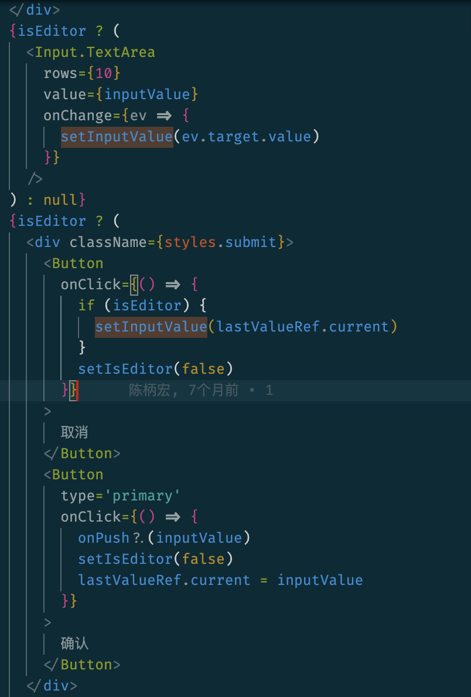

# 项目中代码分析

reply-comment.tsx中 lastValueRef 和 inputValue 的纠结

### 解释

useState产生的state与textare的value直接绑定，onChange会setState

使用useRef来保存上一个值（last Value），方便取消时setState成lastValue，并且给lastValue.current赋值不会触发re-render