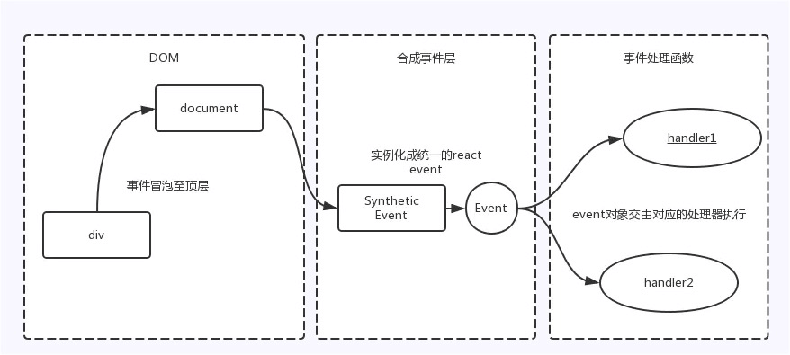
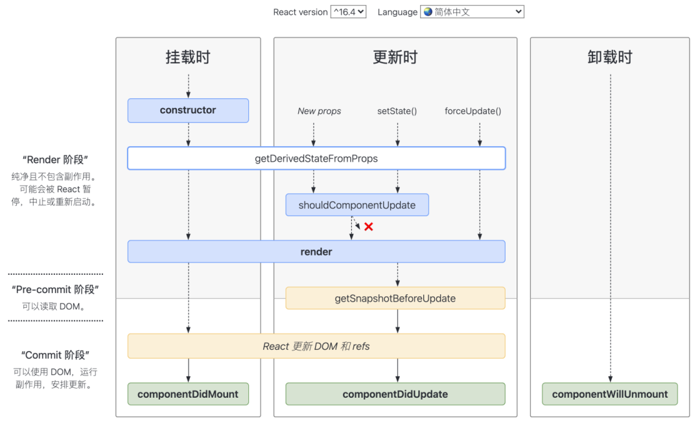

# 高频react面试题20道（附详解）

https://blog.csdn.net/xgangzai/article/details/120375992

## 1. React 事件机制

```jsx
<div onClick={this.handleClick.bind(this)}>Click Me</div>
```

React并不是将click事件绑定到div到真实dom上，而是在document处监听了所有的事件，当事件发生并且冒泡到了document处的时候，React将事件内容封装并交由真正的处理函数运行。这样的方式不仅减少了内存消耗，还能在组件挂载销毁时统一订阅和移除事件。

除此之外，冒泡到docuemnt上的事件也不是原生的浏览器事件，而是由react自己实现的**合成事件（SyntheticEvent）**。因此如果不想事件冒泡的话，应该调用event.preventDefault()方法，而不是event.stopProppagation()。



实现合成事件的目的：

- 合成事件首先抹平了浏览器兼容性问题，另外这是一个跨浏览器原生事件包装器，赋予了跨浏览器的开发能力；
- 对于原生浏览器来说，浏览器会给监听器创建一个事件对象。如果你有很多的事件监听，那么就需要分配很多的事件对象，造成高额的内存分配问题。但对于合成事件来说，有一个事件池专门来管理它们的创建和销毁，当事件需要被使用时，就会从池中复用对象，事件回调结束后，就会销毁事件对象上的属性，从而便于下次复用事件对象。

## 2. React的事件和普通HTML事件有什么不同？

区别：

- 对于事件名称命名方式，原生事件为全小写，react事件采用小驼峰；
- 对于事件函数处理语法，原生事件为字符串，react事件为函数；
- react事件不能采用return false 的方式来阻止浏览器的默认行为，而必须要明确地调用 preventDefault() 来阻止默认行为。

合成事件是react模拟原生DOM事件所有能力的一个事件对象，其优点如下：

- 兼容所有浏览器，更好地跨平台；
- 将事件统一存放在一个<font color="red">数组</font>，避免频繁地新增和删除（垃圾回收）；
- 方便react统一管理和事件机制。

事件的执行顺序为原生事件先执行，合成事件后执行，合成事件会冒泡到绑定的document上，所以尽量避免原生事件与合成事件的混用，如果原生事件阻止冒泡，可能会导致合成事件不执行，因为需要冒泡到document上才会触发合成事件。

## 3. React组件中怎么做事件代理？它的原理是什么？

React基于Virtual DOM实现了一个SyntheticEvent层（合成事件层），定义的事件处理器会接收到一个合成事件对象的实例，它符合W3C标准，且与原生浏览器事件拥有相同的接口，支持冒泡机制，所有的事件都自动绑定在最外层document上。

在React底层，主要对合成事件做了两件事：

- **事件委派**：React会把所有的事件绑定到document上，使用统一的事件监听器，这个事件监听器上维持了一个映射来保存所有组件内部事件监听和处理函数。
- **自动绑定**：React组件中，每个方法的上下文都会指向该组件的实例，即自动绑定this为当前组件。

## 4. React高阶组件、Render props、hooks有什么区别，为什么要不断迭代？

这三者是目前react解决代码复用的主要方式：

- 高阶组件（HOC）是React中用于复用组件逻辑的一种高级技巧。HOC本身不是 React API的一部分，它是一种基于React的组合特性而形成的设计模式。具体而言，高阶组件是参数为组件，返回值为新组件的函数。
- render props 是指一种在React组件之间使用一个值为函数的props共享代码的简单技术，更具体的说，render props是一种用于告知组件需要渲染什么内容的函数prop。
- 通常，render rpops 和 高阶组件只渲染一个子节点。让Hook来服务这个使用场景更加简单，这两种模式仍有用武之地（例如，一个虚拟滚动条组件会有一个renderItem属性，或是一个可见的容器组件或许会有它自己的DOM结构）。但在大部分场景中，Hook足够了，并且能够减少嵌套。

举例代码详见： [React 逻辑复用：Render Props, HOC 和 Hooks.md](React 逻辑复用：Render Props, HOC 和 Hooks.md) 

## 5. 对React-Fiber的理解，它解决了什么问题？

React V15在渲染时，会递归对比VirtualDOM树，找出需要变动的节点，然后同步更新它们，一气呵成。这个过程期间，React会占据浏览器资源，这会导致用户触发的事件得不到响应，并且会导致掉帧，导致用户感觉卡顿。

为了给用户制造一种应用很快的“假象”，不能让一个任务长期霸占着资源。可以将浏览器的渲染、布局、绘制、资源加载（例如HTML解析）、事件响应、脚本执行视作操作系统中的“进程”，需要通过某些调度策略合理地分配CPU资源，从而提高浏览器的用户响应速率，同时兼顾任务执行效率。

所以React通过Fiber架构，让这个执行过程变成可被中断的。“适时”地让出CPU执行权，除了可以让浏览器及时地响应用户的交互，还有 其他好处：

- 分批延时对DOM进行操作，避免一次性操作大量DOM节点，可以得到更好的对用户体验；
- 给浏览器一点喘息的机会，它会对代码进行编译优化（JIT）及进行热代码优化，或者对reflow进行修正。

**核心思想**：Fiber也称协程或者纤程。它和线程并不一样，协程本身是没有并发或者并行能力的（需要配合线程），它只是一种控制流程的让出机制。让出CPU的执行权，让CPU能在这段时间执行其他的操作。渲染的过程可以被中断，可以将控制权交回浏览器，让位给高优先级的任务，浏览器空闲后再恢复渲染。

## 6. React.Component和React.PureComponent的区别

PureComponent标识一个纯组件，可以用来优化React程序，减少render函数执行的次数，从而提高组件的性能。

在React中，当prop或者state发生变化时，可以通过shouldComponentUpdate生命周期函数中执行return false来阻止页面更新，从而减少不必要的render执行。React.PureComponent会自动执行shouldComponentUpdate。

不过，PureComponent中的shouldComponentUpdate进行的是浅比较，也就是说如果是引用数据类型的数据，只会比较是不是同一个地址，而不会比较这个地址里面的数据是否一致。浅比较会忽略属性和状态的突变情况，其实也就是数据引用指针有没有变化，而数据发生改变的时候render是不会执行的。如果需要重新渲染那么就需要重新开辟空间引用数据。PureComponent一般会用在一些纯展示组件上。

使用PureComponent的好处：当组件更新时，如果组件的props或者state都没有变化，render函数就不会触发。省去虚拟DOM的生成和对比过程，达到提升性能的目的。这是因为react自动做了一层浅比较。

## 7. Component,Element,Instance之间的区别和联系？

**元素**：一个元素Element是一个普通对象（Plain object），描述了对于一个DOM节点或者其他组件component，你先让它在屏幕上呈现成什么样子。元素element可以在它的属性props中包含其他元素（用于形成元素树）。创建一个React元素Element成本很低。元素Element创建之后不可变。

**组件**：一个组件Component可以通过多种方式声明。可以是带有一个render方法的类，简单点也可以定义成一个函数。这两种情况下，它都把属性props作为输入，把返回一棵元素树作为输出。

**实例**：一个实例Instance是你在所写的组件类Component class 中使用关键字 this 所指向的东西（实例组件）。它用来存储本地状态和相应生命周期事件很有用。

函数式组件（Functional Component）根本没有实例Instance。类组件（Class Component）有实例Instance，但是永远也不需要之间创建一个组件的实例，React会帮我们做这些。

## 8. React.createClass和extends Component的区别有哪些？

1. 语法区别
   1. crateClass本质上是一个工厂函数，extens的方式更加接近最新ES6规范的class写法。两种方式在语法上的差别主要体现在方法的定义和静态舒心过的声明上
   2. crateClass方式的方法定义使用逗号隔开，因为createClass时一个函数，传递给它的时一个Object；而class的方式定义方法时务必谨记不要使用逗号隔开，这是ES6 class 的语法规范
2. propType 和 getDefaultProps
   1. React.createClass：通过propTypes对象和getDefaultProps()方法来设置和获取props
   2. React.Component：通过设置两个属性propTypes和defaultProps
3. 状态的区别
   1. React.createClass：通过getInitialState()方法返回一个包含初始值的对象
   2. React.Component：通过constructor设置初始状态
4. this区别
   1. React.createClass：会正确绑定this
   2. React.Component：由于使用了ES6，这里会有些不同，属性并不会自动绑定到React类的实例上。
5. Mixins
   1. React.createClass：可以在创建组件时添加一个叫做mixins的属性，并将可供混合的类的集合以数组的形式赋值给mixins
   2. React.Component：如果使用ES6的方式来创建，那么React mixins特性不能被使用了

## 9. React高阶组件是什么，和普通组件有什么区别，使用什么场景？

HOC是一种设计模式，这种设计模式是React自身的组合性质必然产生的。我们将它们称为纯组件，因为它们可以接受任何动态提供的子组件，但它们不会修改或复制其输入组件中的任何行为。

```jsx
function withSubscription(WrappedComponent, selectData) {
  return class extends React.Component {
    constructor(props) {
      super(props)
      this.state = {
        data: selectData(DataSource, props)
      }
    }
    // some code
    render() {
      // some code
      return <WrappedComponent data={this.state.data} {...this.props} />
    }
  }
}

// use
const BlogPostWithSubscription = withSubscription(BlogPost, (DataSource, props) => DataSource.getBlogPost(props.id))
```

1. HOC的优缺点：

   1. 优点：逻辑复用、不影响被包裹的组件内部逻辑
   2. 缺点：HOC传递给被包裹组件的props容易和被包裹后的组件重名，而被覆盖

2. 适用场景：

   1. 代码复用、逻辑抽象
   2. 渲染劫持
   3. State抽象和更改
   4. Props更改

3. 具体应用例子：

   1. **权限控制**：利用高阶组件的条件渲染特性可以对页面进行权限控制，权限控制一般分为两个维度：页面级别和页面元素级别

      ```jsx
      // HOC.js
      function withAdminAuth(WrappedComponent) {
        return class extends React.Component {
          state = {
            isAdmin: false,
          }
          async UNSAFE_componentWillMount() {
            const currentRole = await getCurrentUserRole()
            this.setState({
              isAdmin: currentRole === 'Admin'
            })
          }
          render() {
            if (this.state.isAdmin) {
              return <WrappedComponent {...this.props} />
            } else {
              return (<div>您没有权限查看该页面，请联系管理员！</div>)
            }
          }
        }
      }
      
      // pages/page-a.js
      class PageA extends React.Component {
        constructor(props) {
          super(props)
          // something here...
        }
        UNSAFE_componentWillMount() {
          // fetching data
        }
        render() {
          // render page with data
        }
      }
      export default withAdminAuth(PageA)
      ```

      

   2. **组件渲染性能追踪**：借助父组件子组件生命周期规则捕获子组件的生命周期，可以方便地对某个组件的渲染事件进行记录

      ```jsx
      class Home extends React.Component {
        render() {
          return (<h1>Hello World.</h1>)
        }
      }
      function withTiming(WrappedComponent) {
        return class extends WrappedComponent {
          constructor(props) {
            super(props)
            this.start = 0
            this.end = 0
          }
          UNSAFE_componentWillMount() {
            super.componentWillMount && super.componentWillMount()
            this.start = Date.now()
          }
          componentDidMount() {
            super.componentDidMount && super.componentDidMount()
            this.end = Date.now()
            console.log(`${WrappedComponent.name} 组件渲染时间为 ${this.end - this.start} ms`)
          }
          render() {
            return super.render()
          }
        }
      }
      export default withTiming(Home)
      ```

      注意：withTiming是利用<font color="red">反向继承</font>实现一个高阶组件，功能是计算被包裹组件（这里是Home组件）的渲染时间。

   3. 页面复用

      ```jsx
      const withFetching = fetching => WrappedComponent => {
        return class extends React.Component {
          state = {
            data: []
          }
          async UNSAFE_componentWillMount() {
            const data = await fetching()
            this.setState({
              data,
            })
          }
          render() {
            return <WrappedComponent data={this.state.data} {...this.props} />
          }
        }
      }
      // pages/page-a.js
      export default withFetching(fetching('science-fiction'))(MovieList)
      // pages/page-b.js
      export default withFetching(fetching('action'))(MovieList)
      // pages/page-other.js
      export default withFetching(fetching('some-other-type'))(MovieList)
      ```

      

## 10. 对componentWillReceiveProps的理解

该方法当props发生变化时执行，初始化render时不执行，在这个回调函数里面，你可以根据属性的变化，通过调用this.setState()来更新你的组件状态，旧的属性还是可以通过this.props来获取，这里调用更新状态是安全的，并不会触发额外的render调用。

**使用好处**：在这个生命周期中，可以在子组件的render函数执行前获取新的props，从而更新子组件自己的state。可以将数据放在这里进行执行，需要传递 参数则从componentWillReceiveProps(nextProps)中获取。而不必将所有的请求都放在副组件中。于是该请求只会在该组件渲染时才发出，从而减轻请求负担。componentWillReceiveProps在初始化render的时候不会执行，它会在Component接收到新的状态（props）时触发，一般用于父组件的状态更新时子组件的重新渲染。

这个钩子用不好，容易造成死循环。React 16.9开始不建议使用了，目前标注为 UNSAFE（不安全）UNSAFE_componentWillReceiveProps

<font color='red'>因为我很少用class组件，这个钩子更是没有用过，所以有很多问题不是很清楚，这个问题我忽略</font>，感兴趣可以看看👇官网

https://zh-hans.reactjs.org/docs/react-component.html#unsafe_componentwillreceiveprops

## 11. 哪些方法会触发React重新渲染？重新渲染render会做些什么？

1. 哪些方法会触发render重新渲染？

   1. setState()方法被调用

      <font color='red'>当setState传入null时，不会触发render</font>

      ```jsx
      class App extends React.Component {
        state = {
          a: 1
        }
        render() {
          console.log('render')
          return <>
          	<p>{this.state.a}</p>
          	<button onClick={()=>{
              this.setState({a: 1})	// 虽然这里并没有改变a的值，但是还是会触发 re-render
            }}>Click me</button>
          	<button onClick={()=>{
              this.setState(this.state)	// 虽然这里并没有改变state的值，但是还是会触发 re-render
            }}>setState old</button>
          	<button onClick={()=>this.setState(null)}>setState null</button>
          </>
        }
      }
      ```

   2. 父组件重新渲染

2. 重新渲染render会做些什么？

   1. 会对新旧VNode进行比较，也就是我们所说的<font color='red'>Diff算法</font>
   2. 对新旧两棵树进行一个深度优先遍历，这样每一个节点都会有一个标记，在到深度遍历到时候，每遍历到一个节点，就把该节点和新节点进行对比，如果有差异就放到一个对象里面
   3. 遍历差异对象，根据差异的类型，根据相应规则更新VNode

React的处理render的基本思维模式时每次一有变动就回去渲染整个应用。在Virtual DOM 没有出现之前，最简单的方法就是直接调用innerHTML。Virtual DOM厉害的地方并不是说它比直接操作DOM快，而是说不管数据如何变，都会尽量以最小的代价去更新DOM。React将render函数返回的虚拟DOM树与老的进行比较，从而确定DOM要不要更新、怎么更新。当DOM树很大时，遍历两颗树进行各种比较是很耗性能的，特别是<font color=gold>在顶层setState一个微小的修改，默认会遍历整颗树</font>。尽管React使用高度优化的Diff算法，但这个过程仍会相当损耗性能。（<font color="red">有没有优化、和实践指导</font>？）

## 12. React如何判断什么时候重新渲染组件？

组件状态的改变可能因为props的改变，或者直接通过setState方法改变。组件获得新的状态，然后React决定是否该重新渲染组件。只要组件的state发生变化，React就会对组件进行重新渲染。这是因为React中shouldComponentUpdate方法默认返回true，这就是导致每次更新都会重新渲染的原因。

当React要渲染组件时会执行shouldComponentUpdate方法来看它是否返回true（组件更新，也就是重新渲染）。所以需要重写shouldComponentUpdate方法让它根据实际情况来返回true或false来告诉React什么时候重新渲染、什么时候跳过重新渲染。

## 13. React声明组件有哪些方法，有什么不同？

这里由于引入了hook，有些不同。函数组件也可以有状态，可以声明有状态组件。

三种方式：

1. 函数式定义的无状态组件
2. ES5原生方式React.createClass定义的组件
3. ES6形式的extends React.Component定义的组件

TODO

## 14. 对有状态和无状态组件的理解和使用场景

这里由于引入了hook，有些不同。函数组件也可以有状态。

1. 有状态组件

   特点：

   - 类组件
   - 有继承
   - 可以使用this
   - 可以使用react的生命周期
   - 使用较多，容易频繁触发生命周期钩子函数，影响性能
   - 内部使用state，维护自身状态的变化，有状态组件根据外部传入的props和自身的state进行渲染

   使用场景：

   - 需要使用到状态
   - 需要使用状态操作组件

   总结：TODO

2. 无状态组件

   特点：

   - 不依赖自身状态state
   - 可以时类组件或函数组件
   - 可以完全避免使用this关键字（由于使用的是箭头函数事件无需绑定）
   - 有更高的性能。当不需要使用钩子函数时，应该首先使用无状态组件
   - 组件内部不维护state，只根据外部组件传入的props进行渲染的组件，当props变化时，组件重新渲染

   使用场景：

   - 组件不需要管理state、纯展示

   优点：

   - 简化代码、专注于render
   - 组件不需要被实例化，无生命周期，提升性能。输出（渲染）只取决于输入（属性 props），无副作用
   - 视图与数据的解耦分离

   缺点：

   - 无法使用ref
   - 无生命周期方法
   - 无法控制组件的重新渲染，因为无法使用shouldComponentUpdate，当组件接收到新的属性时必定重新渲染

   总结：TODO

## 15. 对React中Fragment的理解，它的使用场景是什么？

React规定 render方法返回值 只能一个根元素，为了不添加多余DOM，可以使用Fragment来包装。可以添加key，可以简写成<></>

## 16. React如何获取组件对应的DOM元素？

可以用ref获取某个子节点实例，然后可以从当前类组件暴露出去，给别人调用。

三种实现方法：

1. 字符串 16版本之前最常用的方法

   ```jsx
   <p ref="info">span</p>
   ```

2. 函数

   ```jsx
   <p ref={ele => this.info = ele}>span</p>
   ```

3. createRef 16提供的一个API

   ```jsx
   React.createRef()
   ```

## 17. React中可以在render中访问refs吗？为什么？

不可以，render阶段DOM还没有生成，无法获取DOM。DOM的获取获取需要在pre-commit阶段和commit阶段



## 18. 对React的插槽（Portals）的理解，如何使用，有哪些使用场景？

React 官方对 Portals 的定义：

> Portal 提供了一种将子节点渲染到存在于父组件以外的DOM节点的优秀方案

是React 16 提供的官方解决方案，使得组件可以脱离父组件层级挂载在DOM树的任何位置。通俗来说，就是我们render一个组件，但这个组件的DOM结构并不在组件内。

语法：

```jsx
ReactDOM.createPortal(child, container);
```

## 19. 在React中如何避免不必要的render？

React基于<font color="red">虚拟DOM</font>和高效<font color="green">Diff算法</font>的完美配合，实现了对DOM最小粒度的更新。大多数情况下，React对DOM的渲染效率足以满足业务需求。但在个别复杂业务场景下，需要采取一些措施提升运行性能，其中很重要的一个方向，就是避免<font color="yellow">不必要的渲染</font>(Render)。

优化点：

- shouldComponentUpdate 和 PureComponent

在React<font color="red">类组件</font>中，可以利用 shouldComponentUpdate 或者 PureComponent 来减少因父组件更新而触发子组件的render。

- 利用高阶组件

在<font color="red">函数组件</font>中，并没有 shouldComponentUpdate 这个生命周期，可以利用高阶组件，封装一个类似 PureComponent 的功能

- 使用React.memo

React.memo是React 16.6 新增的一个API，用来缓存组件的渲染，避免不必要的更新，其实也是一个高阶组件，与 PureComponent 十分类似，但不同的是，React.memo只能用于<font color="red">函数组件</font>。

## 20. 对React-Intl的理解，它的工作原理

React-intl是雅虎的语言国际化开元项目FormatJS的一部分，通过其提供的组件和API可以与ReactJS绑定。

React-intl提供了两种使用方法，一种是引用React组件，另一种是直接调用API，官方更加推荐在React项目中使用前者，只有在无法使用React组件的地方，才应该调用框架提供的API。它提供了一系列的React组件，包括数字格式化、字符串格式化、日期格式化等。

在React-intl中，可以配置不同的语言包，它的工作原理就是根据需要，在与语言包之间进行切换。