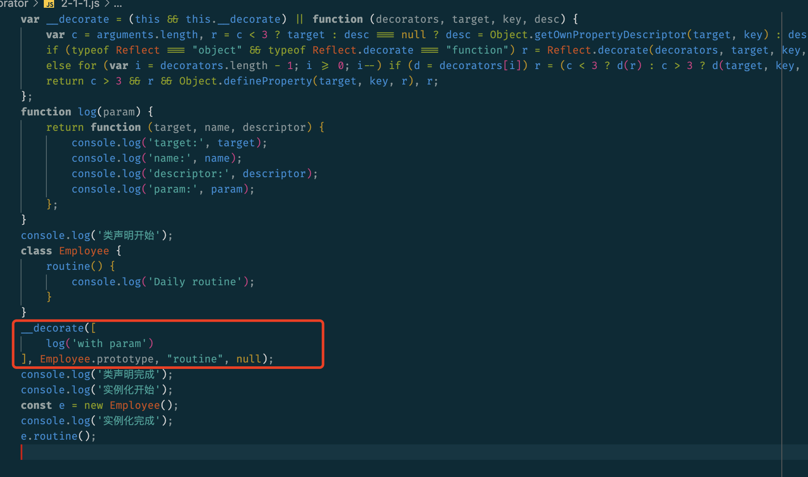
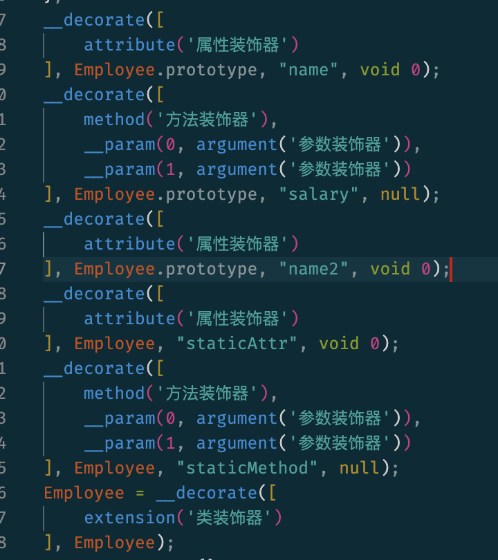

# 幕课教程

## 元组

tuple，相同元素组成数组，不同元素组成元组

### 定义

```ts
const list: [string, number] = ['Sherlock', 1887]		// OK
const list2: [string, number] = [1887, 'Sherlock']	// Error
```

### 可选元素类型

```ts
let list: [number, string?, boolean?]
list = [10, 'Sherlock', true]
list = [10, 'Sherlock']
list = [10]
```

**代码解释**：可选元素必须在必选元素之后，即如果一个元素后缀了`?`，后面的都需要后缀`?`

### 元组类型的Rest使用

```ts
declare function rest(...args: [number, string, boolean]): void
// 等价于
declare function rest(arg1: number, arg2: string, arg3: boolean): void

const list: [number, ...string[]] = [10, 'a', 'b', 'c']
const list1: [string, ...number[]] = ['a', 1, 2, 3]
```


## 枚举

### 反向映射

```ts
enum Months {
  Jan = 1,
  Feb,
  Mar,
  Apr
}
```

编译后

```js
var Months;
(function (Months) {
    Months[Months["Jan"] = 1] = "Jan";
    Months[Months["Feb"] = 2] = "Feb";
    Months[Months["Mar"] = 3] = "Mar";
    Months[Months["Apr"] = 4] = "Apr";
})(Months || (Months = {}));

```

```ts
console.log(Months.Mar === 3) // true

// 那么反过来能取到 Months[3] 的值吗？
console.log(Months[3])  // 'Mar'

// 所以
console.log(Months.Mar === 3)     // true
console.log(Months[3] === 'Mar')  // true
```

#### Tips:

1. 字符串枚举不会生成反向映射
2. 枚举类型被编译成一个对象，它包含了正向映射（name -> value）和反向映射（value -> name）

### const 枚举

常量枚举会直接编译成value，会抹去枚举的定义，提升性能

```ts
enum Months {
  Jan = 1,
  Feb,
  Mar,
  Apr
}

const month = Months.Mar
```

编译后

```js
'use strict'
const month = 3	/* Mar */
```

### 枚举合并

```ts
enum Months {
  Jan = 1,
  Feb,
  Mar,
  Apr
}

enum Months {
  May = 5,
  Jun
}

console.log(Months.Apr) // 4
console.log(Months.Jun) // 6
```

编译后

```js
var Months;
(function (Months) {
    Months[Months["Jan"] = 1] = "Jan";
    Months[Months["Feb"] = 2] = "Feb";
    Months[Months["Mar"] = 3] = "Mar";
    Months[Months["Apr"] = 4] = "Apr";
})(Months || (Months = {}));
(function (Months) {
    Months[Months["May"] = 5] = "May";
    Months[Months["Jun"] = 6] = "Jun";
})(Months || (Months = {}));
console.log(Months.Apr); // 4
console.log(Months.Jun); // 6
```

## never & unknown

`never`类型表示那些永远不存在的值的类型。

`unkown`类型是 `any`类型对应的安全类型（使用起来比`any`更加安全，尽量用`unkown`来替代）。

### never类型

<font color=red>never类型是任何类型的子类型，可以赋值给任何类型</font>；

没有类型是never类型的子类型或可以赋值给never类型（除了never本身之外）。即使any也不可以赋值给never。

<font color=red>any类型是任何类型的父类型，任何类型都可以赋值给any，也可以赋值给除了never之外的任何类型</font>；

#### 应用场景

抛出异常

```ts
function error(message: string): never {
  throw new Error(message)
}

// 推断的返回值类型为 never
function fail(): never {
    return error("Something failed")
}
```

不能取值的地方

```ts
interface Foo {
  type: 'foo'
}

interface Bar {
  type: 'bar'
}

type All = Foo | Bar

function handleValue(val: All) {
  switch (val.type) {
    case 'foo':
      break
    case 'bar':
      break
    default:
      // 此处不能取值
      const exhaustiveCheck: never = val
      break
  }
}
```


## 接口 interface

## 类 class

## 函数 function

## 字面量类型

```ts
let protagonist: 'Sherlock'
protagonist = 'Sherlock'
protagonist = 'Watson'	// Error, Type '"Watson"' is not assignable to type '"Sherlock"'

type Easing = 'ease-in' | 'ease-out' | 'ease-in-out'
class UIElement {
  animate(dx: number, dy: number, easing: Easing) {
    if (easing === 'ease-in') {}
    else if (easing === 'ease-out') {}
    else if (easing === 'ease-in-out') {}
    else {
      // Error
    }
  }
}
let button = new UIElement()
button.animate(0, 0, 'ease-in')
button.animate(0, 0, 'uneasy')	// Error, 'uneasy' 不被允许

// 接口返回，正确类型和异常类型
type Result = {success:true,code:number,object:object}|{success: false,code:number,errMsg:string}
let res: Result = {success:false,code:90001,errMsg: '该二维码已使用'}
if (!res.success) {
  res.errMsg	// OK
  res.object	// Error, Property 'object' does not exist on type '{success: false,code:number,errMsg:string}'
}
```


## 类型推断

## 类型断言

## 类型保护

## 泛型

## 交叉类型

属性冲突，不可赋值

```ts
interface Admin {
  id: number
  administrator: string
  timestamp: string
}

interface User {
  id: number
  groups: number[]
  createLog: (id: number) => void
  timestamp: number
}

let t: Admin & User
t!.administrator	// 合法 Admin.administrator: string
t!.groups					// 合法 User.groups: number[]
t!.id							// 合法 id: number
t!.timestamp			// 合法 timestamp: never
```

### 应用场景

大多数在混入（Mixins）或其他不适合典型面向对象模型的地方

```ts
function extend<T, U>(first: T, second: U) : T & U {
  for(const key in second) {
    (first as T & U)[key] = second[key] as any
  }
  return first as T & U
}

class Person {
  constructor(public name: string) {}
}
class ConsoleLogger {
  log() {}
}

let jim = extend(new Person('Jim'), new ConsoleLogger())
let n = jim.name
jim.log()
```


## 联合类型

与交叉类型的区别：**联合类型表示取值为多种中的一种类型，而交叉类型每次都是**

```ts
let currentMonth: string | number
currentMonth = 'February'
currentMonth = 2
```


## 类型别名

## 索引类型

### Why

实现一个pluck函数，从对象中选取指定属性，得到他们的属性值

```js
function pluck(o, names) {
  return names.map(n => o[n])
}
```

这个该如何改造成ts呢？

索引类型查询操作符`keyof`（用于拿到属性名），索引类型访问操作符`T[K]`（用于拿到属性值的类型）

### 索引操作符 keyof

```ts
interface User {
  id: number
  phone: string
  nickname: string
  readonly department: string
}

class Token {
  private secret: string | undefined
  public accessExp: number = 60 * 60
  public refreshExp: number = 60 * 60 * 24 * 30 * 3
}

let user: keyof User // "id" | "phone" | "nickname" | "department"
type token = keyof Token // "accessExp" | "refreshExp"
```

注意没有 secret

任意`T`，`keyof T`的结果为`T`上已知的**公共属性名的联合**

### 索引操作符 T[K]

通过`keyof`拿到了属性名，接下来还要拿到属性名对应的属性值的类型

```ts
class Token {
  public secret: string = 'ixeFoe3x.2doa'
  public accessExp: number = 60 * 60
  public refreshExp: number = 60 * 60 * 24 * 30 *3
}

type token = keyof Token
type valueType = Token[token]	// string | number
type secret = Token['secret']	// string  注意，这里是在Token类上这么操作，不是实例对象上（那是取值）
```

#### 代码解释：

通过`Token['secret']`拿到了secret的类型为string。

那么这时看我们知道了一个对象的类型为范型`T`，这个对象的属性类型`K`只需要满足`K extends keyof T`，即可得到这个属性值的类型为`T[K]`。

```ts
function getProperty<T, K extends keyof T>(o: T, name: K): T[K] {
  return o[name]; // o[name] is of type T[K]
}
```

### 函数pluck()的类型定义

再来改造pluck函数：

```ts
function pluck<T, K extends keyof T>(o: T, names: K[]): T[K][] {
  return names.map(n => o[n])
}
```

## 映射类型

可以将已知类型的每个属性都变为可选或者只读

### Readonly与Partial关键字

```ts
interface Person {
  name: string
  age: number
}

type PersonOptional = Partial<Person>
type PersonReadonly = Readonly<Person>

// 等价于
type PersonOptional = {
  name?: string
  age?: number
}
type PersonReadonly = {
  readonly name: string
  readonly age: number
}
```

### 两个关键字的源码分析

```ts
type Readonly<T> = {
  readonly [K in keyof T]: T[K]
}
type Partial<T> = {
  [K in keyof T]?: T[K]
}
```

使用了映射类型的语法：`[K in Keys]`，来看这个语法的两个部分：

1. 类型变量`K`: 它会依次绑定到每个属性，对应每个属性名的类型
2. 字符串字面量构成的联合类型的`Keys`: 它包含了要迭代的属性名的集合

接下来分析：

1. `Keys`，可通过`keyof`关键字取得，假设传入的类型是泛型 `T`，得到`keyof T`，即为字符串字面量构成的联合类型： `"name" | "age"`
2. `[K in keyof T]`，将属性名一一映射出来
3. `T[K]`，得到属性值的类型

TypeScript标准库里还包含：`Pick` `Omit`

```ts
type Pick<T, K extends keyof T> = {
  [P in K]: T[P]
}

interface User {
  id: number
  age: number
  name: string
}

type PickUser = Pick<User, 'id'>
```

[更多标准库内容](/Applications/Visual Studio Code.app/Contents/Resources/app/extensions/node_modules/typescript/lib/lib.es5.d.ts)

- Required
- Record
- Exclude
- Extract
- Omit
- NonNullable
- Parameters
- ConstructorParameters
- ReturnType
- InstanceType

## 条件类型

本节介绍 TypeScript 高级类型中的条件类型（conditional type），条件类型就是<font color=red>在初始状态并不直接确定具体类型，而是通过一定的类型运算得到最终的变量类型</font>。

条件类型用来表达<font color=red>非均匀类型映射</font>，可以根据一个条件表达式来进行类型检测，从两个类型中选出一个：

```ts
T extends U ? X : Y
```

语义类似三元运算符：若`T`是`U`的子类型，则类型为`X`，否则为`Y`。若无法确定`T`是否为`U`的子类型，则类型为`X | Y`。

```ts
declare function f<T extends boolean>(x: T): T extends true ? string : number

const x = f(Math.random() < 0.5)	// const x: string | number

const y = f(true)	// const y: string
const z = f(false)	// const z: number
```

### 可分配条件类型

在条件类型`T extends U ? X : Y`中，当泛型参数`T`取值为`A | B | C`时，这个条件类型就等价于`(A extends U ? X : Y) | (B extends U ? X : Y) | (C extends U ? X : Y)`，这就是可分配条件类型。

### 应用场景

[更多标准库内容](/Applications/Visual Studio Code.app/Contents/Resources/app/extensions/node_modules/typescript/lib/lib.es5.d.ts)

- `Exclude<T, U>`——从`T`中剔除可以赋值给`U`的类型
- `Extract<T, U>`——提取`T`中可以赋值给`U`的类型
- `NonNullable<T>`——从`T`中剔除可以赋值给`null`和`undefined`
- `ReturnType<T>`——获取函数返回值类型
- `InstanceType<T>`——获取构造函数的实例类型

```ts
type T00 = Exclude<'a' | 'b' | 'c' | 'd', 'a' | 'c' | 'f'>	// 'b' | 'd'

/**
 * Exclude from T those types that are assignable to U
 */
type Exclude<T, U> = T extends U ? never : T;

/**
 * Extract from T those types that are assignable to U
 */
type Extract<T, U> = T extends U ? T : never;

/**
 * Exclude null and undefined from T
 */
type NonNullable<T> = T & {};

/**
 * Obtain the return type of a function type
 */
type ReturnType<T extends (...args: any) => any> = T extends (...args: any) => infer R ? R : any;

/**
 * Obtain the return type of a constructor function type
 */
type InstanceType<T extends abstract new (...args: any) => any> = T extends abstract new (...args: any) => infer R ? R : any;
```

再看一个进阶的例子，定义一种方法，可以取出接口类型中的函数类型：

```ts
type FunctionPropertyNames<T> = { [K in keyof T]: T[K] extends Function ? K : never }[keyof T]
type FunctionProperties<T> = Pick<T, FunctionPropertyNames<T>>

interface Part = {
  id: number
  name: string
  subparts: Part[]
  firstFn: (brand: string) => void
  anotherFn: (channel: string) => string
}

type FnNames = FunctionPropertyNames<Part>		// 'firstFn' | 'anotherFn'
type FnProperties = FunctionProperties<Part>

type FnProperties = {
  firstFn: (brand: string) => void
  anotherFn: (channel: string) => string
}
```

## is 关键字

`is`关键字被称为类型谓词，用来判断一个变量属于某个接口或类型。如果需要封装一个类型判断函数，你应该第一时间想到它

在一些兑换码场景，经常会需要将兑换码全部转为大写，之后再判断：

```ts
function isString(s: unknow): boolean {
  return typeof s === 'string'
}

function toUpperCase(x: unknow) {
  if (isString(x)) {
    x.toUpperCase()	// Error, Object is of type 'unknow' “x”的类型为“未知”。
  }
}
```

**代码解释**：

一个`unknow`类型的对象不能进行`toUpperCase()`操作，可是在上一行明明已经通过了`isString()`函数确认参数x为string类型，但是由于函数嵌套TypeScript不能进行正确的类型判断。

这时，就可以使用`is`关键字：

```ts
// 注意区别 通过 表明 返回值是 s is string， ts就可以做类型推断，当 if 条件满足时候，x就被推断为 string 类型了
// const isString = (s: unknown): boolean => typeof s === 'string'
const isString = (s: unknown): s is string => typeof s === 'string'

function toUpperCase(x: unknown) {
  if (isString(x)) {
    x.toUpperCase()
  }
}

let a = isString('a')
// 可以直接传递给 unknown 不会报错
let b = isString(1)
console.log(a)
console.log(b)

function test(x: number | string) {
  if (isString(x)) {
    x.toUpperCase()
  } else {
    // 可以推断出 是 number 类型
    x.toFixed(2)
  }
}

function test2(x: number | string | object) {
  if (isString(x)) {
    x.toUpperCase()
  } else {
    // (parameter) x: number | object
    // 可以调用 number | object 联合类型的属性、方法
    x.toString()
  }
}
```

**解释**：通过is关键字将类型范围缩小为string类型，这也是一种代码健壮性的规范约束。

### 一些拓展函数

```ts
const isNumber = (val: unknown): val is number => typeof val === 'number'
const isString = (val: unknown): val is string => typeof val === 'string'
const isSymbol = (val: unknown): val is symbol => typeof val === 'symbol'
const isFunction = (val: unknown): val is Function => typeof val === 'function'
const isObject = (val: unknown): val is Record<any, any> => val !== null && typeof val === 'object'

function isPromise<T = any>(val: unknown): val is Promise<T> {
  return isObject(val) && isFunction(val.then) && isFunction(val.catch)
}

const objectToString = Object.prototype.toString
const toTypeString = (value: unknown): string => objectToString.call(value)
const isPlainObject = (val: unknown): val is object => toTypeString(val) === '[object Object]'

console.log(isObject(null))         // false
console.log(isObject({}))           // true
console.log(isObject([]))           // true
console.log(isObject(()=>{}))       // false

console.log(typeof(null))           // object
console.log(typeof({}))             // object
console.log(typeof([]))             // object
console.log(typeof(()=>{}))         // function

console.log(isPlainObject(null))    // false
console.log(isPlainObject({}))      // true
console.log(isPlainObject([]))      // false
console.log(isPlainObject(()=>{}))  // false

console.log(toTypeString(null))     // '[object Null]'
console.log(toTypeString({}))       // '[object Object]'
console.log(toTypeString([]))       // '[object Array]'
console.log(toTypeString(()=>{}))   // '[object Function]'
```

`is`关键字经常用来封装“类型判断函数”，通过和函数返回值的比较，从而缩小参数的类型范围，所以类型谓词`is`也是一种类型保护。

## infer 关键字

`infer`关键字有些难理解，先看一个类比来帮助理解

语句`let num`中，通过`let`来声明了一个变量，那么怎样声明一个不确定的类型变量呢？答案是`infer`关键字，`infer R`就是一个类型变量`R`。

**在条件类型表达式中，可以在`extends`条件语句中使用`infer`关键字来声明一个待推断的类型变量。

### 通过 ReturnType 理解 infer

```ts
const add = (x: number, y: number) => x + y
type t = ReturnType<typeof add>	// type t = number
/**
 * Obtain the return type of a function type
 */
type ReturnType<T extends (...args: any) => any> = T extends (...args: any) => infer R ? R : any
```

**`infer`的作用是让`TypeScript`自己推断，并将推断的结果存储到一个类型变量中，`infer`只能用于`extends`语句中。**

再来看`ReturnType`的实现：如果`T`满足约束条件`(...args: any) => any`，并且能够赋值给`(...args: any) => infer R`，则返回类型为`R`，否则为`any`

**infer 关键字：告知 ts 自己做推断，并且将结果存储到 后面的 类型变量中**

### 借助 infer 实现元组转联合类型

如：`[string, number] -> string | number`

```ts
type Flatten<T> = T extends Array<infer U> ? U : never

type T0 = [string, number]
type T1 = Flatten<T0>	// string | number
```

**代码解释：**

第1行，如果泛型参数`T`满足约束条件`Array<infer U>`，那么就返回这个类型变量`U`。

第3行，元组类型在一定条件下，是可以赋值给数组类型，满足条件：

```ts
type TypeTuple = [string, number]
type TypeArray = Array<string | number>

type B0 = TypeTuple extends TypeArray ? true: false // true
```

**总计**

infer理解起来比较抽象，一定要亲手写一下本节中的例子。借助条件类型的`infer`关键字来推断类型，可以实现一些比如联合类型转交叉类型、联合类型转元组的操作

https://segmentfault.com/a/1190000041743807

```ts
type ToUnionOfFunction<T> = T extends any ? (x: T) => any : never
type UnionToIntersection<T> = ToUnionOfFunction<T> extends (x: infer P) => any ? P : never
```

## Truthy & Falsy

## 迭代器 iterator

js提供了许多迭代集合的方法，从简单的`for`循环到`map()`和`filter()`。本节要介绍的迭代器也是一种方案，并且迭代器将迭代的概念直接带入核心语言，同时提供一种机制来自定义`for...of`循环行为。

迭代器时一种特殊对象，它符合[迭代器协议](https://developer.mozilla.org/zh-CN/docs/Web/JavaScript/Reference/Iteration_protocols)规范。在 TypeScript 中，我们可以定义一个接口，这个接口上有一个函数类型 `next` ，`next()` 方法的返回值类型是 `{ value: any, done: boolean }`。其中，`value` 是 any 类型，表示下一个将要返回的值；`done` 是布尔类型，当没有更多可返回数据时返回 true。迭代器还会保存一个内部指针，用来指向当前集合中值的位置。

迭代器一旦创建，迭代器对象就可以通过重复调用 `next()` 显式地迭代。

模拟一个简略的迭代器

```ts
interface IteratorInterface {
  next: () => {
    value: any
    done: boolean
  }
}

function createIterator(array: any[]): IteratorInterface {
  let index = 0
  let len = array.length
  
  return {
    next: function() {
      return index < len ? { value: array[index++], done: false}
      :{value:undefined, done: true}
    }
  }
}

var iterator = createIterator([1, 2, 3])
console.log(iterator.next())// {value:1, done: false}
console.log(iterator.next())// {value:2, done: false}
console.log(iterator.next())// {value:3, done: false}
console.log(iterator.next())// {value:undefined, done: true}
```

### 可迭代性

上面的例子，用模拟的迭代器地迭代了一个数组对象，那是不是所有的对象都可以这样迭代呢？当然不是。

只有一个对象实现了 `Symbol.iterator` 属性时，我们才认为它是可迭代的。一些内置的类型如 `Array，Map，Set，String，Int32Array，Uint32Array` 等都已经实现了各自的 `Symbol.iterator`。

`Symbol.iterator` 属性本身是一个函数，就是当前数据结构默认的迭代器生成函数。执行这个函数，就会返回一个迭代器。

比如，`String` 是一个内置的可迭代对象：

```ts
let str: string = 'Hi'
console.log(typeof str[Symbol.iterator])	// function
```

### for...of

`for...of` 会遍历可迭代的对象(*包括 Array，Map，Set，String，TypedArray，arguments 对象等等*)，调用对象上的 `Symbol.iterator` 方法。

### for...of 与 for...in 的区别

- `for...of`语句遍历**可迭代对象**定义要迭代的数据。
- `for...in`语句以任意顺序迭代对象的**可枚举属性**。

**`for...in`可以操作任何对象，迭代对象的可枚举属性。但是`for...of`只关注于可迭代对象的值。**

对数组和Set结构进行结构赋值时，会默认调用`Sysmbol.iterator`方法

```ts
let [head, ...tail] = [1, 2, 3, 4]
// tail = 4
```

扩展运算符也会默认调用Iterator接口，得到一个数组结构：

```ts
let arr = [...'imooc']
console.log(arr)	// ['i', 'm', 'o', 'o', 'c']
```

通过编辑器（例如vscode）可以看到TypeScript迭代器接口定义的源码：

```ts
interface IteratorYieldResult<TYield> {
  done?: false
  value: TYield
}

interface IteratorReturnResult<TReturn> {
  done: true
  value: TReturn
}

type IteratorResult<T, TReturn = any> = IteratorYieldResult<T> | IteratorReturnResult<TReturn>

interface Iterator<T, TReturn = any, TNext = undefined> {
  // NOTE: 'next' is defined using a tuple to ensure we report the correct assignability errors in all places.
  next(...args: [] | [TNext]): IteratorResult<T, TReturn>
  return?(value?: TReturn): IteratorResult<T, TReturn>
  thrown?(e?: any): ItertorResult<T, TReturn>
}

interface IterableIterator<T> extends Iterator<T> {
  [Symbol.iterator](): IterableIterator<T>;
}
```

## 生成器 generator

迭代器和生成器很容易混淆，上节的学习我们知道迭代器时一个对象，那么本节首先要记住：**生成器是一种能够中途停止，然后从停止的地方继续运行的函数**。可以借助`yield`或`return`停止函数运行。

### What

通过`function*`来创建一个生成器函数，在调用一个生成器函数后，并不会立即执行函数中的代码，而是会返回一个迭代器对象，通过调用迭代器对象的`next()`方法，可以获得`yield/return`的返回值。

### 生成器函数的特殊性

一个正常的函数，如果没有`return`或者`thrown`一个异常，一旦被调用在运行结束之前是不会停止的。如果再次调用这个函数，它会再次从第一行开始执行。

```ts
function normalFunc() {
  console.log('I')
  console.log('cannot')
  console.log('be')
  console.log('stopped.')
}
```

> In contrast, a generator is a function that can stop midway and then continue from where it stopped.

```ts
function* generatorFunction() {
  console.log('开始执行')
  yield 'Hello, '
  
  console.log('暂停后再次执行')
  yield 'World!'
}

let iterator = generatorFunction()

console.log(iterator.next().value)
// 开始执行
// Hello,
console.log(iterator.next().value)
// 暂停后再次执行
// World!
console.log(iterator.next())	// {value: undefined, done: true}
```

### 通过 next() 参数向生成器传值

在调用 next() 的时候可以传递一个参数，在下次 yield 前接受到这个参数：

```ts
function* gen() {
  console.log('开始执行')
  let res1 = yield 1
  console.log('中断后继续执行')
  console.log(res1)
  
  let res2 = yield 2
  console.log(res2)
  
  console.log('执行结束')
  return 3
}

let iterator = gen()
console.log(iterator.next('first'))
console.log(iterator.next('second'))
console.log(iterator.next('third'))
/*
开始执行
{ value: 1, done: false }
中断后继续执行
second
{ value: 2, done: false }
third
执行结束
{ value: 3, done: true }
*/
```

**注意**：生成器最初没有产生任何结果（没有输出first），在第一次调用`next()`时传参是无意义的。

生成器还有另一个巨大好处，就是把异步回调代码变成“同步”代码。`async``await`就是基于生成器的语法糖，`await`可以等待异步函数执行完再继续执行后面的代码。

## 装饰器 decorator

装饰器是一种特殊类型的声明，它能够附加到类声明、方法、访问符、属性、类方法的参数上，以达到扩展类的行为。

自从ES2015引入`class`，当我们需要在多个不同的类之间共享或者扩展一些方法或行为的时候，代码会变得错综复杂，极其不优雅，这也是装饰器被提出的一个很重要的原因。

### What

常见的装饰器：类装饰器、属性装饰器、方法装饰器、参数装饰器

装饰器的写法：普通装饰器（无法传参）、装饰器工厂（可传参）

> 装饰器是一项实验性特性，在未来的版本中可能会发生改变

若要启用实验性装饰器特性，你必须在命令行或者`tsconfig.json`里启用`experimentalDecorators`编译器选项：

命令行：

```sh
tsc --target ES5 --experimentalDecorators
```

tsconfig.json

```json
	{
    "compilerOptions": {
      "target": "ES5",
      "experimentalDecorators": true
    }
  }
```

### 装饰器的使用方法

装饰器允许你在类和方法定义的时候去注释或者修改它。装饰器是一个作用于函数的表达式，它接收三个参数`target`、`name`和`descriptor`，然后可选择性的返回被装饰之后的`descriptor`对象。

装饰器使用`@expression`这种语法糖形式，`expression`表达式求值后必须为一个函数，它会在运行时被调用，被装饰器的声明信息作为参数传入。

#### 装饰器工厂

装饰器工厂是一个简单的函数，返回一个函数表达式，以供装饰器在运行时调用。

通过装饰器工厂方法，可以**额外传参，普通装饰器无法传参**。

```ts
function log(param: string) {
    return function(target: any, name: string, descriptor: PropertyDescriptor) {
        console.log('target:', target)
        console.log('name:', name)
        console.log('descriptor:', descriptor)
        
        console.log('param:', param)
    }
}

console.log('类声明开始')
class Employee {
    @log('with param')
    routine() {
        console.log('Daily routine')
    }
}
console.log('类声明完成')

console.log('实例化开始')
const e = new Employee()
console.log('实例化完成')
e.routine()

/*
类声明开始
target: {}
name: routine
descriptor: {
  value: [Function: routine],
  writable: true,
  enumerable: false,
  configurable: true
}
param: with param
类声明完成
实例化开始
实例化完成
Daily routine
*/
```



可以看到，编译后，在类声明后马上接着装饰器工厂的调用

可以看到，先执行装饰器函数，然后执行 `routine()` 函数。至于类属性装饰器函数表达式的三个参数 `target`、`name`、`descriptor` 之后会单独介绍。

#### 装饰器组合

多个装饰器可以同时应用到一个声明上，就像这样

- 写在同一行上

  ```
  @f @g x
  ```

- 写在多行上

  ```ts
  @f
  @g
  x
  ```

在ts里，当多个装饰器应用在一个声明上时会进行如下步骤的操作：

1. 由上至下依次对装饰器表达式求值
2. 求值的结果会被当做函数，由下至上依次调用

```ts
function f() {
    console.log('f(): evaluated')
    return function(target: any, propertyKey: string, descriptor: PropertyDescriptor) {
      console.log('f(): called')
    }
  }
  
  function g() {
    console.log('g(): evaluated')
    return function(target: any, propertyKey: string, descriptor: PropertyDescriptor) {
      console.log('g(): called')
    }
  }
  
  class C {
    @f()
    @g()
    method() {}
  }

  /*
f(): evaluated
g(): evaluated
g(): called
f(): called
  */
```

### 类装饰器

类装饰器表达式会在运行时当作函数被调用，类的构造函数作为其唯一的参数。

通过类装饰器扩展类的属性和方法

```ts
function extension<T extends { new(...args:any[]): {}}>(constructor: T) {
  // 重构构造函数
  return class extends constructor {
    // 扩展属性
    public coreHour = '10:00-15:00'
    // 函数重载
    meeting() {
      console.log('重载: Daily meeting!')
    }
  }
}

@extension
class Employee {
  public name!: string
  public department!: string
  
  constructor(name: string, department: string) {
    this.name = name
    this.department = department
  }
  
  meeting() {
    console.log('Every Monday!')
  }
}

let e = new Employee('Tom', 'IT')
console.log(e)	// Employee { name: 'Tom', department: 'IT', coreHour: '10:00-15:00' }
e.meeting()	// 重载: Daily meeting!
```

函数表达式写法：

```ts
const extension = (constuctor: Function) => {
    constuctor.prototype.coreHour = '10:00-15:00'

    constuctor.prototype.meeting = () => {
        console.log('重载: Daily meeting!')
    }
}

@extension
class Employee {
    public name!: string
    public department!: string

    constructor(name: string, department: string) {
        this.name = name
        this.department = department
    }

    meeting() {
        console.log('Every Monday!')
    }
}

let e: any = new Employee('Tom', 'IT')
console.log(e.coreHour) // 10:00-15:00
e.meeting() // 重载: Daily meeting!
```

**代码解释：**

以上两种写法，本质是相同的，类装饰器函数表达式将构造函数作为唯一的参数，主要用于扩展类的属性和方法。

### 作用于类属性的装饰器

作用于类属性的装饰器表达式会在运行时当作函数被调用，传入下列3个参数 `target`、`name`、`descriptor`：

1. `target`: 对于静态成员来说是类的构造函数，对于实例成员是类的原型对象
2. `name`: 成员的名字
3. `descriptor`: 成员的属性描述符

如果你熟悉 `Object.defineProperty`，你会立刻发现这正是 [Object.defineProperty](https://developer.mozilla.org/zh-CN/docs/Web/JavaScript/Reference/Global_Objects/Object/defineProperty) 的三个参数。

比如通过修饰器完成一个属性只读功能，其实就是修改数据描述符中的 `writable` 的值 ：

```ts
function readonly(value: boolean) {
    return function (target: any, name: string, descriptor: PropertyDescriptor) {
        // target: 对于静态成员来说是类的构造函数，对于实例成员是类的原型对象
        console.log({
            target,
            name,
            descriptor,
            value,
            targetType: typeof target,
            targetIsPrototype: target === Employee.prototype,
            targetIsConstructor: target === Employee,
        })
        descriptor.writable = value
    }
}

class Employee {
    @readonly(false)
    salary() {
        console.log('这是个秘密')
    }

    @readonly(false)
    static staticMethod() {

    }
}

const e = new Employee()

//   Cannot assign to read only property 'salary' of object '#<Employee>'
//   e.salary = () => { // Error，不可写
//     console.log('change')
//   }
e.salary()

/*
{
  target: {},
  name: 'salary',
  descriptor: {
    value: [Function: salary],
    writable: true,
    enumerable: false,
    configurable: true
  },
  value: false,
  targetType: 'object',
  targetIsPrototype: true,
  targetIsConstructor: false
}
{
  target: [class Employee],
  name: 'staticMethod',
  descriptor: {
    value: [Function: staticMethod],
    writable: true,
    enumerable: false,
    configurable: true
  },
  value: false,
  targetType: 'function',
  targetIsPrototype: false,
  targetIsConstructor: true
}
这是个秘密
*/
```

### 方法参数装饰器

参数装饰器表达式会在运行时当作函数被调用，以使用参数装饰器为类的原型上附加一些元数据，传入下列3个参数 `target`、`name`、`index`：

1. `target`: 对于静态成员来说是类的构造函数，对于实例成员是类的原型对象
2. `name`: 成员的名字
3. `index`: 参数在函数参数列表中的索引

注意第三个参数的不同。

```ts
function log(param: string) {
    return function(target: any, name: string, index: number) {
        // target: 对于静态成员来说是类的构造函数，对于实例成员是类的原型对象
        console.log({
            target,
            name,
            index,
            param,
            targetType: typeof target,
            targetIsPrototype: target === Employee.prototype,
            targetIsConstructor: target === Employee,
        })
    }
}

class Employee {
   salary(@log('IT') department: string, @log('John') name: string){
    console.log('这是个秘密')
   }
   static staticMethod(@log('IT') department: string, @log('John') name: string){
    console.log('这是个秘密')
   }
}

/*
{
  target: {},
  name: 'salary',
  index: 1,
  param: 'John',
  targetType: 'object',
  targetIsPrototype: true,
  targetIsConstructor: false
}
{
  target: {},
  name: 'salary',
  index: 0,
  param: 'IT',
  targetType: 'object',
  targetIsPrototype: true,
  targetIsConstructor: false
}
{
  target: [class Employee],
  name: 'staticMethod',
  index: 1,
  param: 'John',
  targetType: 'function',
  targetIsPrototype: false,
  targetIsConstructor: true
}
{
  target: [class Employee],
  name: 'staticMethod',
  index: 0,
  param: 'IT',
  targetType: 'function',
  targetIsPrototype: false,
  targetIsConstructor: true
}
*/
```

可以用参数装饰器来监控一个方法的参数是否被传入。

### 装饰器执行顺序

```ts
function extension(param: string) {
    return function (target: any) {
        console.log('类装饰器', {
            target,
            param,
            targetType: typeof target,
            targetIsPrototype: target === Employee.prototype,
            targetIsConstructor: target === Employee,
        }
        )
    }
}


function method(param: string) {
    return function (target: any, name: string, descriptor: PropertyDescriptor) {
        console.log('方法装饰器', {
            target,
            name,
            descriptor,
            param,
            targetType: typeof target,
            targetIsPrototype: target === Employee.prototype,
            targetIsConstructor: target === Employee,
        })
    }
}

function attribute(param: string) {
    return function (target: any, name: string) {
        console.log('属性装饰器', {
            target,
            name,
            param,
            targetType: typeof target,
            targetIsPrototype: target === Employee.prototype,
            targetIsConstructor: target === Employee,
        })
    }
}

function argument(param: string) {
    return function (target: any, name: string, index: number) {
        console.log('参数装饰器', {
            target,
            name,
            index,
            param,
            targetType: typeof target,
            targetIsPrototype: target === Employee.prototype,
            targetIsConstructor: target === Employee,
        })
    }
}

@extension('类装饰器')
class Employee {
    @attribute('属性装饰器')
    public name!: string

    @attribute('属性装饰器')
    public static staticAttr: string

    @method('方法装饰器')
    salary(@argument('参数装饰器') department: string, @argument('参数装饰器') name: string) {
        console.log('这是个秘密')
    }

    @method('方法装饰器')
    static staticMethod(@argument('参数装饰器') department: string, @argument('参数装饰器') name: string) {
        console.log('这是个秘密')
    }
  
  	@attribute('属性装饰器')
    public name2!: string
}

/*
参数装饰器 {
  target: {},
  name: 'salary',
  index: 1,
  param: '参数装饰器',
  targetType: 'object',
  targetIsPrototype: true,
  targetIsConstructor: false
}
参数装饰器 {
  target: {},
  name: 'salary',
  index: 0,
  param: '参数装饰器',
  targetType: 'object',
  targetIsPrototype: true,
  targetIsConstructor: false
}
方法装饰器 {
  target: {},
  name: 'salary',
  descriptor: {
    value: [Function: salary],
    writable: true,
    enumerable: false,
    configurable: true
  },
  param: '方法装饰器',
  targetType: 'object',
  targetIsPrototype: true,
  targetIsConstructor: false
}
属性装饰器 {
  target: {},
  name: 'name',
  param: '属性装饰器',
  targetType: 'object',
  targetIsPrototype: true,
  targetIsConstructor: false
}
属性装饰器 {
  target: [class Employee],
  name: 'staticAttr',
  param: '属性装饰器',
  targetType: 'function',
  targetIsPrototype: false,
  targetIsConstructor: true
}
参数装饰器 {
  target: [class Employee],
  name: 'staticMethod',
  index: 1,
  param: '参数装饰器',
  targetType: 'function',
  targetIsPrototype: false,
  targetIsConstructor: true
}
参数装饰器 {
  target: [class Employee],
  name: 'staticMethod',
  index: 0,
  param: '参数装饰器',
  targetType: 'function',
  targetIsPrototype: false,
  targetIsConstructor: true
}
方法装饰器 {
  target: [class Employee],
  name: 'staticMethod',
  descriptor: {
    value: [Function: staticMethod],
    writable: true,
    enumerable: false,
    configurable: true
  },
  param: '方法装饰器',
  targetType: 'function',
  targetIsPrototype: false,
  targetIsConstructor: true
}
类装饰器 {
  target: [class Employee],
  param: '类装饰器',
  targetType: 'function',
  targetIsPrototype: false,
  targetIsConstructor: true
}
(base)  chenbinghong@CXYWchenbinghong  ~/Study/FrontEnd/typescript/typescript-imooc   main  ts-node decorator/6
属性装饰器 {
  target: {},
  name: 'name',
  param: '属性装饰器',
  targetType: 'object',
  targetIsPrototype: true,
  targetIsConstructor: false
}
参数装饰器 {
  target: {},
  name: 'salary',
  index: 1,
  param: '参数装饰器',
  targetType: 'object',
  targetIsPrototype: true,
  targetIsConstructor: false
}
参数装饰器 {
  target: {},
  name: 'salary',
  index: 0,
  param: '参数装饰器',
  targetType: 'object',
  targetIsPrototype: true,
  targetIsConstructor: false
}
方法装饰器 {
  target: {},
  name: 'salary',
  descriptor: {
    value: [Function: salary],
    writable: true,
    enumerable: false,
    configurable: true
  },
  param: '方法装饰器',
  targetType: 'object',
  targetIsPrototype: true,
  targetIsConstructor: false
}
属性装饰器 {
  target: {},
  name: 'name2',
  param: '属性装饰器',
  targetType: 'object',
  targetIsPrototype: true,
  targetIsConstructor: false
}
属性装饰器 {
  target: [class Employee],
  name: 'staticAttr',
  param: '属性装饰器',
  targetType: 'function',
  targetIsPrototype: false,
  targetIsConstructor: true
}
参数装饰器 {
  target: [class Employee],
  name: 'staticMethod',
  index: 1,
  param: '参数装饰器',
  targetType: 'function',
  targetIsPrototype: false,
  targetIsConstructor: true
}
参数装饰器 {
  target: [class Employee],
  name: 'staticMethod',
  index: 0,
  param: '参数装饰器',
  targetType: 'function',
  targetIsPrototype: false,
  targetIsConstructor: true
}
方法装饰器 {
  target: [class Employee],
  name: 'staticMethod',
  descriptor: {
    value: [Function: staticMethod],
    writable: true,
    enumerable: false,
    configurable: true
  },
  param: '方法装饰器',
  targetType: 'function',
  targetIsPrototype: false,
  targetIsConstructor: true
}
类装饰器 {
  target: [class Employee],
  param: '类装饰器',
  targetType: 'function',
  targetIsPrototype: false,
  targetIsConstructor: true
}
*/
```

顺序：

- 实例属性、参数、方法（参数先于其方法），属性和方法的顺序就是类中顺序；

- 静态属性、参数、方法（参数先于其方法），属性和方法的顺序就是类中顺序；

- 类

  

  

## 反射 reflect metadata

## 混入 mixins

## 工程之模块

## 工程之命名空间

## 工程之声明合并

## 工程之编译选项

## 工程之tsconfig.json

## 工程之TSLint & ESLint

本节将介绍怎样在一个ts项目中使用ESLint规范，至于为什么不推荐使用TSLint，可以看这篇文章：[TypeScript 官方已经决定全面采用 ESLint](https://eslint.org/blog/2019/01/future-typescript-eslint)，ESLint 的 TypeScript 解析器也成为独立项目，专注解决双方兼容性问题。

所以，同开发前端项目一样，熟练掌握 ESLint 规则，也成了 TypeScript 项目开发的必要条件。