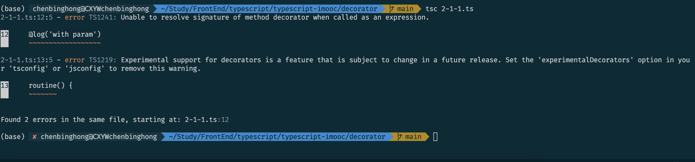

# 重拾Typescript之tsconfig.json配置文件

https://juejin.cn/post/7078666410339565576

## 遇到问题

2-1-1.ts

```ts
function log(param: string) {
    return function(target: any, name: string, descriptor: PropertyDescriptor) {
        console.log('target:', target)
        console.log('name:', name)
        console.log('descriptor:', descriptor)
        
        console.log('param:', param)
    }
}

class Employee {
    @log('with param')
    routine() {
        console.log('Daily routine')
    }
}

const e = new Employee()
e.routine()
```

tsconfig.json

```json
{
    "compilerOptions": {
        "target": "ES5",
        "experimentalDecorators": true
    }
}                                                                          
```

运行命令：

```sh
tsc 2-1-1.ts
```

报错：

>2-1-1.ts:12:5 - error TS1241: Unable to resolve signature of method decorator when called as an expression.
>
>2-1-1.ts:13:5 - error TS1219: Experimental support for decorators is a feature that is subject to change in a future release. Set the 'experimentalDecorators' option in your 'tsconfig' or 'jsconfig' to remove this warning.




首先在电脑全局已经安装过ts后，文件夹中执行`tsc --init`，运行后，文件夹中会生成一个`tsconfig.json`文件。

`tsconfig.js`文件中的内容会在`编译ts`的时候提供帮助。

- <font color=red>通过`tsc + 文件名`的方法并不会使用`tsconfig.json`中配置的内容</font>
- 只有`单纯通过tsc命令`运行项目时，才会读取`tsconfig.json`的文件
- `tsconfig.json`配置项默认会对根目录下的文件进行编译


运行下面的命令，不会报错：

```sh
tsc --target ES5 2-1-1.ts --experimentalDecorators
```

或者使用ts-node

```sh
ts-node 2-1-1.ts
```

## 原来是这么用的

回到上一级，tsc 编译项目 （目录），而不是tsc 文件

```sh
cd ..
tsc -p decorator
```

```
/*
  文件目录：
  ├─src/
  │  ├─index.ts
  │  └─tsconfig.json
  ├─package.json
*/
$ tsc --project src
```

### 指定需要编译的目录

在不指定输入文件的情况下执行 `tsc` 命令，默认从当前目录开始编译，编译所有 `.ts` 文件，并且从当前目录开始逐级向上级目录搜索查找 tsconfig.json 文件。

另外，`tsc` 命令可以通过参数 `--project` 或 `-p` 指定需要编译的目录，该目录需要包含一个 tsconfig.json 文件（或者包含有效配置的 `.json` 文件）。