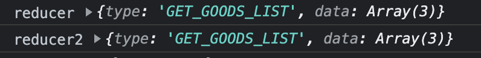
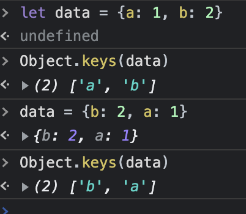

# redux之combineReducers

不同 reducer 的同名的 action 合并时候 dispatch 会都触发

```js
const defaultState = {
    goodsList: [],
    color: 'yellow'
}

const reducer = (state = defaultState, action) => {
    switch (action.type) {
        case 'GET_GOODS_LIST':
            console.log('reducer', action)
            return {
                ...state,
                goodsList: action.data

            }
        default:
            return state;
    }

}

const reducer2 = (state = defaultState, action) => {
    switch (action.type) {
        // 不同 reducer 的同名的 action 合并时候 dispatch 会都触发
        case 'GET_GOODS_LIST':
            console.log('reducer2', action)
            return {
                ...state,
                color: 'blue'
            }
      	case 'SET_SUCCESS':
        		return {
                ...state,
                color: 'green'
          	}
        default:
            return state;
    }
}

export default combineReducers({
    reducer,
    reducer2,   // 这里的顺序会影响 同名 action 触发 的 顺序
});

// 不同 reducer 的同名的 action 合并时候 dispatch 会都触发
dispatch({type: 'GET_GOODS_LIST', data: ['a', 'b', 'c']});

```



```js
export default combineReducers({
    reducer2,
    reducer,   // 这里的顺序会影响 同名 action 触发 的 顺序
});
```


可以用`Object.keys`获得对象的书面表达式中key的顺序

