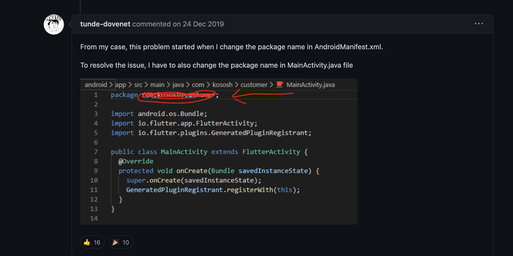

# AndroidManifest.xml 和 MainActivity.kt package 命名冲突问题
Flutter tool hangs waiting on observatory port when AndroidManifest.xml and MainActivity.kt package name get out of sync #33214
当 AndroidManifest.xml 和 MainActivity.kt 包名称不同步时，Flutter 工具挂起等待观察端口

https://github.com/flutter/flutter/issues/33214

