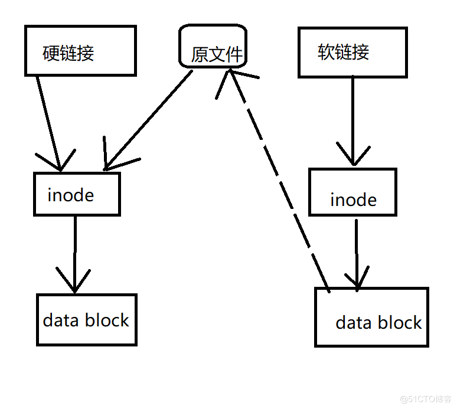
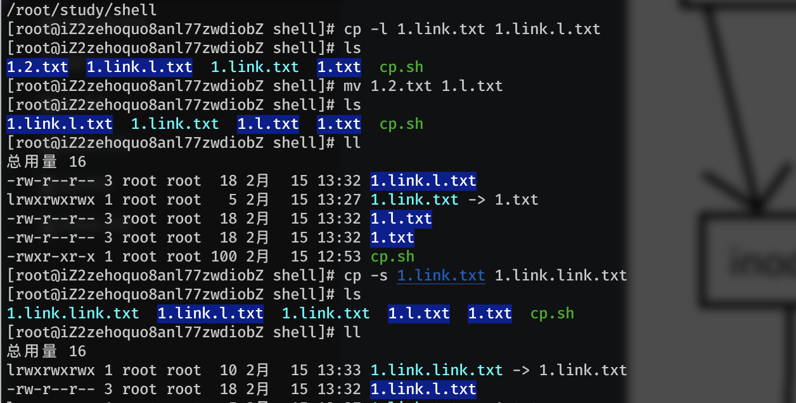

# 每天学习一个命令：cp

[https://www.cnblogs.com/peida/archive/2012/10/29/2744185.html](https://www.cnblogs.com/peida/archive/2012/10/29/2744185.html)

cp命令用来复制文件或者目录，是Linux系统中最常用的命令之一。一般情况下，shell会设置一个别名，在命令行下复制文件时，如果目标文件已经存在，就会询问是否覆盖，不管你是否使用-i参数。但是如果是在shell脚本中执行cp时，没有-i参数时不会询问是否覆盖。这说明命令行和shell脚本的执行方式有些不同。 

## 命令参数

```sh
-a, --archive  等于-dR --preserve=all
--backup[=CONTROL  为每个已存在的目标文件创建备份
-b        类似--backup 但不接受参数
--copy-contents    在递归处理是复制特殊文件内容
-d        等于--no-dereference --preserve=links
-f, --force    如果目标文件无法打开则将其移除并重试(当 -n 选项存在时则不需再选此项)
-i, --interactive    覆盖前询问(使前面的 -n 选项失效)
-H        跟随源文件中的命令行符号链接
-l, --link      链接文件而不复制
-L, --dereference  总是跟随符号链接
-n, --no-clobber  不要覆盖已存在的文件(使前面的 -i 选项失效)
-P, --no-dereference  不跟随源文件中的符号链接
-p        等于--preserve=模式,所有权,时间戳
--preserve[=属性列表  保持指定的属性(默认：模式,所有权,时间戳)，如果可能保持附加属性：环境、链接、xattr 等
-R, -r, --recursive 复制目录及目录内的所有项目
```

## 命令实例：

### 实例一：复制单个文件到目标目录，文件在目标文件中不存在

#### 命令：
```sh
cp log.log test5
```
#### 输出：
```sh
[root@localhost test]# cp log.log test5
[root@localhost test]# ll
-rw-r--r-- 1 root root  0 10-28 14:48 log.log
drwxr-xr-x 6 root root 4096 10-27 01:58 scf
drwxrwxrwx 2 root root 4096 10-28 14:47 test3
drwxr-xr-x 2 root root 4096 10-28 14:53 test5
[root@localhost test]# cd test5
[root@localhost test5]# ll
-rw-r--r-- 1 root root 0 10-28 14:46 log5-1.log
-rw-r--r-- 1 root root 0 10-28 14:46 log5-2.log
-rw-r--r-- 1 root root 0 10-28 14:46 log5-3.log
-rw-r--r-- 1 root root 0 10-28 14:53 log.log
```
#### 说明：

在没有带-a参数时，两个文件的时间是不一样的。在带了-a参数时，两个文件的时间是一致的。 


### 实例二：目标文件存在时，会询问是否覆盖

#### 命令：
```sh
cp log.log test5
```
#### 输出：
```sh
[root@localhost test]# cp log.log test5
cp：是否覆盖“test5/log.log”? n
[root@localhost test]# cp -a log.log test5
cp：是否覆盖“test5/log.log”? y
[root@localhost test]# cd test5/
[root@localhost test5]# ll
-rw-r--r-- 1 root root 0 10-28 14:46 log5-1.log
-rw-r--r-- 1 root root 0 10-28 14:46 log5-2.log
-rw-r--r-- 1 root root 0 10-28 14:46 log5-3.log
-rw-r--r-- 1 root root 0 10-28 14:48 log.log
```
#### 说明：

<font color=red>目标文件存在时，会询问是否覆盖。这是因为cp是cp -i的别名。目标文件存在时，即使加了-f标志，也还会询问是否覆盖。</font>


### 实例三：复制整个目录

#### 命令：
```sh
cp -a srcDir distPath
```
#### 输出：

### 目标目录存在时：
```sh
[root@localhost test]# cp -a test3 test5 
[root@localhost test]# ll
-rw-r--r-- 1 root root  0 10-28 14:48 log.log
drwxr-xr-x 6 root root 4096 10-27 01:58 scf
drwxrwxrwx 2 root root 4096 10-28 14:47 test3
drwxr-xr-x 3 root root 4096 10-28 15:11 test5
[root@localhost test]# cd test5/
[root@localhost test5]# ll
-rw-r--r-- 1 root root  0 10-28 14:46 log5-1.log
-rw-r--r-- 1 root root  0 10-28 14:46 log5-2.log
-rw-r--r-- 1 root root  0 10-28 14:46 log5-3.log
-rw-r--r-- 1 root root  0 10-28 14:48 log.log
drwxrwxrwx 2 root root 4096 10-28 14:47 test3
```

### 目标目录不存在是：
```sh
[root@localhost test]# cp -a test3 test4
[root@localhost test]# ll
-rw-r--r-- 1 root root  0 10-28 14:48 log.log
drwxr-xr-x 6 root root 4096 10-27 01:58 scf
drwxrwxrwx 2 root root 4096 10-28 14:47 test3
drwxrwxrwx 2 root root 4096 10-28 14:47 test4
drwxr-xr-x 3 root root 4096 10-28 15:11 test5
[root@localhost test]#
```

#### 说明：

<font color=red>注意目标目录存在与否结果是不一样的。目标目录存在时，整个源目录被复制到目标目录里面。</font>


### 实例四：复制的 log.log 建立一个连结档 log_link.log

#### 命令：
```sh
cp -s log.log log_link.log
```
#### 输出：
```sh
[root@localhost test]# cp -s log.log log_link.log
[root@localhost test]# ll
lrwxrwxrwx 1 root root  7 10-28 15:18 log_link.log -> log.log
-rw-r--r-- 1 root root  0 10-28 14:48 log.log
drwxr-xr-x 6 root root 4096 10-27 01:58 scf
drwxrwxrwx 2 root root 4096 10-28 14:47 test3
drwxrwxrwx 2 root root 4096 10-28 14:47 test4
drwxr-xr-x 3 root root 4096 10-28 15:11 test5
```
#### 说明：

<font color=red>那个 log_link.log 是由 -s 的参数造成的，建立的是一个『快捷方式』，所以您会看到在文件的最右边，会显示这个文件是『连结』到哪里去的！</font>


## 硬连接和软连接

```sh
cp -l file hardlink # 会创建一个硬连接
cp -s file softlink # 会创建一个软连接

ln file hardlink		# 会创建一个硬连接
ln -s file softlink # 会创建一个软连接
```

[https://blog.csdn.net/yaxuan88521/article/details/125216682](https://blog.csdn.net/yaxuan88521/article/details/125216682)

### 区别





在我的iterm中

硬连接是蓝底白字

软连接是浅蓝字