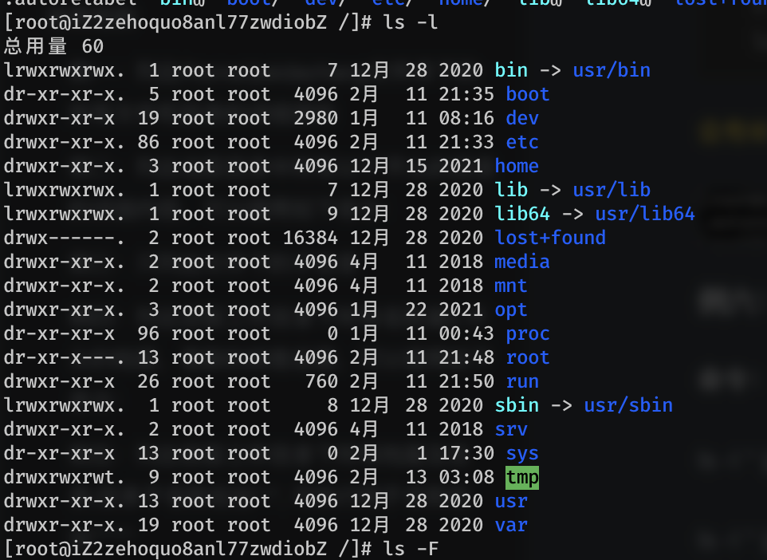

# 每天学习一个命令：ls

[https://www.cnblogs.com/peida/archive/2012/10/23/2734829.html](https://www.cnblogs.com/peida/archive/2012/10/23/2734829.html)

## 常用参数

```
-a, –all 列出目录下的所有文件，包括以 . 开头的隐含文件
-A 同-a，但不列出“.”(表示当前目录)和“..”(表示当前目录的父目录)。
-c 配合 -lt：根据 ctime 排序及显示 ctime (文件状态最后更改的时间)配合 -l：显示 ctime 但根据名称排序否则：根据 ctime 排序
-C 每栏由上至下列出项目
–color[=WHEN] 控制是否使用色彩分辨文件。WHEN 可以是'never'、'always'或'auto'其中之一
-d, –directory 将目录象文件一样显示，而不是显示其下的文件。
-D, –dired 产生适合 Emacs 的 dired 模式使用的结果
-f 对输出的文件不进行排序，-aU 选项生效，-lst 选项失效
-g 类似 -l,但不列出所有者
-G, –no-group 不列出任何有关组的信息
-h, –human-readable 以容易理解的格式列出文件大小 (例如 1K 234M 2G)
–si 类似 -h,但文件大小取 1000 的次方而不是 1024
-H, –dereference-command-line 使用命令列中的符号链接指示的真正目的地
–indicator-style=方式 指定在每个项目名称后加上指示符号<方式>：none (默认)，classify (-F)，file-type (-p)
-i, –inode 印出每个文件的 inode 号
-I, –ignore=样式 不印出任何符合 shell 万用字符<样式>的项目
-k 即 –block-size=1K,以 k 字节的形式表示文件的大小。
-l 除了文件名之外，还将文件的权限、所有者、文件大小等信息详细列出来。
-L, –dereference 当显示符号链接的文件信息时，显示符号链接所指示的对象而并非符号链接本身的信息
-m 所有项目以逗号分隔，并填满整行行宽
-o 类似 -l,显示文件的除组信息外的详细信息。  
-r, –reverse 依相反次序排列
-R, –recursive 同时列出所有子目录层
-s, –size 以块大小为单位列出所有文件的大小
-S 根据文件大小排序
–sort=WORD 以下是可选用的 WORD 和它们代表的相应选项：
extension -X status -c
none -U time -t
size -S atime -u
time -t access -u
version -v use -u
-t 以文件修改时间排序
-u 配合 -lt:显示访问时间而且依访问时间排序
配合 -l:显示访问时间但根据名称排序
否则：根据访问时间排序
-U 不进行排序;依文件系统原有的次序列出项目
-v 根据版本进行排序
-w, –width=COLS 自行指定屏幕宽度而不使用目前的数值
-x 逐行列出项目而不是逐栏列出
-X 根据扩展名排序
-1 每行只列出一个文件
–help 显示此帮助信息并离开
–version 显示版本信息并离开
```

## 常用范例

### 例一：列出/home/peidachang文件夹下的所有文件和目录的详细资料

**命令**：ls -l -R /home/peidachang

在使用 ls 命令时要注意命令的格式：在命令提示符后，首先是命令的关键字，接下来是命令参数，在命令参数之前要有一短横线“-”，所有的命令参数都有特定的作用，自己可以根据需要选用一个或者多个参数，在命令参数的后面是命令的操作对象。在以上这条命令“ ls -l -R /home/peidachang”中，“ls” 是命令关键字，“-l -R”是参数，“ /home/peidachang”是命令的操作对象。在这条命令中，使用到了两个参数，分别为“l”和“R”，当然，你也可以把他们放在一起使用，如下所示：

**命令**：ls -lR /home/peidachang

这种形式和上面的命令形式执行的结果是完全一样的。另外，如果命令的操作对象位于当前目录中，可以直接对操作对象进行操作;如果不在当前目录则需要给出操作对象的完整路径，例如上面的例子中，我的当前文件夹是peidachang文件夹，我想对home文件夹下的peidachang文件进行操作，我可以直接输入 ls -lR peidachang，也可以用 ls -lR /home/peidachang。 

### 例二：列出当前目录中所有以“t”开头的目录的详细内容，可以使用如下命令：

**命令**：ls -l t*  

可以查看当前目录下文件名以“t”开头的所有文件的信息。其实，在命令格式中，方括号内的内容都是可以省略的，对于命令ls而言，如果省略命令参数和操作对象，直接输入“ ls ”，则将会列出当前工作目录的内容清单。

### 例三：只列出文件下的子目录

**命令：**ls -F /opt/soft |grep /$ 

列出 /opt/soft 文件下面的子目录

**输出**：

```sh
[root@localhost opt]# ls -F /opt/soft |grep /$
jdk1.6.0_16/
subversion-1.6.1/
tomcat6.0.32/
```

**命令**：ls -l /opt/soft | grep "^d"

列出 /opt/soft 文件下面的子目录详细情况

**输出**：

```sh
[root@localhost opt]# ls -l /opt/soft | grep "^d"
drwxr-xr-x 10 root root   4096 09-17 18:17 jdk1.6.0_16
drwxr-xr-x 16 1016 1016   4096 10-11 03:25 subversion-1.6.1
drwxr-xr-x 9 root root   4096 2011-11-01 tomcat6.0.32
```

### 例四：列出目前工作目录下所有名称是s 开头的档案，愈新的排愈后面，可以使用如下命令：

**命令**：ls -ltr s*

**输出**：

```sh
[root@localhost opt]# ls -ltr s*
src:
总计 0


script:
总计 0


soft:
总计 350644
drwxr-xr-x 9 root root   4096 2011-11-01 tomcat6.0.32
-rwxr-xr-x 1 root root 81871260 09-17 18:15 jdk-6u16-linux-x64.bin
drwxr-xr-x 10 root root   4096 09-17 18:17 jdk1.6.0_16
-rw-r--r-- 1 root root 205831281 09-17 18:33 apache-tomcat-6.0.32.tar.gz
-rw-r--r-- 1 root root  5457684 09-21 00:23 tomcat6.0.32.tar.gz
-rw-r--r-- 1 root root  4726179 10-10 11:08 subversion-deps-1.6.1.tar.gz
-rw-r--r-- 1 root root  7501026 10-10 11:08 subversion-1.6.1.tar.gz
drwxr-xr-x 16 1016 1016   4096 10-11 03:25 subversion-1.6.1
```

### 例五：列出目前工作目录下所有档案及目录;目录于名称后加"/", 可执行档于名称后加"\*"** 

**命令**：ls -AF

**输出**：

```sh
[root@localhost opt]# ls -AF
log/ script/ soft/ src/ svndata/ web/
```

<font color=gold>会有@</font>浅蓝色-->链接文件




### 例六：计算当前目录下的文件数和目录数

**命令：**

ls -l * |grep "^-"|wc -l ---文件个数 

ls -l * |grep "^d"|wc -l  ---目录个数

### 例七: 在ls中列出文件的绝对路径

**命令**：ls | sed "s:^:`pwd`/:"

**输出**：

```sh
  [root@localhost opt]# ls | sed "s:^:`pwd`/:" 
  /opt/log
  /opt/script
  /opt/soft
  /opt/src
  /opt/svndata
  /opt/web
```

### 例九：列出当前目录下的所有文件（包括隐藏文件）的绝对路径， 对目录不做递归

**命令**：find $PWD -maxdepth 1 | xargs ls -ld

**输出**：

```sh
[root@localhost opt]# find $PWD -maxdepth 1 | xargs ls -ld
drwxr-xr-x 8 root root 4096 10-11 03:43 /opt
drwxr-xr-x 2 root root 4096 2012-03-08 /opt/log
drwxr-xr-x 2 root root 4096 2012-03-08 /opt/script
drwxr-xr-x 5 root root 4096 10-11 03:21 /opt/soft
drwxr-xr-x 2 root root 4096 2012-03-08 /opt/src
drwxr-xr-x 4 root root 4096 10-11 05:22 /opt/svndata
drwxr-xr-x 4 root root 4096 10-09 00:45 /opt/web
```


### 例十：递归列出当前目录下的所有文件（包括隐藏文件）的绝对路径

**命令**： find $PWD | xargs ls -ld 


### 例十一：指定文件时间输出格式

**命令：**

 **ls -tl --time-style=full-iso**

**输出：**

```sh
[root@localhost soft]# ls -tl --time-style=full-iso 
总计 350644
drwxr-xr-x 16 1016 1016 4096 2012-10-11 03:25:58.000000000 +0800 subversion-1.6.1
```

 **ls -ctl --time-style=long-iso**

**输出**：

```sh
[root@localhost soft]# ls -ctl --time-style=long-iso
总计 350644
drwxr-xr-x 16 1016 1016   4096 2012-10-11 03:25 subversion-1.6.1
```

## 扩展：

**1. 显示彩色目录列表**

  打开/etc/bashrc, 加入如下一行:

```bash
alias ls="ls --color"
```

  下次启动bash时就可以像在Slackware里那样显示彩色的目录列表了, 其中颜色的含义如下:

1. 蓝色-->目录
2. 绿色-->可执行文件
3. 红色-->压缩文件
4. 浅蓝色-->链接文件
5. 灰色-->其他文件