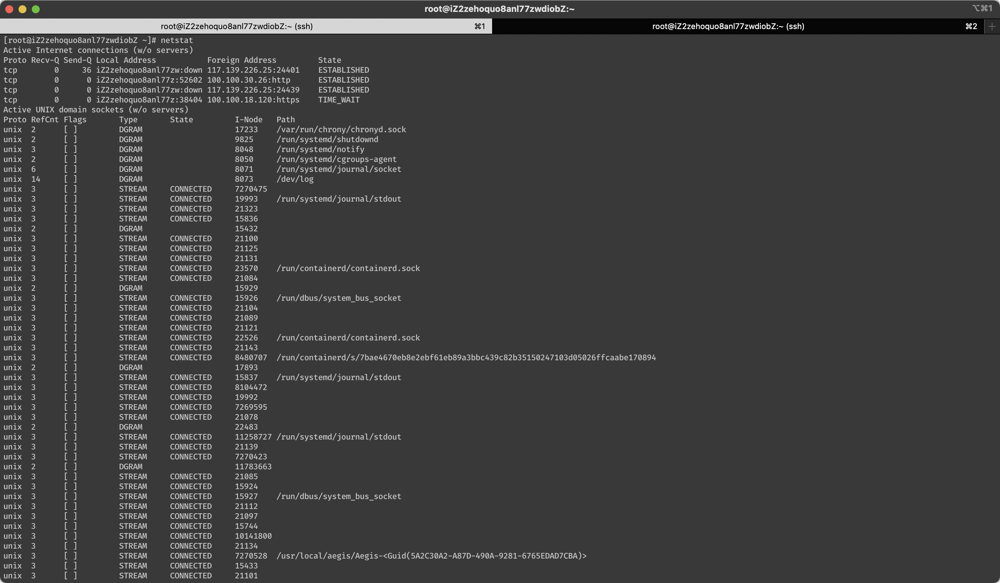
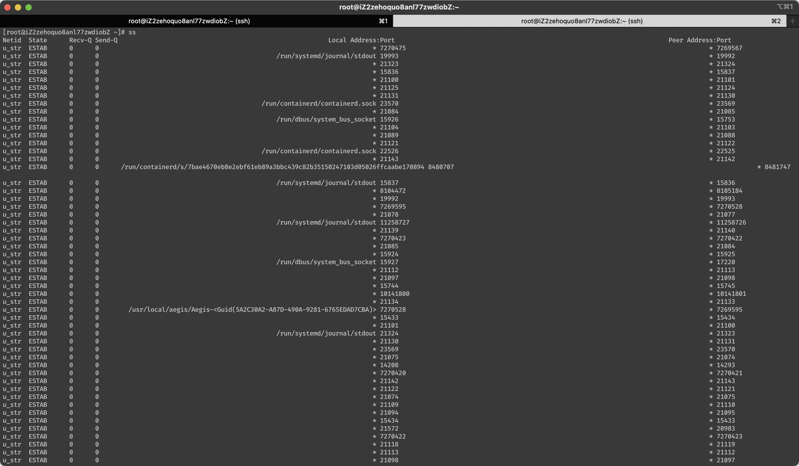
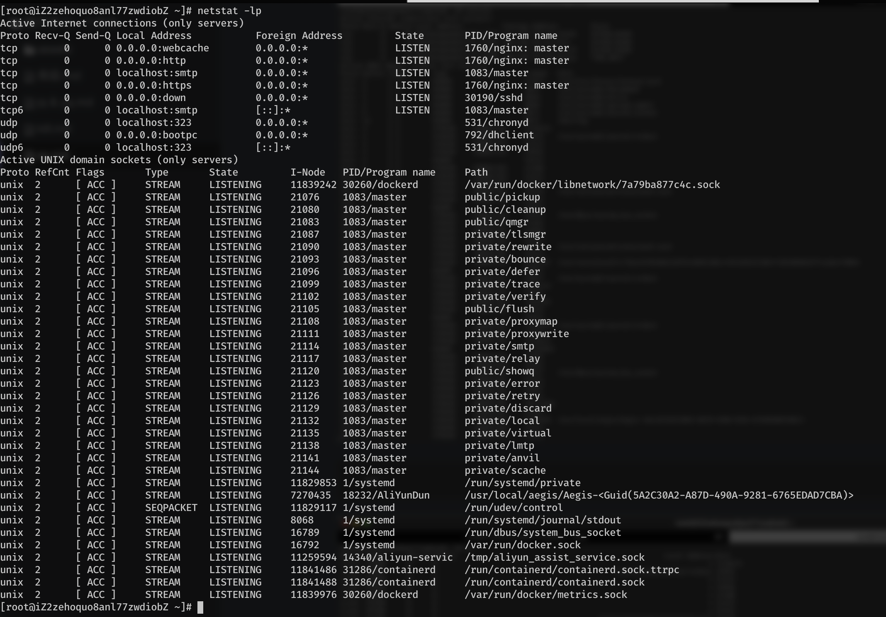
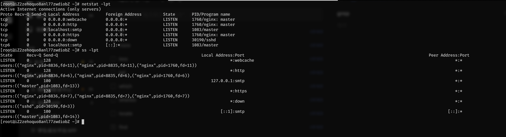

# 每天学习一个命令：ss socket 数据

[https://einverne.github.io/post/2013/01/ss-command-socket-statistics.html](https://einverne.github.io/post/2013/01/ss-command-socket-statistics.html)

ss 命令可以用来获取 socket 信息，可以用来显示和 netstat 类似的信息，但 ss 能够显示更多 TCP 和状态的信息，包括 PACKET，TCP，UDP，DCCP，RAW，和 Unix domain sockes 等等。

通过 ss ，可以获取当前机器如何和外界通信非常详细的信息，包括网络连接信息，网络协议，Linux socket 连接状态等等。通过这些信息，可以非常轻松和方便的定位网络问题。当服务器 Socket 连接数量比较大时，netstat 可能就罢工了，这个时候 ss 还是能够应付的，ss 使用了 TCP 协议栈中的 `tcp_diag`，`tcp_diag` 是一个用于分析统计的模块。

## 命令格式

```sh
ss [options] [ FILTER ]
```

当没有选项使用时，ss 会显示一组已经建立 open non-listening sockets (TCP/UNIX/UDP) 连接的 sockets。

选项

```sh
-h, --help	帮助信息
-V, --version	程序版本信息
-n, --numeric	不解析服务名称
-r, --resolve        解析主机名
-a, --all	显示所有套接字（sockets）
-l, --listening	显示监听状态的套接字（sockets）
-o, --options        显示计时器信息
-e, --extended       显示详细的套接字（sockets）信息
-m, --memory         显示套接字（socket）的内存使用情况
-p, --processes	显示使用套接字（socket）的进程
-i, --info	显示 TCP 内部信息
-s, --summary	显示套接字（socket）使用概况
-4, --ipv4           仅显示 IPv4 的套接字（sockets）
-6, --ipv6           仅显示 IPv6 的套接字（sockets）
-0, --packet	        显示 PACKET 套接字（socket）
-t, --tcp	仅显示 TCP 套接字（sockets）
-u, --udp	仅显示 UCP 套接字（sockets）
-d, --dccp	仅显示 DCCP 套接字（sockets）
-w, --raw	仅显示 RAW 套接字（sockets）
-x, --unix	仅显示 Unix 套接字（sockets）
-f, --family=FAMILY  显示 FAMILY 类型的套接字（sockets），FAMILY 可选，支持  unix, inet, inet6, link, netlink
-A, --query=QUERY, --socket=QUERY
      QUERY := {all|inet|tcp|udp|raw|unix|packet|netlink}[,QUERY]
-D, --diag=FILE     将原始 TCP 套接字（sockets）信息转储到文件
 -F, --filter=FILE   从文件中都去过滤器信息
       FILTER := [ state TCP-STATE ] [ EXPRESSION ]
```

## 使用实例

### 显示 TCP 连接，UDP 连接，Unix Sockets

```sh
ss -u -a
ss -t
ss -x
```

`netstat` 命令几乎一样

```sh
netstat -u -a
netstat -t
netstat -x
```

### 显示摘要信息

```sh
ss -s
```

列出当前的 established, closed, orphaned and waiting TCP sockets<font color=gold>我在服务器上试的不是这样</font>


### 查看进程使用的 socket

```sh
ss -lp
```

说明：

- `-l` 参数显示当前正在监听的 socket

在结果中可以过滤出端口占用的进程

```sh
ss -lp | grep 80
```


## 过滤 TCP 状态

ss 命令能够通过 TCP states 来过滤，状态列表

- established
- syn-sent
- syn-recv
- fin-wait-1
- fin-wait-2
- time-wait
- closed
- close-wait
- last-ack
- listening
- closing

`ss` 命令能够识别的其他状态

- all (all of the above states)
- connected (all the states with the exception of listen and closed)<font color=gold>除了listening、closed</font>
- synchronized (all of the connected states with the exception of syn-sent)<font color=gold>除了syn-sent</font>
- bucket (states which are maintained as minisockets, for example time-wait and syn-recv)
- big (Opposite to bucket state)

对于 tcp ipv4

```
ss -4 state FILTER
ss -4 state listening
```

对于 ipv6

```
ss -6 state FILTER
```

显示所有状态为 established 的 SMTP 连接

```
ss -o state established '( dport = :smtp or sport = :smtp )'
```

显示所有状态为 Established 的 HTTP 连接

```
ss -o state established '( dport = :http or sport = :http )'
```

这里一定要注意引号中的写法，该有的空格一定要有。

## 显示特定目的地的连接

ss 另外一个非常便利的功能就是可以查看特定 IP 地址的连接情况，比如想要查看多少连接从 IP 192.168.1.130 连接到本机，则可以

```
ss dst 192.168.1.130
```

对于本地连接同理

```
ss src 192.168.1.200
ss src 192.168.1.200:80
ss src 192.168.1.200:http
ss src 192.168.1.200:smtp
```

## reference

- http://www.cnblogs.com/peida/archive/2013/03/11/2953420.html


## 实践

Mac os 上没有 `ss`，只有 `netstat`

```sh
netstat
```



```sh
ss
```



### netstat 字段

- Proto
- Recv-Q
- Send-Q
- Local Address
- Foreign Address
- State

### ss 字段

- State
- Recv-Q
- Send-Q
- Local Address:Port
- Peer Address:Port


### 显示摘要信息

```sh
[root@iZ2zehoquo8anl77zwdiobZ ~]# ss -s
Total: 241 (kernel 293)
TCP:   20 (estab 5, closed 8, orphaned 0, synrecv 0, timewait 0/0), ports 0

Transport Total     IP        IPv6
*	  293       -         -
RAW	  0         0         0
UDP	  3         2         1
TCP	  12        10        2
INET	  15        12        3
FRAG	  0         0         0
```

其实`netstat`命令更加详细

```sh
[root@iZ2zehoquo8anl77zwdiobZ ~]# netstat -s
Ip:
    12312836 total packets received
    6511460 forwarded
    0 incoming packets discarded
    5801358 incoming packets delivered
    11718788 requests sent out
    133 dropped because of missing route
Icmp:
    100736 ICMP messages received
    57 input ICMP message failed.
    ICMP input histogram:
        destination unreachable: 269
        timeout in transit: 145
        echo requests: 100321
        timestamp request: 1
    100648 ICMP messages sent
    0 ICMP messages failed
    ICMP output histogram:
        destination unreachable: 326
        echo replies: 100321
        timestamp replies: 1
IcmpMsg:
        InType3: 269
        InType8: 100321
        InType11: 145
        InType13: 1
        OutType0: 100321
        OutType3: 326
        OutType14: 1
Tcp:
    58694 active connections openings
    229281 passive connection openings
    206137 failed connection attempts
    4193 connection resets received
    5 connections established
    5569422 segments received
    5001860 segments send out
    85275 segments retransmited
    294 bad segments received.
    403163 resets sent
    InCsumErrors: 293
Udp:
    129901 packets received
    248 packets to unknown port received.
    0 packet receive errors
    149190 packets sent
    0 receive buffer errors
    0 send buffer errors
UdpLite:
TcpExt:
    389445 invalid SYN cookies received
    206098 resets received for embryonic SYN_RECV sockets
    42 packets pruned from receive queue because of socket buffer overrun
    62701 TCP sockets finished time wait in fast timer
    409 packets rejects in established connections because of timestamp
    568155 delayed acks sent
    38 delayed acks further delayed because of locked socket
    Quick ack mode was activated 7142 times
    160 SYNs to LISTEN sockets dropped
    25629 packets directly queued to recvmsg prequeue.
    457717 bytes directly in process context from backlog
    15608145 bytes directly received in process context from prequeue
    1036820 packet headers predicted
    2090 packets header predicted and directly queued to user
    894121 acknowledgments not containing data payload received
    884080 predicted acknowledgments
    21 times recovered from packet loss due to fast retransmit
    3174 times recovered from packet loss by selective acknowledgements
    Detected reordering 64 times using FACK
    Detected reordering 103 times using SACK
    Detected reordering 230 times using time stamp
    106 congestion windows fully recovered without slow start
    198 congestion windows partially recovered using Hoe heuristic
    132 congestion windows recovered without slow start by DSACK
    5076 congestion windows recovered without slow start after partial ack
    TCPLostRetransmit: 637
    21 timeouts after reno fast retransmit
    1022 timeouts after SACK recovery
    1269 timeouts in loss state
    9180 fast retransmits
    1041 forward retransmits
    5760 retransmits in slow start
    17909 other TCP timeouts
    TCPLossProbes: 43495
    TCPLossProbeRecovery: 20579
    4 classic Reno fast retransmits failed
    1123 SACK retransmits failed
    7266 DSACKs sent for old packets
    114 DSACKs sent for out of order packets
    20777 DSACKs received
    18 DSACKs for out of order packets received
    1713 connections reset due to unexpected data
    581 connections reset due to early user close
    693 connections aborted due to timeout
    TCPDSACKIgnoredOld: 18
    TCPDSACKIgnoredNoUndo: 12726
    TCPSpuriousRTOs: 272
    TCPSackShifted: 727
    TCPSackMerged: 5052
    TCPSackShiftFallback: 16522
    TCPBacklogDrop: 2
    TCPRetransFail: 1
    TCPRcvCoalesce: 323761
    TCPOFOQueue: 112764
    TCPOFOMerge: 135
    TCPChallengeACK: 149
    TCPSYNChallenge: 1
    TCPSpuriousRtxHostQueues: 49
    TCPAutoCorking: 3
    TCPFromZeroWindowAdv: 1
    TCPToZeroWindowAdv: 1
    TCPWantZeroWindowAdv: 343
    TCPSynRetrans: 11229
    TCPOrigDataSent: 2218801
    TCPHystartTrainDetect: 2
    TCPHystartTrainCwnd: 96
    TCPHystartDelayDetect: 43
    TCPHystartDelayCwnd: 4574
    TCPACKSkippedSynRecv: 20
    TCPACKSkippedPAWS: 53
    TCPACKSkippedSeq: 199
    TCPACKSkippedTimeWait: 4
    TCPACKSkippedChallenge: 2
IpExt:
    InNoRoutes: 18
    InOctets: 2189691274
    OutOctets: 2737409457
    InNoECTPkts: 12647267
    InECT0Pkts: 2
```

### 查看进程使用的 socket

```
netstat -lp
```



```sh
netstat -lpt
ss -lpt # 可以看到 pid
```


