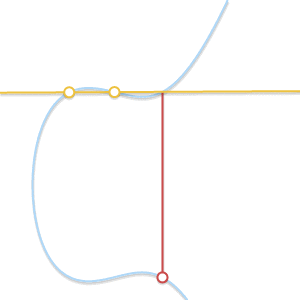

# ECC

## 椭圆曲线

由于 ECC 算法运算过程中需要使用 WMF 曲线的切线，因此为了使 WNF 曲线没有奇异点，即处处光滑可导，需要满足其判别式不为零，即：

$$
y^2=x^3+ax+bx
$$
$$
\Delta=4a^3+27b^2\neq0
$$

同时，定义射影平面上的无穷远点，记为 0.无穷远点是所有曲线在无穷远处的交点，也被称为理想点。因此，下面的论述当中所采用的完整的 WNF 椭圆曲线公式为：

$$
E=\{(x,y)\in\mathbb{R}^2|y^2=x^3+ax+b,\Delta=4a^3+27b^2\neq0\}\cap\{0\}
$$

## 群论

- 封闭性
- 结合律
- 单位元
- 逆元

不一定满足交换律，满足的是交换群（阿贝尔群），不满足是非交换群（非阿贝尔群）

## 椭圆曲线的群法则

可以基于特定椭圆曲线定义一个群

- 群的元素是椭圆曲线上的点的集合

- 单位元是无穷远点，记为 0

- 逆元是 x 轴对称点

- 二元操作规则定义：

  - 我们规定：曲线上共线三点和为零，P+Q+R=0，故 P+Q=-R
  - 没有要求顺序，故 P+(Q+R)=Q+(P+R)=R+(P+Q)=...=0，即二元操作符是同时满足结合律和交换律，是一个阿贝尔群

  

  ## 几何加法

  

  - 边界条件：
    - P+0=P 0+Q=Q
    - P+(-P)=0
    - P=Q （切线相交于 R) P+P=-R
    - P!=Q 且找不到第三个点，P+Q=-P（切于 P）或者-Q（切于 Q）

## 代数加法

