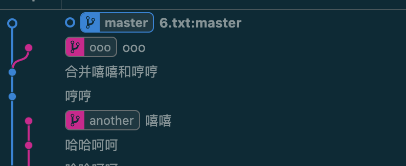
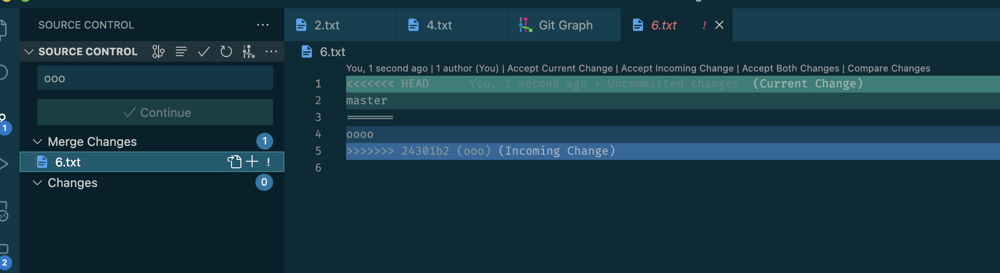
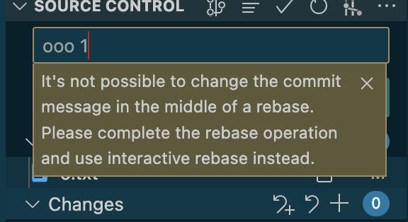
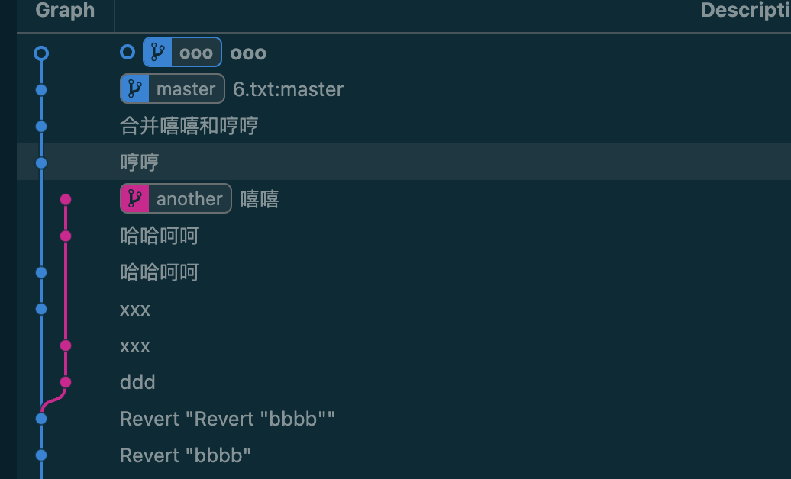

## 处理前



```sh
git checkout ooo  
git rebase master 
Auto-merging 6.txt
CONFLICT (add/add): Merge conflict in 6.txt
error: could not apply 24301b2... ooo
hint: Resolve all conflicts manually, mark them as resolved with
hint: "git add/rm <conflicted_files>", then run "git rebase --continue".
hint: You can instead skip this commit: run "git rebase --skip".
hint: To abort and get back to the state before "git rebase", run "git rebase --abort".
Could not apply 24301b2... ooo
```



如果有冲突，需要处理冲突



而且不能修改commit

## 处理后

