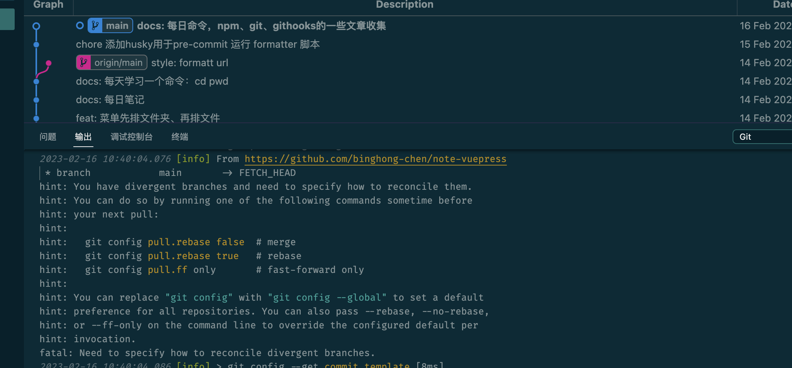
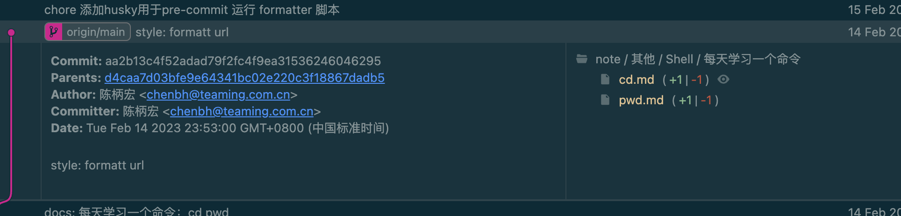
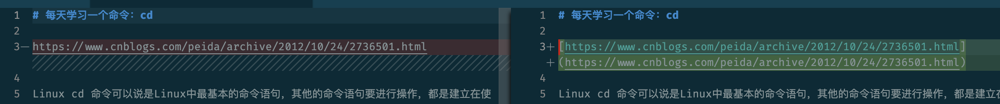
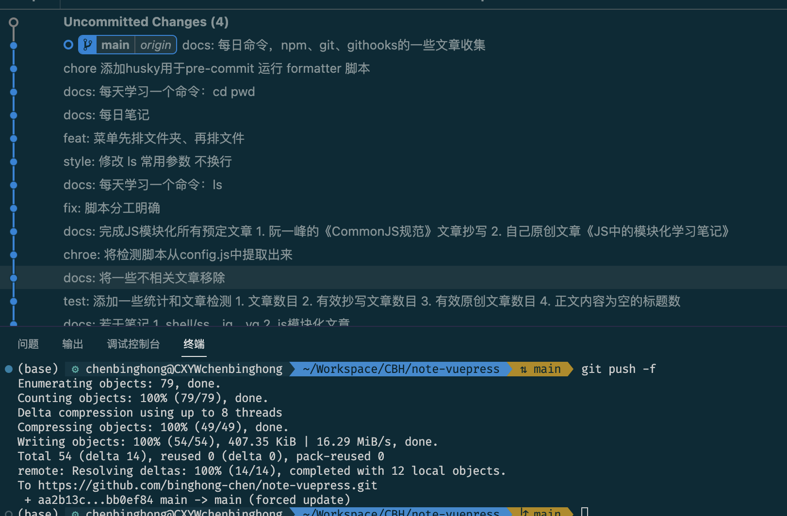

# 博客项目无法同步到远程

## 问题说明



```sh
git push          
To https://github.com/binghong-chen/note-vuepress.git
 ! [rejected]        main -> main (non-fast-forward)
error: failed to push some refs to 'https://github.com/binghong-chen/note-vuepress.git'
hint: Updates were rejected because the tip of your current branch is behind
hint: its remote counterpart. Integrate the remote changes (e.g.
hint: 'git pull ...') before pushing again.
hint: See the 'Note about fast-forwards' in 'git push --help' for details.
```

```sh
git pull
hint: You have divergent branches and need to specify how to reconcile them.
hint: You can do so by running one of the following commands sometime before
hint: your next pull:
hint: 
hint:   git config pull.rebase false  # merge
hint:   git config pull.rebase true   # rebase
hint:   git config pull.ff only       # fast-forward only
hint: 
hint: You can replace "git config" with "git config --global" to set a default
hint: preference for all repositories. You can also pass --rebase, --no-rebase,
hint: or --ff-only on the command line to override the configured default per
hint: invocation.
fatal: Need to specify how to reconcile divergent branches.
```


## 分析原因





**极有可能：**

git commit --amend之后，本地仓库和远程仓库的log版本历史不一致了，此时想要git push，也会报这个错。
个人理解： 使用该命令后，虽然所有提交记录的内容没变化，但最后一次提交的commit id变化了。git不允许push改变提交历史的操作，可以新增或者减少commit但不能改变原来的commit历史，因此会报冲突。

原文链接：https://blog.csdn.net/weixin_42310154/article/details/118676936

**还有可能：**

是我没有用husky pre-commit以前，手动调用了 `npm run formatter` 格式化url，然后提交到了远程仓库；

然后我测试 husky 那天，反复的commit 和回退，不小心回退多了。

然后在本地长出了新的分支（没有及时push到远程仓库），导致本地和远程的git log 分叉了。

- [ ] 测试这两种情况，会不会复现

## 解决

远端的不要了，因为只是url格式化，本地新的分支都已经处理了。

使用：

```sh
git push -u origin main -f
```

[git中Updates were rejected because the tip of your current branch is behind解决方案](https://blog.csdn.net/IT_SoftEngineer/article/details/107133313) 中说：

> 这句话执行的后果就是在远程仓库中进行的相关修改会被删除，使远程仓库回到你本地仓库未修改之前的那个版本，
>    然后上传你基于本地仓库的修改。这如果在企业开发中就会让别的程序员的这些天的开发付之东流，一切回到解放前。

我这里可以直接强制push



## 参考资料

[git中Updates were rejected because the tip of your current branch is behind解决方案](https://blog.csdn.net/IT_SoftEngineer/article/details/107133313)

如果要保留远程的修改，使用下面相关的命令

```sh
git pull
hint: You have divergent branches and need to specify how to reconcile them.
hint: You can do so by running one of the following commands sometime before
hint: your next pull:
hint: 
hint:   git config pull.rebase false  # merge
hint:   git config pull.rebase true   # rebase
hint:   git config pull.ff only       # fast-forward only
hint: 
hint: You can replace "git config" with "git config --global" to set a default
hint: preference for all repositories. You can also pass --rebase, --no-rebase,
hint: or --ff-only on the command line to override the configured default per
hint: invocation.
fatal: Need to specify how to reconcile divergent branches.
```

TODO：研究下这三个命令的区别

```sh
git config pull.rebase false  # merge
git config pull.rebase true   # rebase
git config pull.ff only       # fast-forward only
```

