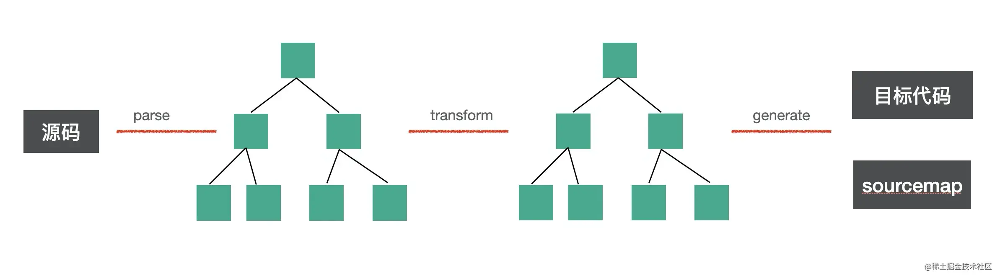
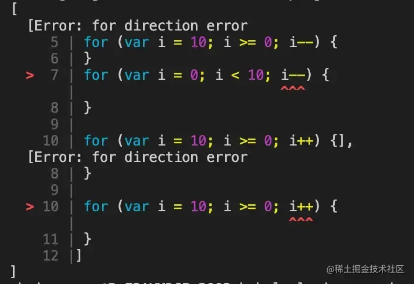
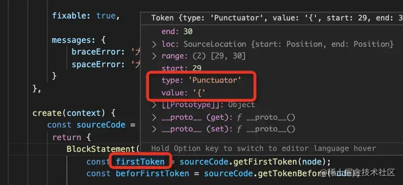
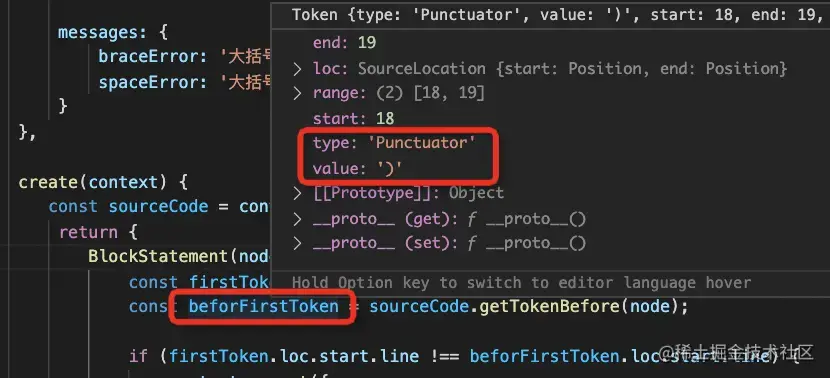

# babel

https://juejin.cn/post/7164007268952834084

babel插件

babel是一个js编译器，把高版本的语法代码，转换成低版本代码，并会自动引入 polyfill

三个步骤：parse、transform、generate

parse：代码从字符串转换为AST

transform：对AST各种增删改

generate：AST转换为目标代码并声称sourcemap

所有的转换都是针对AST的转换，transform阶段

babel把这些AST转换逻辑组织成一个个plugin

plugin比较多，又提供了preset（plugin的集合）

只需要preset-xx即可，不用关心具体用了啥plugin

常用的: @babel/preset-env，只要指定targets运行环境，preset-env内部会自动引入相应的plugin来做AST转换

我们可以自己写plugin来做转换

除了代码转换，还可以做静态分析，通过分析AST来发现一些问题，并在编译期间抛出错误

静态分析：ESLint和TypeScript Compiler，也是做Js的静态分析

可以在编译期间发现错误。

ESLint 逻辑错误、格式错误

TSC：类型错误

都是AST，Babel能不能实现ESLint和TSC的功能呢？

尝试用Babel插件实现Lint功能：

发现ESLint里逻辑错误的rule都很容易实现，因为都是对AST分析

比如：for 迭代方向错误，就是看条件是<还是>,对应的是++还是--，很容易分析

但是格式错误没办法，因为Babel插件中拿不到AST关联的token信息

ESLint插件如何检查格式错误？

ESLint提供了根据AST节点拿到它token信息的api，比如块语句可以拿到 { 的 token 信息，也就是所在行列号等：

也可以拿到 { 的上一个 token 也就是 ) 的 token 信息，包含了行列号：

