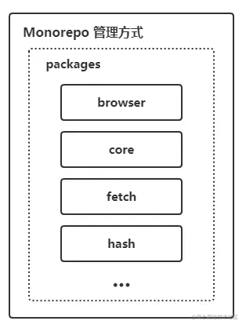

# 初识
2023-04-17 掘金看到一个开源项目：[heimdallr-sdk](https://github.com/LuciferHuang/heimdallr-sdk)

正好那天看知识星球也提到了 monorepo

[掘金文章《我开源了一款轻量级前端监控sdk》](https://juejin.cn/post/7210970258369708092) 提到了为什么要使用 monorepo

为了能统一工作流，降低项目基建成本，提高团队协作性；项目采用目前主流的 `monorepo` 方式进行代码管理，即把多个 packages 放在同一仓库中，插件也将作为独立的子包放在 packages 下，统一编译、调试、发布

