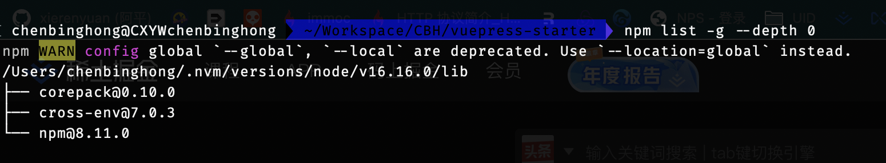

# npm查看全局安装过的包

[https://www.jianshu.com/p/a741edd16436](https://www.jianshu.com/p/a741edd16436)

```sh
npm list -g --depth 0
```



解释一下：

| 命令      | 解释             |
| --------- | ---------------- |
| npm list  | 显示安装过的包   |
| -g        | 指全局安装过的包 |
| --depth 0 | 限制输出模块层级 |