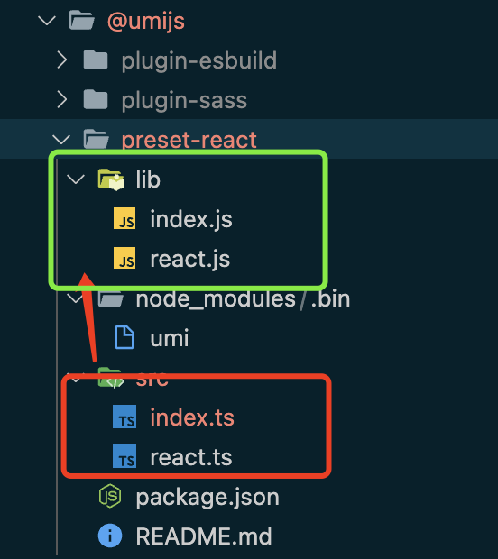
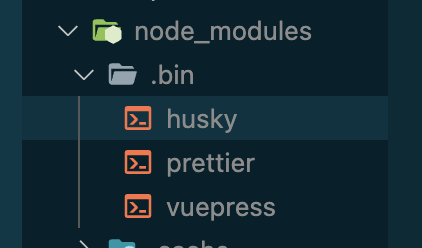
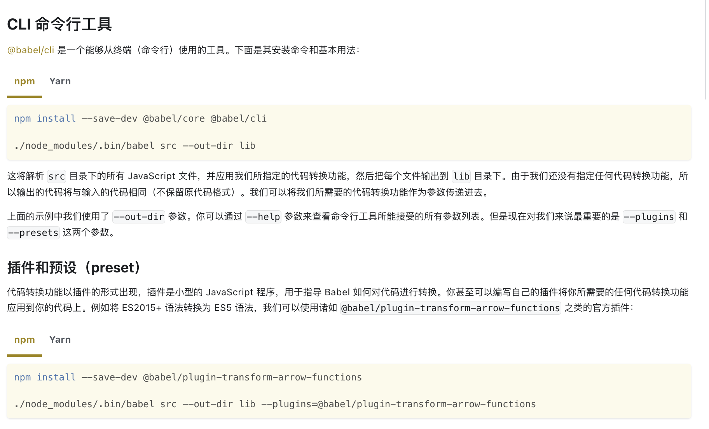

## lib目录

lib一般是src经过babel转换后的代码

## node_modules/.bin目录

node_modules/.bin下是什么呢？

[https://juejin.cn/post/7013294745988366350](https://juejin.cn/post/7013294745988366350)

[https://stackoverflow.com/questions/25306168/what-is-the-purpose-of-bin-folder-in-node-modules](https://stackoverflow.com/questions/25306168/what-is-the-purpose-of-bin-folder-in-node-modules)

[https://www.zhihu.com/question/333901187](https://www.zhihu.com/question/333901187)