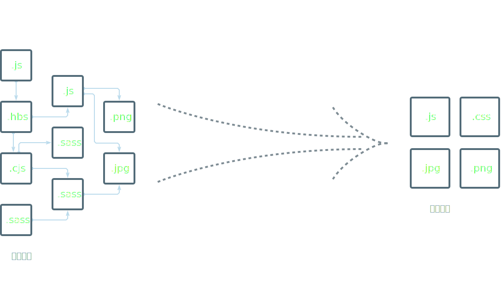

# 首页
[https://webpack.docschina.org](https://webpack.docschina.org)



可以看到，webpack是一个将模块依赖打包成静态资源的工具。

## 编写代码

**src/index.js**

```js
import bar from './bar.js';

bar();
```

**src/bar.js**

```js
export default function bar() {
  //
}
```

## 构建

**[不使用配置](https://youtu.be/3Nv9muOkb6k?t=21293)** 或提供自定义的 **webpack.config.js**

```js
const path = require('path');

module.exports = {
  entry: './src/index.js',
  output: {
    path: path.resolve(__dirname, 'dist'),
    filename: 'bundle.js',
  },
};
```

**page.html**

```html
<!DOCTYPE html>
<html>
  <head>
    <meta charset="utf-8" />
    ...
  </head>
  <body>
    ...
    <script src="dist/bundle.js"></script>
  </body>
</html>
```

