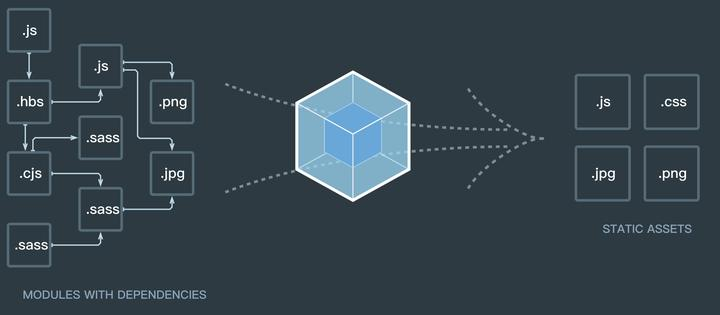
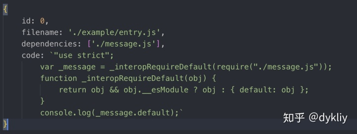
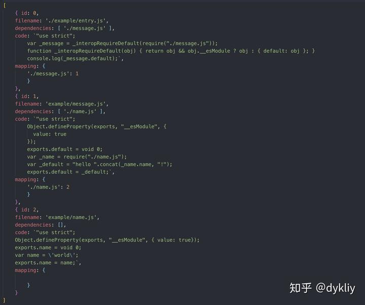
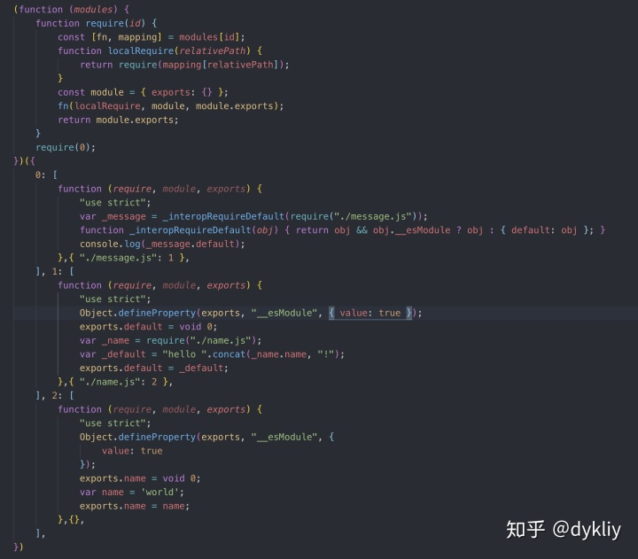

https://zhuanlan.zhihu.com/p/58151131

## 什么是webpack

它是一个模块打包器，也可以引用官网的一幅图解释，我们可以看到webpack，可以分析各个模块的依赖关系，最终打包成我们常见的静态文件，.js、.css、.jpg、.png。今天我们先不弄那么复杂，我们就介绍webpack是怎么分析ES6的模块依赖，怎么把ES6的代码转成ES5的。



## 实现

由于ES6转ES5需要用到babel，所以要用到以下插件

```sh
npm install @babel/core @babel/parser @babel/traverse @babel/preset-env --save-dev
```

## 需要的文件

使用webpack肯定少不了源文件，我们会涉及三个需要打包的js文件（`entry.js`、`message.js`、`name.js`）

```js
// entry.js
import message from './message.js'
console.log(message);

// message.js
import { name } from './name.js'
export default `hello ${name}`

// name.js
export const name = 'world'

// bundler.js
// 读取文件信息，并获取当前js文件的依赖关系
function createAsset(filename) {/*代码略*/}
// 从入口开始分析所有依赖项，形成依赖图，采用广度优先遍历
function createGraph(entry) {/*代码略*/}
// 根据生成的依赖关系图，生成浏览器可执行文件
function bundle(graph) {/*代码略*/}
```

`entry.js`就是我们的入口文件，文件的依赖关系是，`entry.js`依赖`message.js`，`message.js`依赖`name.js`。

`bundle.js`是我们简易版的webpack

目录结构

```sh
- example
	- entry.js
	- message.js
	- name.js
- bundle.js
```

## 如何分析依赖

webpack分析依赖是从一个入口文件开始分析的，当我们把一个入口文件的路径传入，webpack就会通过这个文件的路径读取文件的信息（读取到的本质其实是字符串），然后把读取到的信息转化成AST（抽象语法树），简单点来说，就是把一个js文件里面的内容存到某种数据结构里，里面包括了各种信息，其中就有**当前模块依赖了哪些模块**。我们暂时把通过文件路径能返回文件信息的这个函数叫`createAsset`。

### createAsset 返回什么

第一步我们肯定需要从`entry.js`开始分析，于是就有了如下的代码，我们先不关心`createAsset`具体代码是怎么实现的，具体代码我们会放到最后。

```js
createAsset('./example/entry.js')
```

当执行这句代码，`createAsset`会返回下面的数据结构，这里包括了**模块的id**、**文件路径**、**依赖数组**（`entry.js`依赖了`message.js`，所以会返回依赖的文件名），**code**（这个是`entry.js` ES6转ES5的代码）



通过`createAsset`我们成功拿到了`entry.js`的依赖，就是`dependencies`数组。

### createGraph 返回什么，如何找下一个依赖

我们通过上面可以拿到`entry.js`依赖的模块，于是我们就可以接着去遍历`dependencies`数组，循环调用`createAsset`这样就可以得到全部模块相互依赖的信息。想得到全部依赖信息需要调用`createGraph`这个函数，它会进行广度遍历，最终返回下面的数据



我们可以看到返回的数据，字段之前已经解释了，除了`mapping`（这个字段是把当前模块依赖的**文件名称**和模块的id做一个映射，目的是为了方便查找模块。

### bundle 返回什么 && 最后步骤

现在我们已经能拿到每个模块之间的依赖关系，我们再调用`bundle`函数，其实`bundle`函数就是返回我们构造的字符串，拿到字符串，我们把字符串导出成`bundle.js`。输出如下图



## 源码

[点击查看源码](https://github.com/romanticu/simple_webpack/blob/master/bundler.js)

```js
const fs = require("fs");
const path = require("path");
const babylon = require("@babel/parser");
const traverse = require("@babel/traverse").default;
const babel = require("@babel/core");


let ID = 0;
//读取文件信息，并获得当前js文件的依赖关系
function createAsset(filename) {
  //获取文件，返回值是字符串
  const content = fs.readFileSync(filename, "utf-8");

  //讲字符串为ast（抽象语法树， 这个是编译原理的知识，说得简单一点就是，可以把js文件里的代码抽象成一个对象，代码的信息会存在对象中）
  //babylon 这个工具是是负责解析字符串并生产ast。
  const ast = babylon.parse(content, {
    sourceType: "module"
  });

  //用来存储 文件所依赖的模块，简单来说就是，当前js文件 import 了哪些文件，都会保存在这个数组里
  const dependencies = [];

  //遍历当前ast（抽象语法树）
  traverse(ast, {
    //找到有 import语法 的对应节点
    ImportDeclaration: ({ node }) => {
      //把当前依赖的模块加入到数组中，其实这存的是字符串，
      //例如 如果当前js文件 有一句 import message from './message.js'， 
      //'./message.js' === node.source.value
      dependencies.push(node.source.value);
    }
  });

  //模块的id 从0开始， 相当一个js文件 可以看成一个模块
  const id = ID++;

  //这边主要把ES6 的代码转成 ES5
  const { code } = babel.transformFromAstSync(ast, null, {
    presets: ["@babel/preset-env"]
  });

  return {
    id,
    filename,
    dependencies,
    code
  };
}

//从入口开始分析所有依赖项，形成依赖图，采用广度遍历
function createGraph(entry) {
  const mainAsset = createAsset(entry);
    
  //既然要广度遍历肯定要有一个队列，第一个元素肯定是 从 "./example/entry.js" 返回的信息
  const queue = [mainAsset];
  
  
  for (const asset of queue) {
    const dirname = path.dirname(asset.filename);

    //新增一个属性来保存子依赖项的数据
    //保存类似 这样的数据结构 --->  {"./message.js" : 1}
    asset.mapping = {};

    asset.dependencies.forEach(relativePath => {
      const absolutePath = path.join(dirname, relativePath);
        
      //获得子依赖（子模块）的依赖项、代码、模块id，文件名
      const child = createAsset(absolutePath);

      //给子依赖项赋值，
      asset.mapping[relativePath] = child.id;

      //将子依赖也加入队列中，广度遍历
      queue.push(child);
    });
  }
  return queue;
}

//根据生成的依赖关系图，生成对应环境能执行的代码，目前是生产浏览器可以执行的
function bundle(graph) {
  let modules = "";

  //循环依赖关系，并把每个模块中的代码存在function作用域里
  graph.forEach(mod => {
    modules += `${mod.id}:[
      function (require, module, exports){
        ${mod.code}
      },
      ${JSON.stringify(mod.mapping)},
    ],`;
  });

  //require, module, exports 是 cjs的标准不能再浏览器中直接使用，所以这里模拟cjs模块加载，执行，导出操作。
  const result = `
    (function(modules){
      //创建require函数， 它接受一个模块ID（这个模块id是数字0，1，2） ，它会在我们上面定义 modules 中找到对应是模块.
      function require(id){
        const [fn, mapping] = modules[id];
        function localRequire(relativePath){
          //根据模块的路径在mapping中找到对应的模块id
          return require(mapping[relativePath]);
        }
        const module = {exports:{}};
        //执行每个模块的代码。
        fn(localRequire,module,module.exports);
        return module.exports;
      }
      //执行入口文件，
      require(0);
    })({${modules}})
  `;

  return result;
}

const graph = createGraph("./example/entry.js");
const ret = bundle(graph);

// 打包生成文件
fs.writeFileSync("./bundle.js", ret);
```

## 最后

文章可能有不足的地方，请大家见谅，如果有什么疑问可以下方留言讨论。

如果大家对文字描述还是不太清楚，建议看我下方提供的视频，我就是从视频中学的，这个是在youtube上的视频，大家懂的，有条件的还是建议看一下。

[官方40分钟教你写webpack](https://link.zhihu.com/?target=https%3A//www.youtube.com/watch%3Fv%3DGc9-7PBqOC8%26list%3DLLHK1mTHpwrUeYgF5gu-Kd4g)