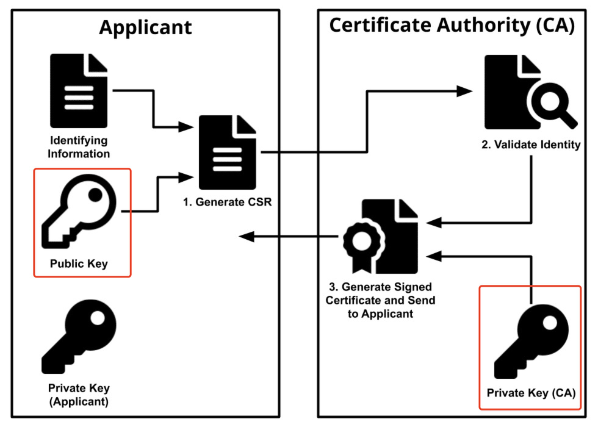
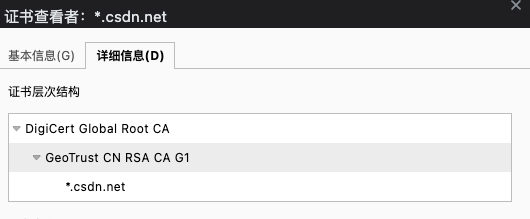
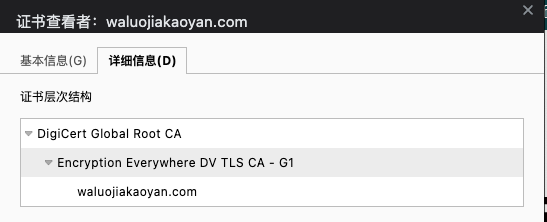
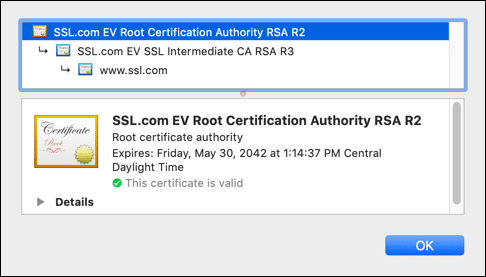
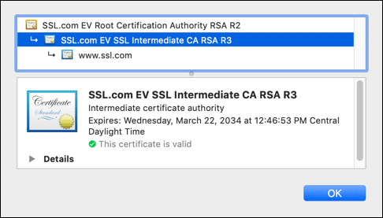
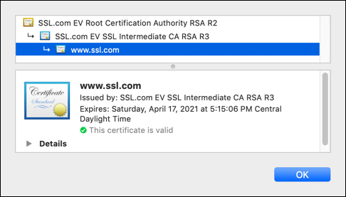

# CA

https://www.ssl.com/zh-CN/%E5%B8%B8%E8%A7%81%E9%97%AE%E9%A2%98/%E4%BB%80%E4%B9%88%E6%98%AF%E8%AF%81%E4%B9%A6%E9%A2%81%E5%8F%91%E6%9C%BA%E6%9E%84/

## 什么是证书颁发机构（CA）？

CSR: Certificate Sign Request 证书签名请求

申请人私钥 是安全的，永远不要向CA（或其他任何人）展示。

### 根证书认证机构

### 中级证书认证机构

## 什么是信任链？

In SSL/TLS, S/MIME, 代码签名，以及其他应用X.509证书，证书层次结构用于验证证书颁发者的有效性。此层次结构层为信任链。在信任链中，证书由层次结构中较高级别的证书颁发和签名。

A信任链包括几个部分：

1. 信任锚，证书原始证书颁发机构（CA）。
2. 至少一个中级证书，用作CA和最终实体证书之间的“绝缘”。
3. 最终实体证书，用于验证诸如网站，公司或个人之类的实体的身份。

## 什么是信任锚？

根认证中心（CA）作为*信任锚*在信任链中。此信任锚的有效性对于整个链的完整性至关重要。

如果CA是公共信任（例如SSL.com），主要软件公司会将根CA证书包含在其浏览器和操作系统软件中。这种包含确保了信任链中的证书可以返回到CA的任何根证书，并且该软件将被信任。

## 什么是中间证书？

根CA（信任锚）可以签发中级证书。中间证书提供了一种灵活的结构，可将信任锚的有效性授予链中其他中间和最终实体证书。

从次意义上说：中间证书起着管理功能，每个中间体都可以用来授予根CA对其他组织的信任；

还提供了最终实体证书和根CA之间的缓冲区，以保护私有根密钥不受损害。

对于公共信任的CA（包括SSL.com），CA/Browser论坛的基准要求实际上禁止直接从根CA颁发最终实体证书，该证书必需安全地保持脱机状态。这意味着任何公共信任证书的信任链中至少包含一个中间证书。

## 什么是最终实体证书？

*最终实体证书*是信任链中最后一环。授予对象（网站、公司、政府或个人）

