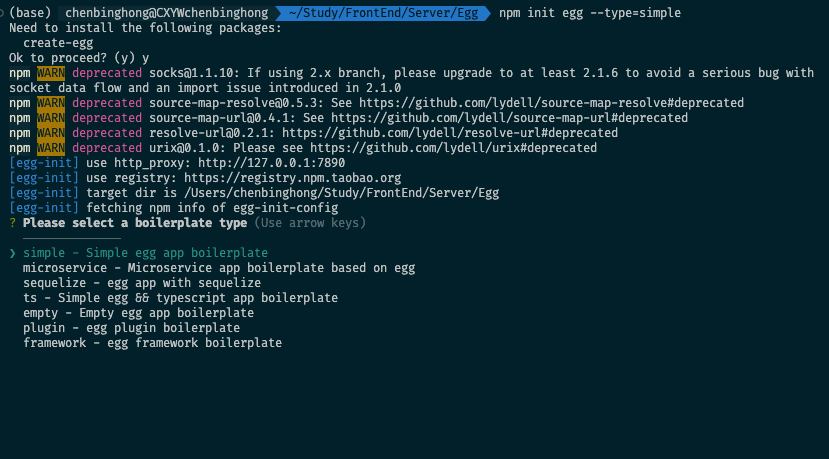
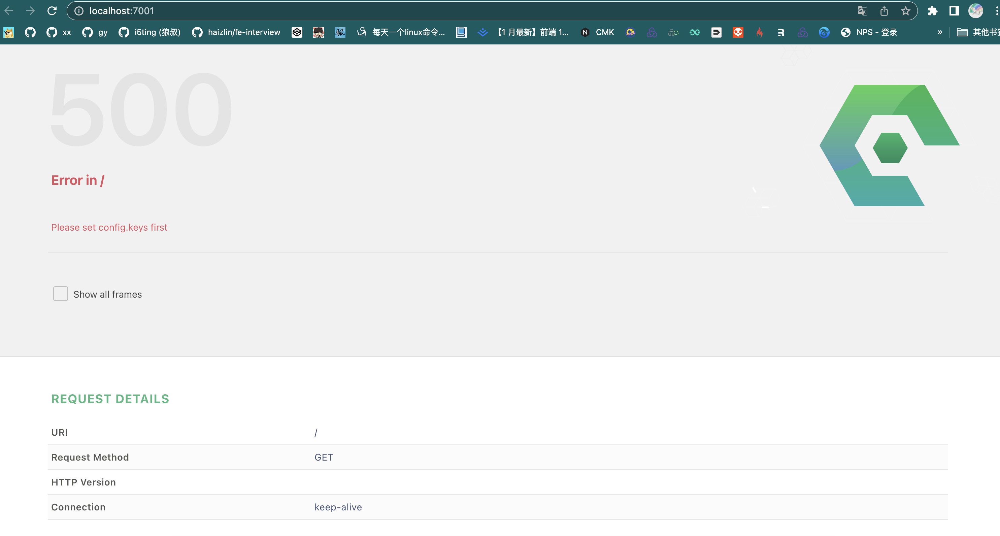

# 新建

```sh
npm init egg --type=simple
Need to install the following packages:
  create-egg
Ok to proceed? (y) y
npm WARN deprecated socks@1.1.10: If using 2.x branch, please upgrade to at least 2.1.6 to avoid a serious bug with socket data flow and an import issue introduced in 2.1.0
npm WARN deprecated source-map-resolve@0.5.3: See https://github.com/lydell/source-map-resolve#deprecated
npm WARN deprecated source-map-url@0.4.1: See https://github.com/lydell/source-map-url#deprecated
npm WARN deprecated resolve-url@0.2.1: https://github.com/lydell/resolve-url#deprecated
npm WARN deprecated urix@0.1.0: Please see https://github.com/lydell/urix#deprecated
[egg-init] use http_proxy: http://127.0.0.1:7890
[egg-init] use registry: https://registry.npm.taobao.org
[egg-init] target dir is /Users/chenbinghong/Study/FrontEnd/Server/Egg
[egg-init] fetching npm info of egg-init-config
? Please select a boilerplate type (Use arrow keys)
  ──────────────
❯ simple - Simple egg app boilerplate 
  microservice - Microservice app boilerplate based on egg 
  sequelize - egg app with sequelize 
  ts - Simple egg && typescript app boilerplate 
  empty - Empty egg app boilerplate 
  plugin - egg plugin boilerplate 
  framework - egg framework boilerplate 
```



```sh
npm init egg --type=simple
[egg-init] use http_proxy: http://127.0.0.1:7890
[egg-init] use registry: https://registry.npm.taobao.org
[egg-init] target dir is /Users/chenbinghong/Study/FrontEnd/Server/Egg
[egg-init] fetching npm info of egg-init-config
? Please select a boilerplate type simple - Simple egg app boilerplate
[egg-init] use boilerplate: simple(egg-boilerplate-simple)
[egg-init] fetching npm info of egg-boilerplate-simple
Error: read ECONNRESET
    at TLSWrap.onStreamRead (node:internal/stream_base_commons:217:20)
npm ERR! code 1
npm ERR! path /Users/chenbinghong/Study/FrontEnd/Server/Egg
npm ERR! command failed
npm ERR! command sh -c create-egg

npm ERR! A complete log of this run can be found in:
npm ERR!     /Users/chenbinghong/.npm/_logs/2023-02-17T06_25_37_092Z-debug-0.log
```

log文件

```
36 http fetch GET 200 https://registry.npmmirror.com/create-egg 15538ms (cache revalidated)
37 timing arborist:ctor Completed in 0ms
38 timing arborist:ctor Completed in 0ms
39 timing command:init Completed in 99172ms
40 verbose stack Error: command failed
40 verbose stack     at ChildProcess.<anonymous> (/Users/chenbinghong/.nvm/versions/node/v16.16.0/lib/node_modules/npm/node_modules/@npmcli/promise-spawn/lib/index.js:63:27)
40 verbose stack     at ChildProcess.emit (node:events:527:28)
40 verbose stack     at maybeClose (node:internal/child_process:1092:16)
40 verbose stack     at Process.ChildProcess._handle.onexit (node:internal/child_process:302:5)
41 verbose cwd /Users/chenbinghong/Study/FrontEnd/Server/Egg
42 verbose Darwin 22.1.0
43 verbose node v16.16.0
44 verbose npm  v8.11.0
45 error code 1
46 error path /Users/chenbinghong/Study/FrontEnd/Server/Egg
47 error command failed
48 error command sh -c create-egg
49 verbose exit 1
50 timing npm Completed in 99234ms
51 verbose code 1
52 error A complete log of this run can be found in:
52 error     /Users/chenbinghong/.npm/_logs/2023-02-17T06_25_37_092Z-debug-0.log
```

一直有问题，使用逐步搭建

[#逐步搭建](https://www.eggjs.org/zh-CN/intro/quickstart#逐步搭建)

```sh
$ mkdir egg-example
$ cd egg-example
$ npm init
$ npm i egg --save
$ npm i egg-bin --save-dev
```

添加 `npm scripts` 到 `package.json`：

```json
{
  "name": "egg-example",
  "scripts": {
    "dev": "egg-bin dev"
  }
}
```

### 编写 Controller

如果你熟悉 Web 开发或 MVC，肯定猜到我们第一步需要编写的是 [Controller](https://www.eggjs.org/zh-CN/basics/controller) 和 [Router](https://www.eggjs.org/zh-CN/basics/router)。

```js
// app/controller/home.js
const Controller = require('egg').Controller;


class HomeController extends Controller {
  async index() {
    this.ctx.body = 'Hello world';
  }
}


module.exports = HomeController;
```

配置路由映射：

```js
// app/router.js
module.exports = (app) => {
  const { router, controller } = app;
  router.get('/', controller.home.index);
};
```

加一个[配置文件](https://www.eggjs.org/zh-CN/basics/config)：

```js
// config/config.default.js
exports.keys = <此处改为你自己的 Cookie 安全字符串>;
```

此时目录结构如下：

```bash
egg-example
├── app
│   ├── controller
│   │   └── home.js
│   └── router.js
├── config
│   └── config.default.js
└── package.json
```

完整的目录结构规范参见[目录结构](https://www.eggjs.org/zh-CN/basics/structure)。

好，现在可以启动应用来体验下

```bash
$ npm run dev
$ open http://localhost:7001
```

> 注意：
>
> - Controller 有 `class` 和 `exports` 两种编写方式，本文示范的是前者，你可能需要参考 [Controller](https://www.eggjs.org/zh-CN/basics/controller) 文档。
> - Config 也有 `module.exports` 和 `exports` 的写法，具体参考 [Node.js modules 文档](https://nodejs.org/api/modules.html#modules_exports_shortcut)。

代理环境差，不用代理。

```sh
 pnpm i egg --save
 WARN  GET https://registry.npm.taobao.org/egg error (ECONNRESET). Will retry in 10 seconds. 2 retries left.
Packages: +336
+++++++++++++++++++++++++++++++++++++++++++++++++++++++++++++++++++++++++++++++++++
Packages are hard linked from the content-addressable store to the virtual store.
  Content-addressable store is at: /Users/chenbinghong/Library/pnpm/store/v3
  Virtual store is at:             node_modules/.pnpm
Progress: resolved 336, reused 336, downloaded 0, added 336, done

dependencies:
+ egg 3.15.0
(base)  chenbinghong@CXYWchenbinghong  ~/Study/FrontEnd/Server/Egg  pnpm i egg-bin 
--save-dev 
 WARN  GET https://registry.npmmirror.com/tslib error (ECONNRESET). Will retry in 10 seconds. 2 retries left.
 WARN  GET https://registry.npmmirror.com/egg-ts-helper/-/egg-ts-helper-1.34.7.tgz error (ECONNRESET). Will retry in 10 seconds. 2 retries left.
 WARN  GET https://registry.npmmirror.com/type-fest/-/type-fest-3.6.0.tgz error (ECONNRESET). Will retry in 10 seconds. 2 retries left.
 WARN  GET https://registry.npm.taobao.org/dateformat error (ECONNRESET). Will retry in 10 seconds. 2 retries left.
 WARN  GET https://registry.npm.taobao.org/tcomb-validation error (ECONNRESET). Will retry in 10 seconds. 2 retries left.
 WARN  GET https://registry.npmmirror.com/browser-stdout/-/browser-stdout-1.3.1.tgz error (ECONNRESET). Will retry in 10 seconds. 2 retries left.
 WARN  GET https://registry.npmmirror.com/cli-width error (ECONNRESET). Will retry in 10 seconds. 2 retries left.
 WARN  GET https://registry.npm.taobao.org/normalize-path error (ECONNRESET). Will retry in 10 seconds. 2 retries left.
Packages: +181
+++++++++++++++++++++++++++++++++++++++++++++++++++++++++++++++++++++++++++++++++++
node_modules/.pnpm/registry.npmmirror.com+egg-bin@6.1.2/node_modules/egg-bin: Runningnode_modules/.pnpm/registry.npmmirror.com+egg-bin@6.1.2/node_modules/egg-bin: Running postinstall script, done in 53ms0, downloaded 45, added 181, done

devDependencies:
+ egg-bin 6.1.2

 WARN  Issues with peer dependencies found
.
└─┬ egg-bin 6.1.2
  ├─┬ egg-ts-helper 1.34.7
  │ └─┬ ts-node 10.9.1
  │   └── ✕ missing peer @types/node@"*"
  └─┬ ts-node 10.9.1
    ├── ✕ missing peer @types/node@"*"
    └── ✕ missing peer typescript@>=2.7
Peer dependencies that should be installed:
  @types/node@"*"   typescript@>=2.7  
```



```sh
 npm run dev

> egg@1.0.0 dev
> egg-bin dev

2023-02-17 14:46:43,792 INFO 60803 [master] node version v16.16.0
2023-02-17 14:46:43,793 INFO 60803 [master] egg version 3.15.0
2023-02-17 14:46:44,112 INFO 60803 [master] agent_worker#1:60804 started (318ms)
2023-02-17 14:46:44,452 INFO 60803 [master] egg started on http://127.0.0.1:7001 (659ms)
Cookie need secret key to sign and encrypt.
Please add `config.keys` in /Users/chenbinghong/Study/FrontEnd/Server/Egg/config/config.default.js
egg-logger deprecated EggContextLogger is deprecated, use the EggLogger directly node_modules/.pnpm/registry.npmmirror.com+egg@3.15.0/node_modules/egg/app/extend/context.js:114:19
2023-02-17 14:47:08,605 ERROR 60805 nodejs.Error: Please set config.keys first
    at Application.get keys [as keys] (/Users/chenbinghong/Study/FrontEnd/Server/Egg/node_modules/.pnpm/registry.npmmirror.com+egg@3.15.0/node_modules/egg/lib/application.js:285:15)
    at Object.get cookies [as cookies] (/Users/chenbinghong/Study/FrontEnd/Server/Egg/node_modules/.pnpm/registry.npmmirror.com+egg@3.15.0/node_modules/egg/app/extend/context.js:23:66)
    at Object.get [egg-security#CSRF_SECRET] (/Users/chenbinghong/Study/FrontEnd/Server/Egg/node_modules/.pnpm/registry.npmmirror.com+egg-security@2.11.0/node_modules/egg-security/app/extend/context.js:91:35)
    at Object.ensureCsrfSecret (/Users/chenbinghong/Study/FrontEnd/Server/Egg/node_modules/.pnpm/registry.npmmirror.com+egg-security@2.11.0/node_modules/egg-security/app/extend/context.js:104:13)
    at csrf (/Users/chenbinghong/Study/FrontEnd/Server/Egg/node_modules/.pnpm/registry.npmmirror.com+egg-security@2.11.0/node_modules/egg-security/lib/middlewares/csrf.js:15:11)
    at dispatch (/Users/chenbinghong/Study/FrontEnd/Server/Egg/node_modules/.pnpm/registry.npmmirror.com+koa-compose@4.1.0/node_modules/koa-compose/index.js:42:32)
    at /Users/chenbinghong/Study/FrontEnd/Server/Egg/node_modules/.pnpm/registry.npmmirror.com+koa-compose@4.1.0/node_modules/koa-compose/index.js:34:12
    at dispatch (/Users/chenbinghong/Study/FrontEnd/Server/Egg/node_modules/.pnpm/registry.npmmirror.com+koa-compose@4.1.0/node_modules/koa-compose/index.js:42:32)
    at session (/Users/chenbinghong/Study/FrontEnd/Server/Egg/node_modules/.pnpm/registry.npmmirror.com+koa-session@6.4.0/node_modules/koa-session/index.js:41:13)
    at dispatch (/Users/chenbinghong/Study/FrontEnd/Server/Egg/node_modules/.pnpm/registry.npmmirror.com+koa-compose@4.1.0/node_modules/koa-compose/index.js:42:32)

pid: 60805
hostname: CXYWchenbinghong
```

