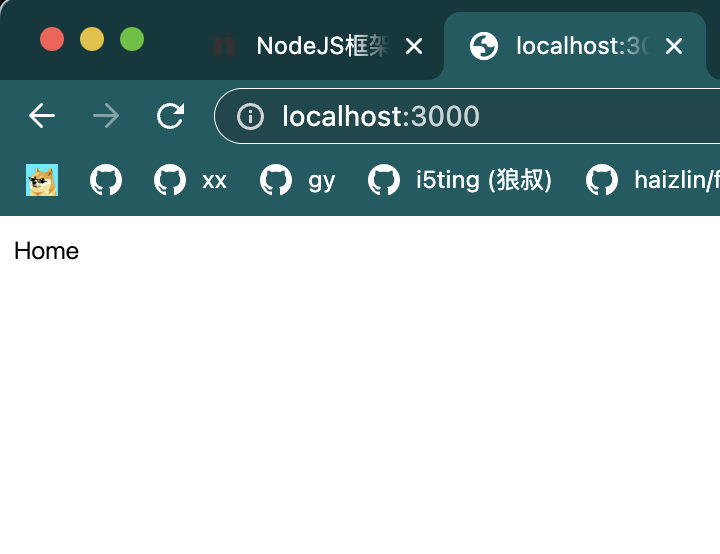

## 安装

```sh
npm install express
```

## Hello Demo

```js
const express = require('express');
const app = express();

/* 中间件 */
app.use((req, res, next) => {
    console.log('middleware');
    next();
    console.log('middleware call');
});

/* 路由部分 */
const router = express.Router();
router.get('/', (req, res) => {
    res.send('Home');
});

app.use(router);

/* 静态文件 */
app.use(express.static('./'));

app.listen(3000);
```

