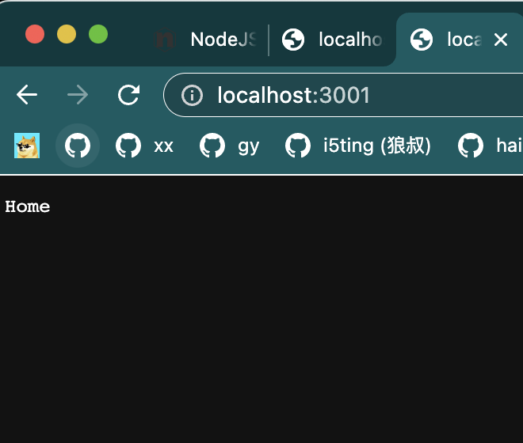

## 安装

[https://blog.csdn.net/qq_42840755/article/details/124507675](https://blog.csdn.net/qq_42840755/article/details/124507675)

```sh
npm install koa2 --save

# 用于配置路由
npm install koa-router --save

# 用于静态资源管理
npm install koa-static --save
```

## Hello Demo

```js
const express = require('express');
const app = express();

/* 中间件 */
app.use((req, res, next) => {
    console.log('middleware');
    next();
    console.log('middleware call');
});

/* 路由部分 */
const router = express.Router();
router.get('/', (req, res) => {
    res.send('Home');
});

app.use(router);

/* 静态文件 */
app.use(express.static('./'));

app.listen(3001);
```


