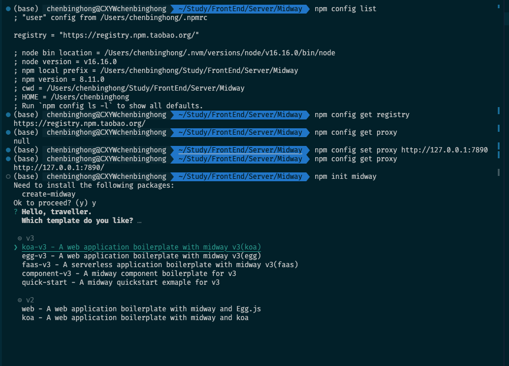

```sh
npm init midway
npm ERR! code ECONNRESET
npm ERR! syscall read
npm ERR! errno ECONNRESET
npm ERR! network request to https://registry.npmmirror.com/create-midway failed, reason: read ECONNRESET
npm ERR! network This is a problem related to network connectivity.
npm ERR! network In most cases you are behind a proxy or have bad network settings.
npm ERR! network 
npm ERR! network If you are behind a proxy, please make sure that the
npm ERR! network 'proxy' config is set properly.  See: 'npm help config'

npm ERR! A complete log of this run can be found in:
```



需要设置 proxy

```sh
npm init midway                          
Need to install the following packages:
  create-midway
Ok to proceed? (y) y
✔ Hello, traveller.
  Which template do you like? · koa-v3 - A web application boilerplate with midway v3(koa)
✔ What name would you like to use for the new project? · midway-project
⠋ Downloading Boilerplate... [Generator]: "npm --registry=https://registry.npm.taobao.org/ pack @midwayjs-examples/application-koa-v3@1.0.20 && mkdir midwayjs-examples-application-koa-v3-1.0.20" download template failed and try with npm
Error: Command failed: npm pack @midwayjs-examples/application-koa-v3@1.0.20 && mkdir midwayjs-examples-application-koa-v3-1.0.20
npm ERR! code ECONNRESET
npm ERR! syscall read
npm ERR! errno ECONNRESET
npm ERR! network request to https://registry.npmmirror.com/@midwayjs-examples%2fapplication-koa-v3 failed, reason: read ECONNRESET
npm ERR! network This is a problem related to network connectivity.
npm ERR! network In most cases you are behind a proxy or have bad network settings.
npm ERR! network 
npm ERR! network If you are behind a proxy, please make sure that the
npm ERR! network 'proxy' config is set properly.  See: 'npm help config'

npm ERR! A complete log of this run can be found in:
npm ERR!     /Users/chenbinghong/.npm/_logs/2023-02-17T06_14_46_947Z-debug-0.log

    at checkExecSyncError (node:child_process:828:11)
    at Object.execSync (node:child_process:899:15)
    at NpmPatternGenerator.getPackage (/Users/chenbinghong/.npm/_npx/21406589f72956d0/node_modules/create-midway/dist/index.js:13875:33)
    at NpmPatternGenerator.getTemplateConfig (/Users/chenbinghong/.npm/_npx/21406589f72956d0/node_modules/create-midway/dist/index.js:13915:20)
    at NpmPatternGenerator.run (/Users/chenbinghong/.npm/_npx/21406589f72956d0/node_modules/create-midway/dist/index.js:13693:42)
    at async AddPlugin.generator (/Users/chenbinghong/.npm/_npx/21406589f72956d0/node_modules/create-midway/dist/index.js:357:13)
    at async CommandCore.execLifecycle (/Users/chenbinghong/.npm/_npx/21406589f72956d0/node_modules/create-midway/dist/index.js:810:21)
    at async CommandCore.invoke (/Users/chenbinghong/.npm/_npx/21406589f72956d0/node_modules/create-midway/dist/index.js:777:9)
    at async cli (/Users/chenbinghong/.npm/_npx/21406589f72956d0/node_modules/create-midway/dist/index.js:23:3) {
  status: 1,
  signal: null,
  output: [
    null,
    null,
    <Buffer 6e 70 6d 20 45 52 52 21 20 63 6f 64 65 20 45 43 4f 4e 4e 52 45 53 45 54 0a 6e 70 6d 20 45 52 52 21 20 73 79 73 63 61 6c 6c 20 72 65 61 64 0a 6e 70 6d ... 602 more bytes>
  ],
  pid: 56140,
  stdout: null,
  stderr: <Buffer 6e 70 6d 20 45 52 52 21 20 63 6f 64 65 20 45 43 4f 4e 4e 52 45 53 45 54 0a 6e 70 6d 20 45 52 52 21 20 73 79 73 63 61 6c 6c 20 72 65 61 64 0a 6e 70 6d ... 602 more bytes>
}
```


boilerplace 锅炉房


## 参考

[Midway 快速入门](http://www.midwayjs.org/docs/quick_guide)