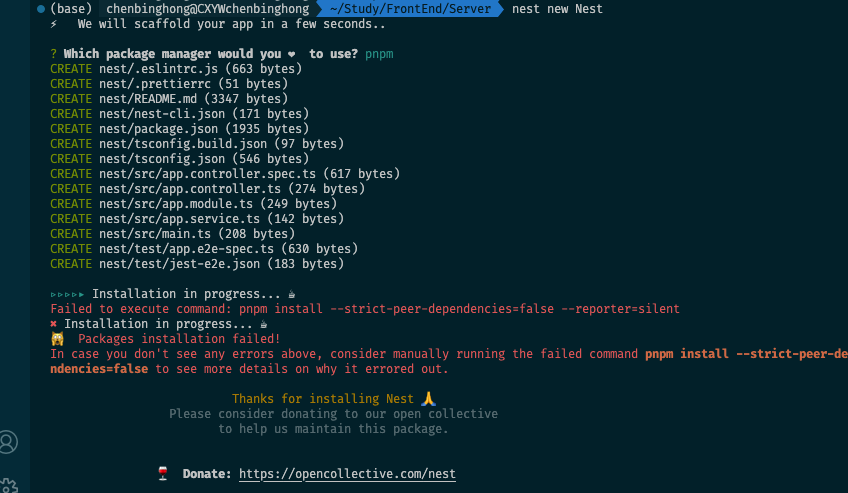
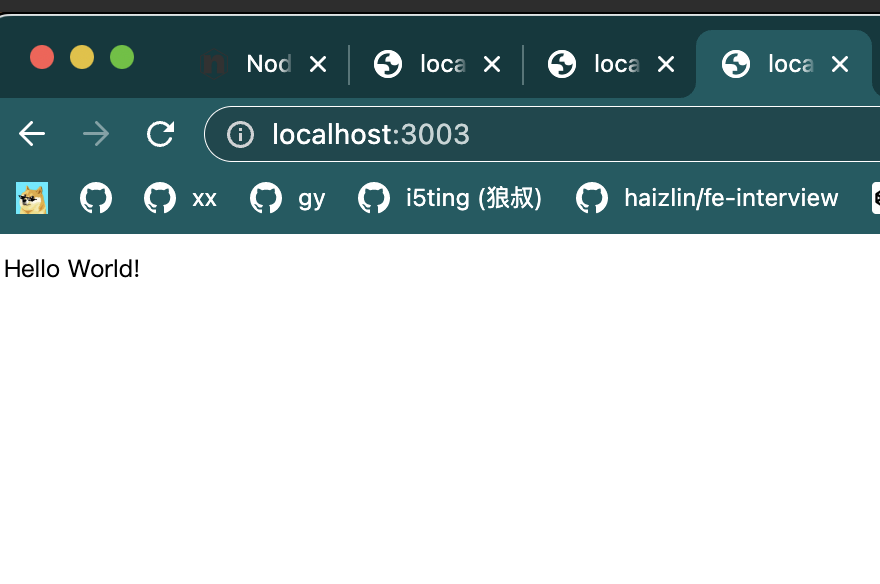

# 安装

```sh
$ npm i -g @nestjs/cli
$ nest new project-name
```

```sh
nest new Nest
⚡  We will scaffold your app in a few seconds..

? Which package manager would you ❤️  to use? pnpm
CREATE nest/.eslintrc.js (663 bytes)
CREATE nest/.prettierrc (51 bytes)
CREATE nest/README.md (3347 bytes)
CREATE nest/nest-cli.json (171 bytes)
CREATE nest/package.json (1935 bytes)
CREATE nest/tsconfig.build.json (97 bytes)
CREATE nest/tsconfig.json (546 bytes)
CREATE nest/src/app.controller.spec.ts (617 bytes)
CREATE nest/src/app.controller.ts (274 bytes)
CREATE nest/src/app.module.ts (249 bytes)
CREATE nest/src/app.service.ts (142 bytes)
CREATE nest/src/main.ts (208 bytes)
CREATE nest/test/app.e2e-spec.ts (630 bytes)
CREATE nest/test/jest-e2e.json (183 bytes)

▹▹▹▹▸ Installation in progress... ☕
Failed to execute command: pnpm install --strict-peer-dependencies=false --reporter=silent
✖ Installation in progress... ☕
🙀  Packages installation failed!
In case you don't see any errors above, consider manually running the failed command pnpm install --strict-peer-dependencies=false to see more details on why it errored out.
                                         
                          Thanks for installing Nest 🙏
                 Please consider donating to our open collective
                        to help us maintain this package.
                                         
                                         
               🍷  Donate: https://opencollective.com/nest
                                         
```



```sh
pnpm install --strict-peer-dependencies=false
 WARN  GET https://registry.npm.taobao.org/@types%2Fsupertest error (ECONNRESET). Will retry in 10 seconds. 2 retries left.
 WARN  GET https://registry.npm.taobao.org/prettier error (ECONNRESET). Will retry in 10 seconds. 2 retries left.
 WARN  GET https://registry.npm.taobao.org/eslint-plugin-prettier error (ECONNRESET). Will retry in 10 seconds. 2 retries left.
 WARN  GET https://registry.npmmirror.com/jest/-/jest-29.3.1.tgz error (ECONNRESET). Will retry in 10 seconds. 2 retries left.
 WARN  GET https://registry.npmmirror.com/source-map-support error (ECONNRESET). Will retry in 10 seconds. 2 retries left.
 WARN  GET https://registry.npmmirror.com/@types%2Fjest error (ECONNRESET). Will retry in 10 seconds. 2 retries left.
 WARN  GET https://registry.npmmirror.com/@typescript-eslint%2Fparser error (ECONNRESET). Will retry in 10 seconds. 2 retries left.
 WARN  GET https://registry.npmmirror.com/@typescript-eslint%2Feslint-plugin error (ECONNRESET). Will retry in 10 seconds. 2 retries left.
 WARN  GET https://registry.npmmirror.com/supertest error (ECONNRESET). Will retry in 10 seconds. 2 retries left.
 WARN  GET https://registry.npmmirror.com/@nestjs%2Fschematics error (ECONNRESET). Will retry in 10 seconds. 2 retries left.
 WARN  GET https://registry.npmmirror.com/@nestjs%2Fcli error (ECONNRESET). Will retry in 10 seconds. 2 retries left.
 WARN  GET https://registry.npmmirror.com/eslint error (ECONNRESET). Will retry in 10 seconds. 2 retries left.
 WARN  GET https://registry.npmmirror.com/ts-loader error (ECONNRESET). Will retry in 10 seconds. 2 retries left.
 WARN  GET https://registry.npmmirror.com/@nestjs%2Ftesting error (ECONNRESET). Will retry in 10 seconds. 2 retries left.
 WARN  GET https://registry.npmmirror.com/eslint-config-prettier error (ECONNRESET). Will retry in 10 seconds. 2 retries left.
 WARN  GET https://registry.npmmirror.com/@types%2Fexpress error (ECONNRESET). Will retry in 10 seconds. 2 retries left.
 WARN  GET https://registry.npmmirror.com/jest/-/jest-29.3.1.tgz error (ECONNRESET). Will retry in 1 minute. 1 retries left.
 WARN  GET https://registry.npmmirror.com/eslint-plugin-prettier error (ECONNRESET). Will retry in 10 seconds. 2 retries left.
 WARN  GET https://registry.npmmirror.com/@types%2Fsupertest error (ECONNRESET). Will retry in 10 seconds. 2 retries left.
 WARN  GET https://registry.npmmirror.com/prettier error (ECONNRESET). Will retry in 10 seconds. 2 retries left.
 WARN  GET https://registry.npmmirror.com/source-map-support error (ECONNRESET). Will retry in 1 minute. 1 retries left.
 WARN  GET https://registry.npmmirror.com/@types%2Fjest error (ECONNRESET). Will retry in 1 minute. 1 retries left.
 WARN  GET https://registry.npmmirror.com/@typescript-eslint%2Fparser error (ECONNRESET). Will retry in 1 minute. 1 retries left.
 WARN  GET https://registry.npmmirror.com/@typescript-eslint%2Feslint-plugin error (ECONNRESET). Will retry in 1 minute. 1 retries left.
 WARN  GET https://registry.npmmirror.com/supertest error (ECONNRESET). Will retry in 1 minute. 1 retries left.
 WARN  GET https://registry.npmmirror.com/@nestjs%2Fschematics error (ECONNRESET). Will retry in 1 minute. 1 retries left.
 WARN  GET https://registry.npmmirror.com/eslint error (ECONNRESET). Will retry in 1 minute. 1 retries left.
 WARN  GET https://registry.npmmirror.com/@nestjs%2Fcli error (ECONNRESET). Will retry in 1 minute. 1 retries left.
 WARN  GET https://registry.npmmirror.com/@nestjs%2Ftesting error (ECONNRESET). Will retry in 1 minute. 1 retries left.
 WARN  GET https://registry.npmmirror.com/ts-loader error (ECONNRESET). Will retry in 1 minute. 1 retries left.
 WARN  GET https://registry.npmmirror.com/@types%2Fexpress error (ECONNRESET). Will retry in 1 minute. 1 retries left.
 WARN  GET https://registry.npmmirror.com/eslint-config-prettier error (ECONNRESET). Will retry in 1 minute. 1 retries left.
 WARN  GET https://registry.npmmirror.com/prettier error (ECONNRESET). Will retry in 1 minute. 1 retries left.
 WARN  GET https://registry.npmmirror.com/eslint-plugin-prettier error (ECONNRESET). Will retry in 1 minute. 1 retries left.
 WARN  GET https://registry.npmmirror.com/@types%2Fsupertest error (ECONNRESET). Will retry in 1 minute. 1 retries left.
 ERR_PNPM_META_FETCH_FAIL  GET https://registry.npm.taobao.org/source-map-support: request to https://registry.npmmirror.com/source-map-support failed, reason: read ECONNRESET
 ERR_PNPM_META_FETCH_FAIL  GET https://registry.npm.taobao.org/@types%2Fjest: request to https://registry.npmmirror.com/@types%2Fjest failed, reason: read ECONNRESET
 ERR_PNPM_NO_MATCHING_VERSION  No matching version found for @types/jest@29.2.4

The latest release of @types/jest is "29.2.3".

Other releases are:
  * ts2.0: 16.0.5
  * ts2.1: 20.0.3
  * ts2.2: 21.1.2
  * ts2.3: 23.3.13
  * ts2.4: 23.3.13
  * ts2.5: 23.3.13
  * ts2.6: 23.3.13
  * ts2.7: 23.3.13
  * ts2.8: 23.3.13
  * ts2.9: 23.3.13
  * ts3.0: 25.1.5
  * ts3.1: 26.0.13
  * ts3.2: 26.0.14
  * ts3.3: 26.0.14
  * ts3.4: 26.0.14
  * ts3.5: 26.0.14
  * ts3.6: 26.0.14
  * ts3.7: 26.0.14
  * ts3.8: 27.4.1
  * ts3.9: 28.1.1
  * ts4.0: 28.1.1
  * ts4.1: 28.1.1
  * ts4.2: 28.1.1
  * ts4.3: 29.2.3
  * ts4.4: 29.2.3
  * ts4.5: 29.2.3
  * ts4.6: 29.2.3
  * ts4.7: 29.2.3
  * ts4.8: 29.2.3
  * ts4.9: 29.2.3
  * ts5.0: 29.2.3

If you need the full list of all 182 published versions run "$ pnpm view @types/jest versions".
```


## 开始使用

```sh
cd project-name
pnpm install
```

```sh
pnpm install
 WARN  GET https://registry.npm.taobao.org/ts-node error (ECONNRESET). Will retry in 10 seconds. 2 retries left.
 WARN  GET https://registry.npm.taobao.org/typescript error (ECONNRESET). Will retry in 10 seconds. 2 retries left.
 WARN  deprecated sourcemap-codec@1.4.8: Please use @jridgewell/sourcemap-codec instead
Packages: +632
++++++++++++++++++++++++++++++++++++++++++++++++++++++++++++++++++++++++++++++++++++++++++++++++++++++++++++++++++
Packages are hard linked from the content-addressable store to the virtual store.
  Content-addressable store is at: /Users/chenbinghong/Library/pnpm/store/v3
  Virtual store is at:             node_modules/.pnpm
node_modules/.pnpm/registry.npmmirror.com+@nestjs+core@9.3.9_q6agyr4hwia55oswpsa7zjxcpm/node_modules/@nestjs/core: Rnode_modules/.pnpm/registry.npmmirror.com+@nestjs+core@9.3.9_q6agyr4hwia55oswpsa7zjxcpm/node_modules/@nestjs/core: Running postinstall script, done in 2.6snloaded 153, added 632, done

dependencies:
+ @nestjs/common 9.3.9
+ @nestjs/core 9.3.9
+ @nestjs/platform-express 9.3.9
+ reflect-metadata 0.1.13
+ rxjs 7.8.0

devDependencies:
+ @nestjs/cli 9.2.0
+ @nestjs/schematics 9.0.4
+ @nestjs/testing 9.3.9
+ @types/express 4.17.17
+ @types/jest 29.2.4 (29.4.0 is available)
+ @types/node 18.11.18 (18.13.0 is available)
+ @types/supertest 2.0.12
+ @typescript-eslint/eslint-plugin 5.52.0
+ @typescript-eslint/parser 5.52.0
+ eslint 8.34.0
+ eslint-config-prettier 8.6.0
+ eslint-plugin-prettier 4.2.1
+ jest 29.3.1
+ prettier 2.8.4
+ source-map-support 0.5.21
+ supertest 6.3.3
+ ts-jest 29.0.3 (29.0.5 is available)
+ ts-loader 9.4.2
+ ts-node 10.9.1
+ tsconfig-paths 4.1.1 (4.1.2 is available)
+ typescript 4.9.5

 ERR_PNPM_PEER_DEP_ISSUES  Unmet peer dependencies

.
└─┬ ts-loader 9.4.2
  └── ✕ missing peer webpack@^5.0.0
Peer dependencies that should be installed:
  webpack@^5.0.0  

hint: If you want peer dependencies to be automatically installed, add "auto-install-peers=true" to an .npmrc file at the root of your project.
hint: If you don't want pnpm to fail on peer dependency issues, add "strict-peer-dependencies=false" to an .npmrc file at the root of your project.
```

```js
import { NestFactory } from '@nestjs/core';
import { AppModule } from './app.module';

async function bootstrap() {
  const app = await NestFactory.create(AppModule);
  await app.listen(3003);
}
bootstrap();
```



## 参考

[NestJS中文文档 NestJS 简介](https://www.nestjs.com.cn/)

[NestJS中文文档 第一步](https://www.nestjs.com.cn/first-steps)

[NestJS 探索与实践](https://zhuanlan.zhihu.com/p/459627768)
