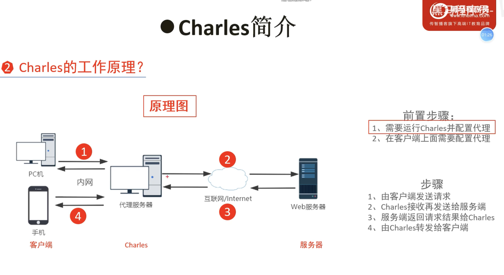
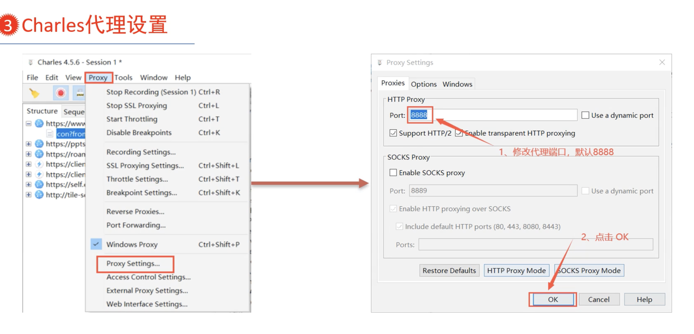
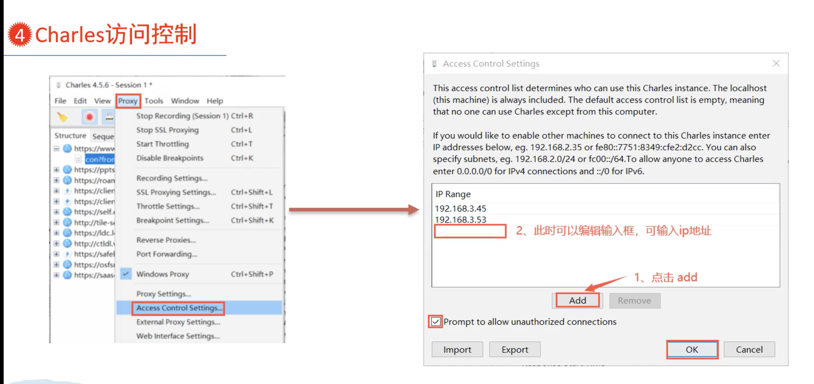

# Charles学习笔记

[https://www.bilibili.com/video/BV1mQ4y1N7dn](https://www.bilibili.com/video/BV1mQ4y1N7dn)

[https://www.bilibili.com/video/BV1VK411s7f9](https://www.bilibili.com/video/BV1VK411s7f9)

## 原理

运行Charles的电脑就是代理服务器

要抓手机的包，需要在手机上配置Charles代理服务器

## 能做什么

- HTTP、HTTPS代理
- 流量控制～弱网环境
- 接口并发请求
- 重发网络请求
- 断点调试

## 代理设置

如果8888端口被占用，需要修改

## 访问控制

默认是其他机器不能通过这个charles来代理，只有本机可以

可以输入ip（ipv4、ipv6）

Prompt to allow unauthorized connections

## 客户端设置（手机抓包）

### windows

### macos

### ios

### android

## 抓包分析

## https抓取&证书

### 无证书

### windows证书

### https 代理配置

### macos证书

### ios证书

## 流量配置

### 弱网测试

## 断电配置

