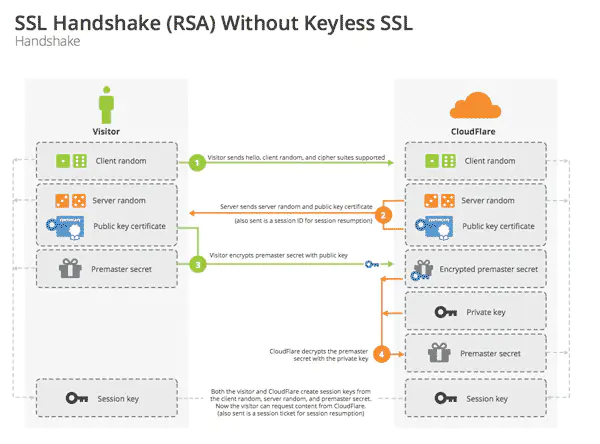
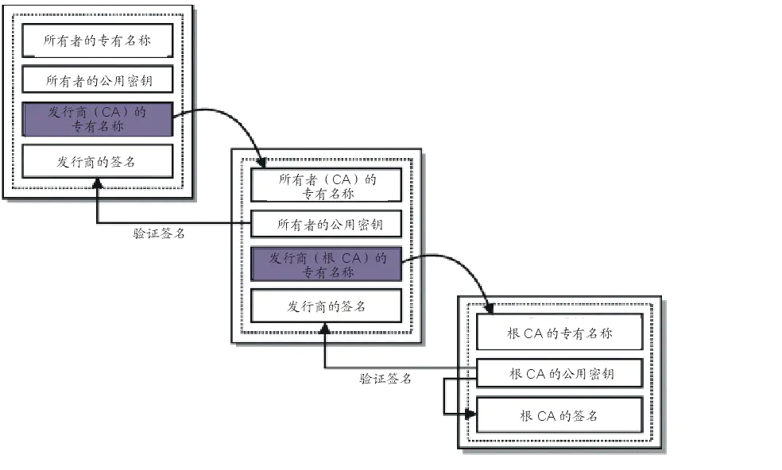

# HTTPS

https://www.jianshu.com/p/6bf2f9a37feb

## TLS

> 传输层安全协议（Transport Layer Security），其前身是安全套接层（Security Sockets Layer）是一种安全协议



TLS建立过程：

1. 客户端发送ClientHello（包含支持的协议版本、加密算法和**随机数A（Client random）**到服务端
2. 服务端返回ServerHello、公钥、证书、**随机数B*（Server random）**到客户端
3. 客户端使用CA证书验证返回证书无误后。生成**随机数C（Premaster secret）**，用公钥对其加密，发送到服务端
4. 服务端用**私钥**解密得到**随机数C（Permaster secret）**，随后根据已经得到的**随机数ABC生成对称密钥（hello的时候确定的加密算法）**，并对需要发送的数据进行对称加密发送
5. 客户端使用对称密钥（客户端也用随机数ABC生成对称密钥）对数据解密
6. 双方手持对称密钥**使用对称加密算法通讯**

## 证书

> 证书用来证明公钥拥有者身份的凭证

数字证书一般由数字证书认证机构签发，需要：

1. 申请者通过**非对称加密算法（RSA）**生成一对**公钥**和**私钥**，然后把需要的申请信息（国家、域名等）连同公钥发送给**证书认证机构（CA）**
2. CA确认无误后痛殴**消息摘要算法（MD5、SHA）**生成整个申请信息等摘要签名M，然后把**签名M和使用的摘要算法**用**CA自己的私钥**进行加密

证书包含了：

1. 公钥
2. 证书拥有者身份信息
3. 数字证书认证机构（CA、发行者）信息
4. 发行者对这份文件的数字签名及使用的算法
5. 有效期

证书的格式和验证方法普遍遵循<font color=red>X.509</font>国际标准

## 证书认证机构（CA）

> 数字证书认证机构（Certificate Authority，CA），也称为电子商务认证中戏、电子商务认证授权机构，是负责发放和管理数字证书的权威机构，并作为电子商务交易中受信任的第三方，承担公钥体系中公钥合法性检验的责任。

其实任何个体/组织都可以称为CA（自签证书），但是你发布的证书客户端是不信任的，也是就前文提及的需要权威，比如：

**Symantec、Comodo、Godaddy、Digicert**

客户端信任这些CA，就会在本地保存这些CA的**根证书（root certificate）**，根证书是CA自己的证书，是证书验证链的开头。

<font color=red>根证书没有机构（已经是权威了）再为其做数字签名，所以都是**自签证书**</font>

CA会通过**中介证书（intermediate-certificate）**替代根证书去做服务器端端证书签名，确保根证书密钥绝对不可访问。

## 证书信任链

前文提到，在向CA申请证书时是需要**CA私钥**去对整个证书的签名摘要做非对称加密的，也就是证书是可以通过**CA公钥**去解密得到**证书的签名摘要**的。

当我们再次用**相同的摘要算法**（证书里面有保存所使用的算法）对整个证书做签名，如果得到的签名和证书上的签名是一致的，说明这个证书是可信任的。

同理，中介证书也是可以被这样的方式证明其可信任。这样的一整个流程被称为**信任链（Chain of trust）**。

就是我**绝对**相信你（A>B）；你**绝对**相信他（B>C）；等于我**绝对**相信他（A>C）。

以下是整个流程：



1. 客户端得到服务端返回的证书，通过读取得到**服务端证书的发布机构（Issuer）**
2. 客户端去操作系统查找这个发布机构的证书，如果不是根证书就继续递归下去，**直到拿到根证书**
3. 用**根证书的公钥**去**解密验证**上一层证书的**合法性**，再拿上一层证书的公钥去验证更上层证书的合法性；递归回溯
4. 最后验证服务器端端证书是**可信任**的

## 疑惑

需要递归去验证吗？我还以为客户端只用验证最近的中间人

其实想想也是：客户端只植入了根证书的公钥，意味着客户端只信任根证书，需要递归到根证书。

根证书的公钥集成在了浏览器中。


## 实战

```sh
curl -v https://www.baidu.com
* Uses proxy env variable NO_PROXY == 'localhost,127.0.0.1,::1'
* Uses proxy env variable https_proxy == 'http://127.0.0.1:7890'
*   Trying 127.0.0.1:7890...
* Connected to 127.0.0.1 (127.0.0.1) port 7890 (#0)
* allocate connect buffer
* Establish HTTP proxy tunnel to www.baidu.com:443
> CONNECT www.baidu.com:443 HTTP/1.1
> Host: www.baidu.com:443
> User-Agent: curl/7.84.0
> Proxy-Connection: Keep-Alive
> 
< HTTP/1.1 200 Connection established
< 
* Proxy replied 200 to CONNECT request
* CONNECT phase completed
* ALPN: offers h2
* ALPN: offers http/1.1
*  CAfile: /etc/ssl/cert.pem
*  CApath: none
* (304) (OUT), TLS handshake, Client hello (1):
* (304) (IN), TLS handshake, Server hello (2):
* TLSv1.2 (IN), TLS handshake, Certificate (11):
* TLSv1.2 (IN), TLS handshake, Server key exchange (12):
* TLSv1.2 (IN), TLS handshake, Server finished (14):
* TLSv1.2 (OUT), TLS handshake, Client key exchange (16):
* TLSv1.2 (OUT), TLS change cipher, Change cipher spec (1):
* TLSv1.2 (OUT), TLS handshake, Finished (20):
* TLSv1.2 (IN), TLS change cipher, Change cipher spec (1):
* TLSv1.2 (IN), TLS handshake, Finished (20):
* SSL connection using TLSv1.2 / ECDHE-RSA-AES128-GCM-SHA256
* ALPN: server accepted http/1.1
* Server certificate:
*  subject: C=CN; ST=beijing; L=beijing; OU=service operation department; O=Beijing Baidu Netcom Science Technology Co., Ltd; CN=baidu.com
*  start date: Jul  5 05:16:02 2022 GMT
*  expire date: Aug  6 05:16:01 2023 GMT
*  subjectAltName: host "www.baidu.com" matched cert's "*.baidu.com"
*  issuer: C=BE; O=GlobalSign nv-sa; CN=GlobalSign RSA OV SSL CA 2018
*  SSL certificate verify ok.
> GET / HTTP/1.1
> Host: www.baidu.com
> User-Agent: curl/7.84.0
> Accept: */*
> 
* Mark bundle as not supporting multiuse
< HTTP/1.1 200 OK
< Accept-Ranges: bytes
< Cache-Control: private, no-cache, no-store, proxy-revalidate, no-transform
< Connection: keep-alive
< Content-Length: 2443
< Content-Type: text/html
< Date: Tue, 27 Dec 2022 09:58:09 GMT
< Etag: "588603e2-98b"
< Last-Modified: Mon, 23 Jan 2017 13:23:46 GMT
< Pragma: no-cache
< Server: bfe/1.0.8.18
< Set-Cookie: BDORZ=27315; max-age=86400; domain=.baidu.com; path=/
< 
<!DOCTYPE html>
<!--STATUS OK--><html> <head><meta http-equiv=content-type content=text/html;charset=utf-8><meta http-equiv=X-UA-Compatible content=IE=Edge><meta content=always name=referrer><link rel=stylesheet type=text/css href=https://ss1.bdstatic.com/5eN1bjq8AAUYm2zgoY3K/r/www/cache/bdorz/baidu.min.css><title>百度一下，你就知道</title></head> <body link=#0000cc> <div id=wrapper> <div id=head> <div class=head_wrapper> <div class=s_form> <div class=s_form_wrapper> <div id=lg>  </div> <form id=form name=f action=//www.baidu.com/s class=fm> <input type=hidden name=bdorz_come value=1> <input type=hidden name=ie value=utf-8> <input type=hidden name=f value=8> <input type=hidden name=rsv_bp value=1> <input type=hidden name=rsv_idx value=1> <input type=hidden name=tn value=baidu><span class="bg s_ipt_wr"><input id=kw name=wd class=s_ipt value maxlength=255 autocomplete=off autofocus=autofocus></span><span class="bg s_btn_wr"><input type=submit id=su value=百度一下 class="bg s_btn" autofocus></span> </form> </div> </div> <div id=u1> <a href=http://news.baidu.com name=tj_trnews class=mnav>新闻</a> <a href=https://www.hao123.com name=tj_trhao123 class=mnav>hao123</a> <a href=http://map.baidu.com name=tj_trmap class=mnav>地图</a> <a href=http://v.baidu.com name=tj_trvideo class=mnav>视频</a> <a href=http://tieba.baidu.com name=tj_trtieba class=mnav>贴吧</a> <noscript> <a href=http://www.baidu.com/bdorz/login.gif?login&amp;tpl=mn&amp;u=http%3A%2F%2Fwww.baidu.com%2f%3fbdorz_come%3d1 name=tj_login class=lb>登录</a> </noscript> <script>document.write('<a href="http://www.baidu.com/bdorz/login.gif?login&tpl=mn&u='+ encodeURIComponent(window.location.href+ (window.location.search === "" ? "?" : "&")+ "bdorz_come=1")+ '" name="tj_login" class="lb">登录</a>');
                </script> <a href=//www.baidu.com/more/ name=tj_briicon class=bri style="display: block;">更多产品</a> </div> </div> </div> <div id=ftCon> <div id=ftConw> <p id=lh> <a href=http://home.baidu.com>关于百度</a> <a href=http://ir.baidu.com>About Baidu</a> </p> <p id=cp>&copy;2017&nbsp;Baidu&nbsp;<a href=http://www.baidu.com/duty/>使用百度前必读</a>&nbsp; <a href=http://jianyi.baidu.com/ class=cp-feedback>意见反馈</a>&nbsp;京ICP证030173号&nbsp;  </p> </div> </div> </div> </body> </html>
* Connection #0 to host 127.0.0.1 left intact

```

