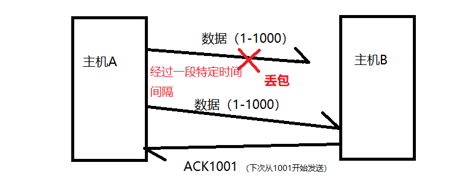
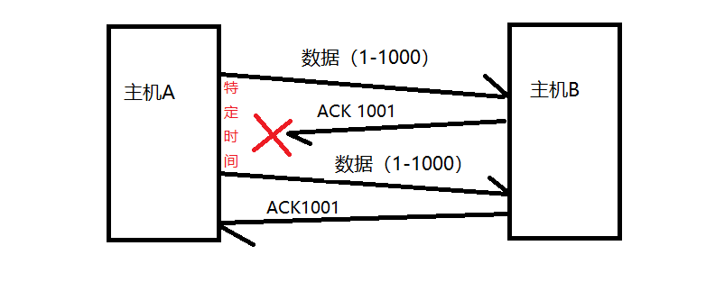
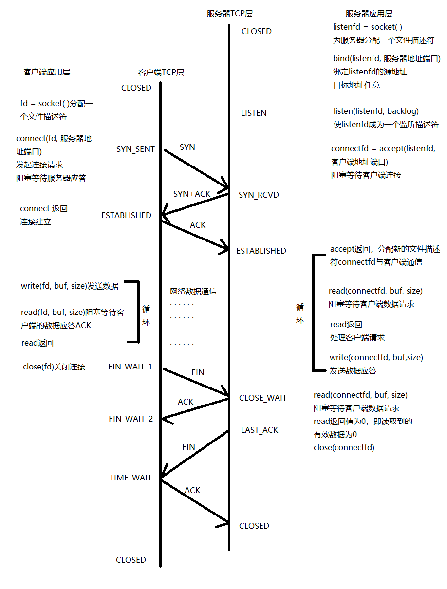
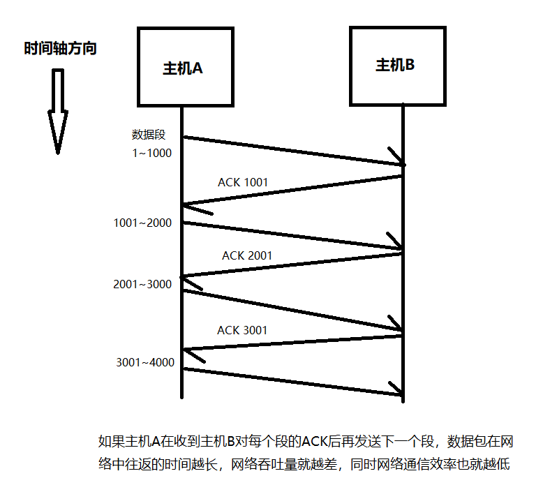
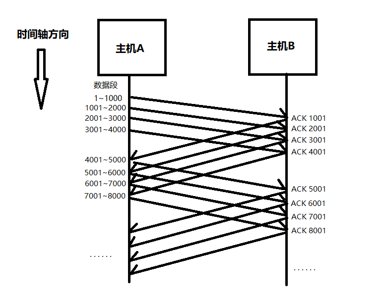
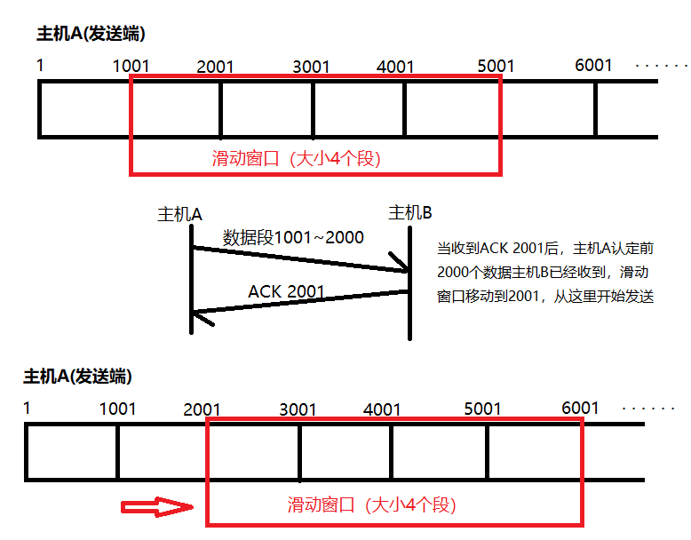
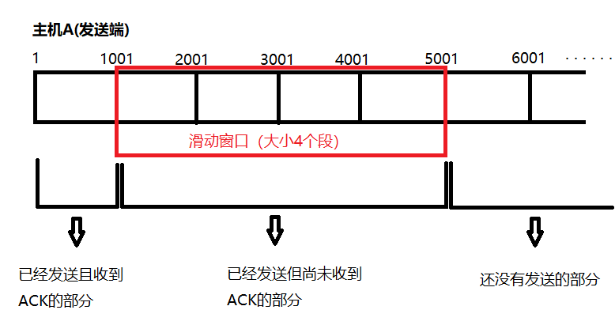
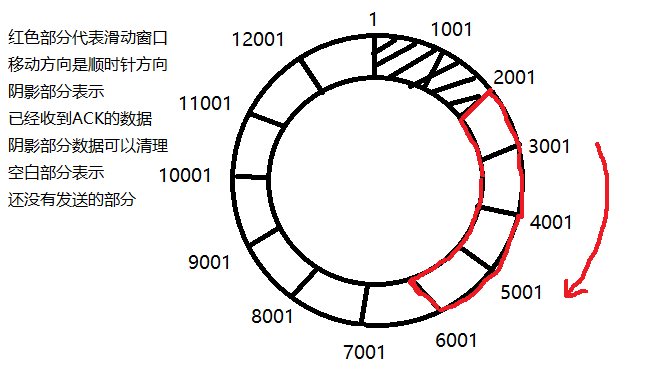
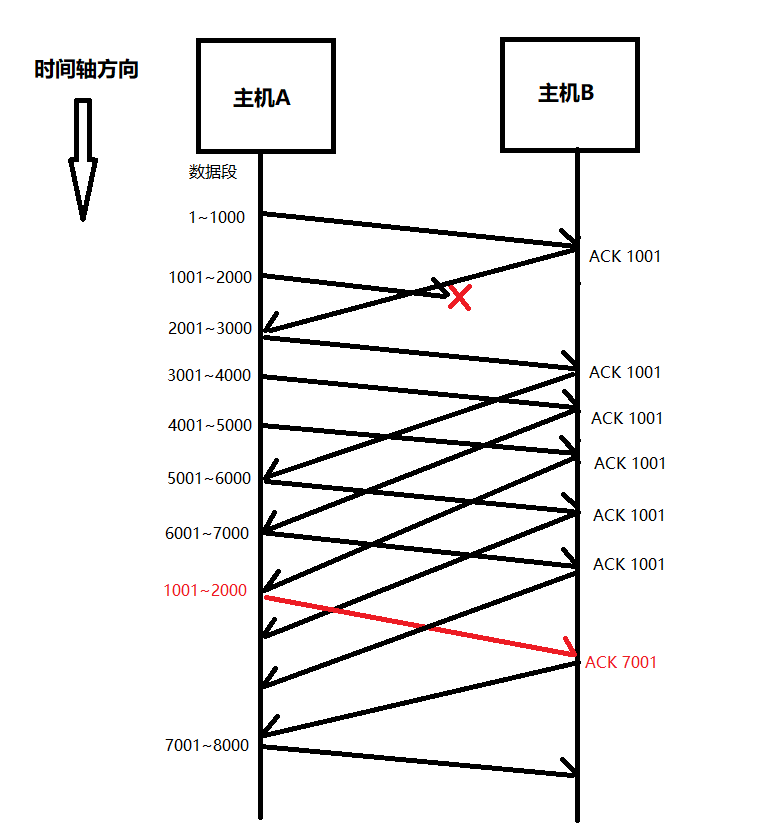
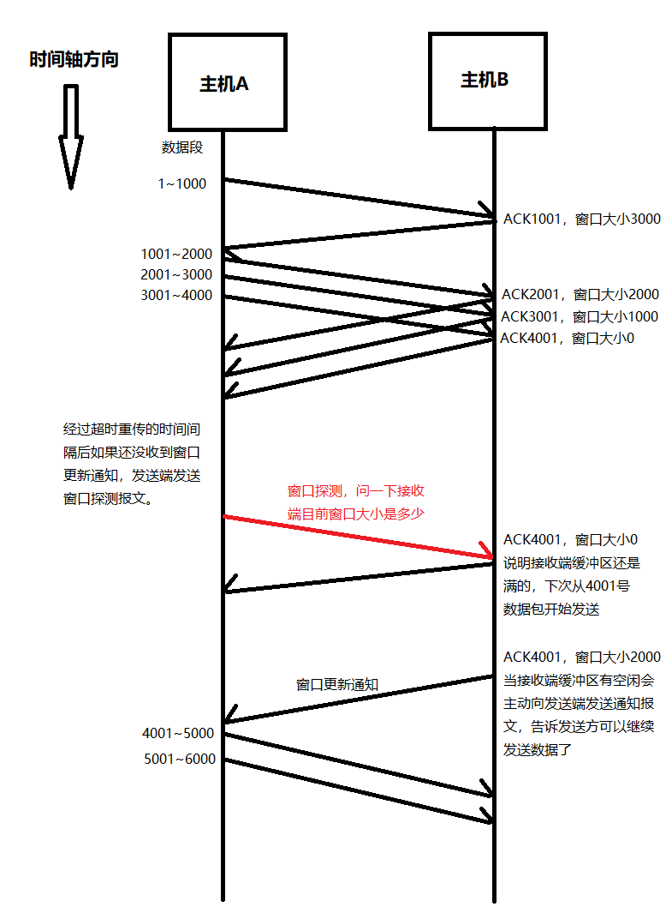

# TCP

https://blog.csdn.net/weixin_45523353/article/details/124305056

Transmission Control Protocol

 传输控制协议

面向连接的、可靠的、基于字节流的传输层协议

对传输、发送、通信进行控制的协议

## 特点

## 超时重发机制

第二种情况下，B会收到重复数据，可根据序列号排重

如何设置重传的时间间隔？

RTT：Round Trip Time，往返时间

略大于：RTT+抖动（RTT方差）

500ms单位控制，

500ms

2*500ms

4*500ms

。。。

达到一定次数后，判定为网络异常，强制关闭TCP连接

## 连接管理功能

## 三次握手&四次挥手

## 滑动窗口

TCP 会以段为单位，每发一个段就进行一次确认应答处理，但是这样的传输方式，如果数据包在网络中往返的时间越长，网络通信的效率就会越低。

为了解决上面的问题，TCP 中引入了滑动窗口的概念。有了滑动窗口后，即使数据包在网络中往返时间较长，也可以保证网络通信效率。这种模式下 ACK 不再是对每个数据段分别确认，而是发送端主机在发送了一个段后不必一直等待 ACK，它会继续发送。

滑动窗口的大小指的是不需要等待 ACK 到达，可以继续发送的数据段的大小，以上图为例，图中的窗口大小（下文的流量控制章节有详细说明）就是 4000 字节，即四个段。通过图示可知，主机 A 在发送前四个段的时候，不用等待主机 B 的 ACK，就可以连续发送。

当主机 A 收到了第一个 ACK 之后，滑动窗口向后滑动，继续发送第五个段的数据包，并以此类推，这个滑动窗口是由操作系统内核来进行维护的，其作用就是在**发送缓冲区**中记录当前还有哪些数据没有收到 ACK，只有被 ACK 确认过的额数据才能从缓冲区中删掉，这样就可以保证如果出现重传需求，发送端可以立刻在发送缓冲区的未确认部分找到历史数据，直接发送。而不用担心历史数据遗失的问题了。

滑动窗口越大，网络的吞吐率也就越高。

滑动窗口机制设计的非常巧妙，可以用顺序的方式将多个段同时发送提高通信的性能，假如上图中 ACK 2001 在网络中阻塞或者丢失，我们最后只收到了 ACK 5001，那我们还需要重传 2001~3000 这个数据段吗？答案明显是不用的，因为 TCP 的确认应答机制明确了 ACK 之前编号的数据一定已经收到，因此如果我们直接收到了 ACK 5001，那在上图中，**我们就可以直接将滑动窗口向右移动到 5001，并继续将窗口中的数据段连续发送出去！**

注意是ACK 2001丢失，不是数据段10001～2000丢失，是确认丢失；如果收到ACK5001，那么可以确保 2001、3001、4001都已经收到

因为滑动窗口的存在，将整个发送缓冲区分成三个部分，分别是已经发送且收到 ACK 的数据，已经发送还未收到 ACK 的数据，和还没有发送的数据，已经收到 ACK 这部分的数据就可以被清除了，不过缓冲区是开辟在计算机内存中的一部分空间，其容量是有限制的，这就要求滑动窗口机制可以重复使用之前用过的空间，所以发送端的缓冲区我们可以认为是一个环形队列。

那么前文介绍的 TCP 超时重传机制，在滑动窗口这里，该怎么使用呢，我们一样分两种情况来讨论，其实可以启用 TCP 重传机制的情形也只有这两种：①ACK 丢失；②报文段丢失

### 情形1 ACK丢失:

数据包发送到对端，但是对端返回到ACK在网络传输中丢失，这种情况其实我们刚才已经解决了，那就是可以通过后续的ACK进行确认，TCP的确认应答机制保证ACK之前的所有数据都已经成功接收，因此即使ACK2001丢失，如果我们后续收到了 ACK 3001、ACK4001等，就可以确认前面的数据段已经送达，华东窗口直接移动到的ACK处即可。

### 情形2 数据段丢失：

数据段丢失，下面的例子假设1001～2000这个数据段在传输过程中丢失，那么发送端会收到接收端的ACK轰炸，即接收端会一直发送ACK1001，像是在提醒发送端，它想要的是从1001开始的数据段。如果在窗口比较大并且报文段丢失的情况下，同一个序列的ACK会重复返回。**一旦发送端连续三次收到同一个序号的ACK**，就会将这个ACK所对应的数据段进行重发，这种重发机制会比上面提到的超时重发机制更加高效，因为它不用等待，只要三连收到同一个序号的ACK，就立马重发数据，因此这种机制也被称为**高速重发控制（快重传）**。不过注意它是与超时重发机制互补的。两者并不冲突。

只在窗口比较大并且报文段丢失的情况下，才会快重传？？？

## 流量控制

### why

说完了发送端，再来看看接收端，接收端处理数据的速度是有限的。如果发送端发送的太快，导致接收端的接收缓冲区被填满了，这个时候如果发送端还继续发送数据，就会造成丢包，又因为 TCP 是可靠性连接，所以后面又会引发丢包重传的连锁反应，因此 TCP 作为传输控制协议，它也**要根据接收端的处理数据能力来控制一下发送端的发送速度**。这种机制就是流量控制。

### how

之前介绍 TCP 报文首部的时候，就提到过 TCP 首部中有一个 “窗口大小” 的字段，这个字段是接收端通过 ACK 报文返还给发送端的。而接收端则会根据这个字段来设置自己的滑动窗口大小，也就是说发送端的滑动窗口大小一定不能超过接收端的窗口大小，这就把双方连接起来了！

窗口大小这个字段的值越大，说明网络的吞吐量越大，如果接收端的缓冲区快要被填满了，这个字段就会被重置，变为一个更小的值在后续的 ACK 中返还给发送端，提醒发送端发慢一些，这样就形成了一个完整的 TCP 流量控制体系。

上图在接收端收到 3001~4000 数据段时，自己的接收缓冲区就满了，因此它在 ACK 中不仅告知了发送端下一次数据要从 4001 开始发送，同时也在窗口大小字段中标注出，自己的剩余大小为 0，这时发送端就不会再发送数据了，而是等待接收端的应用层软件处理数据，清理接收端缓冲区。如果在超时重传的时间间隔中，接收端没有发送过来一个窗口大小的更新通知，那么发送端就会主动发送一个**窗口探测报文**，接收端收到这个窗口探测报文后，返还一个 ACK，告知发送端下一次从哪里开始发送数据，并携带自己的窗口大小。**当接收端的缓冲区有空闲的空间后，接收端会主动向发送端发送一个窗口更新通知**，发送端收到这个窗口更新通知后，就会根据更新后的窗口大小，继续有控制地发送自己的数据。当然，这个窗口更新通知在网络传输中也有可能丢失，因此，发送端的窗口探测不止一次，而是每隔一个超时重传的时间间隔就主动发送一次。

## 拥塞控制

### why

自从有了上述介绍的滑动窗口之后，TCP 传播的效率大大提升，不再是一个个单独发送数据段，而是连续大量发送数据段，但是如果刚刚建立了连接就大量发送数据，很有可能引发其它问题。

计算机网络是一个共享的环境，上面连接着许多的计算机，就好比一条高速公路，大家都可以在上面行驶，如果某一时间已经堵车了，但还有大量的汽车驶上该条公路，那么就会引发整条公路的交通陷入瘫痪。计算机网络也是如此，如果网络环境已经比较拥堵，仍然发送大量的数据段，是非常危险的行为。因此 TCP 为了防止这种问题的出现，在通信一开始的时候会采取**慢启动**的机制，先探查一下当前的网络状况，再确定按照多大的速度传输数据。

网络中的带宽、交换结点中的缓存和处理机等，都是网络的资源。在某段时间，若对网络中某一资源的需求超过了该资源所能提供的可承受的能力，网络的性能就会变坏。这种情况就叫做拥塞

TCP 为提高网络利用率，降低丢包率，并保证网络资源对每条数据流的公平性。即所谓的拥塞控制

怎么探查网络状况的？

### how

为了在发送端可以进行调节发送数据的量，定义了一个 **“拥塞窗口”** 的概念，在慢启动开始时，拥塞窗口在发送开始的时候大小设置为 1，每次收到一个 ACK 应答，拥塞窗口就翻倍，这样就实现了指数级增长，**每次发送数据的时候，会将拥塞窗口和接收端的窗口大小字段进行比较，取两者中更小的那个作为发送端的滑动窗口大小**。

慢启动只是初始的时候比较慢，但是增长速度较快，其拥塞窗口的增长速度是指数级别的，但是指数增长是在是太快了，所以我们需要规定一个阈值，当拥塞窗口超过阈值后，不再以指数方式增长，而是以线性方式增长。当遇到网络阻塞后，将拥塞窗口置为 1，并将阈值设置为上次出现拥塞情况时拥塞窗口大小的二分之一（现在已经不再使用了），**目前使用的是快速回复，直接将拥塞窗口置为上次出现拥塞情况时拥塞窗口大小的二分之一。**

TCP拥塞标准文档：RFC 5681

四个部分：

- slow start 慢启动、慢开始
- congestion avoidance 拥塞避免
- fast retransmit 快重传
- fast recovery 快恢复

算法版本：

- reno
- vegas
- cubic

总结一下，TCP 协议正如它的名字一样，传输控制协议，不仅要建立、断开和保持传输所用的连接，而且要在传输过程中进行控制，不可以发的太慢，也不可以发的太快。所以 TCP 的可靠性为网络通信提供了安全，而 TCP 的对于连接的控制则大大提高了网络传输的效率。

# CCNA 必备：Linux 网络基础知识入门及 tcp 协议（三）|学习笔记

https://developer.aliyun.com/article/1056795