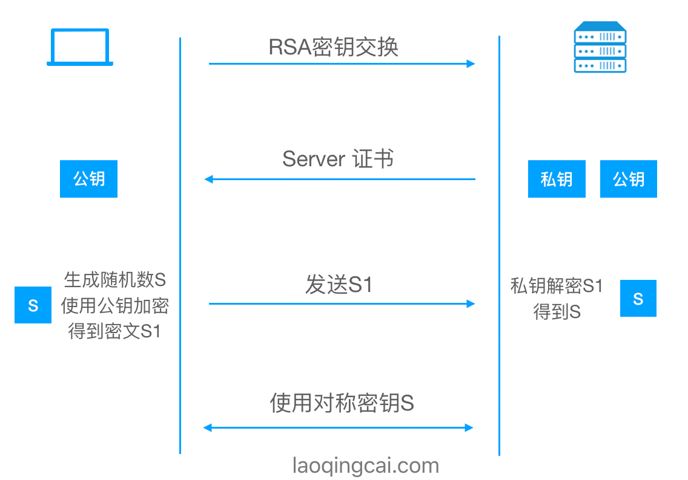
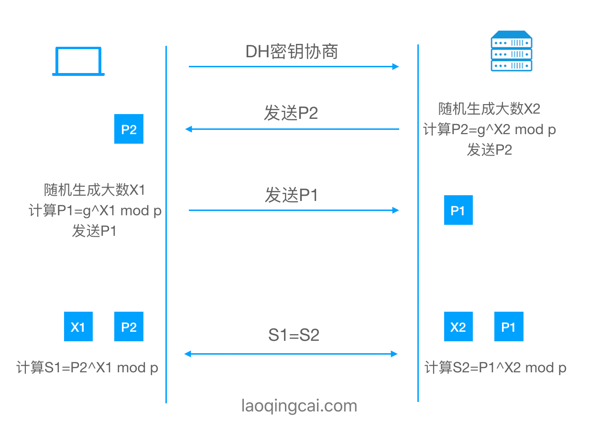
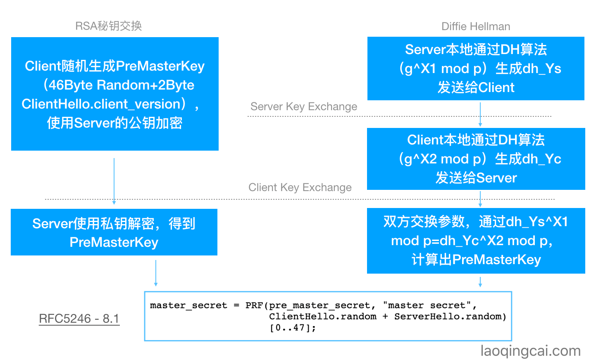

# TLS1.2 PreMasterSecret And MasterSecret

[https://www.laoqingcai.com/tls1.2-premasterkey/](https://www.laoqingcai.com/tls1.2-premasterkey/)

在SSL/TLS中，Pre Master Secret（预主密钥）作用至关重要，无论是RSA加密算法、DH密钥交换算法，最终都是为了交换或者协商出Pre Master Secret。通过Pre Master Secret，结合其他参数，计算出Master Secret，作为整个会话的密钥。

## Pre Master Secret

不同的密钥协商算法，计算Pre Master Secret（预主密钥）过程也不一样。那么我们来看下RSA交换肃反、DH协商算法（ECDH、DHE、ECDHE）时如何得出Pre Master Secret的。

## RSA

最常用的非对称加密算法，有以下两个特点：私钥加密、公钥解密；公钥加密、私钥解密。使用RSA算法交换密钥的流程如下：



1. Client请求Server，Server返回证书，包含公钥Cer。
2. Client生成随机数作为预主密钥S，使用公钥Cer加密，得到密文S1，发送给Server。
3. Server收到密文S1，使用私钥解密，得到预主密钥S。

### 如何生成

那么在SSL/TLS中，使用RSA交换算法，Pre Master Secret是如何生成的呢？[RFC2546](https://tools.ietf.org/html/rfc5246#section-7.4.7.1)中有这样的描述：

```c
struct {
  select (KeyExchangeALgorithm) {
    case rsa:
    	EncrypteePreMasterSecret;
    case dhe_dss:
    case dhe_rsa:
    case dh_dss:
    case dh_rsa:
    case dh_anon:
    	ClientDiffieHellmanPublic;
  } exchange_keys;
} ClientKeyExchange;

struct {
  ProtocolVersion client_version;
  opaque random[46];
} PreMasterSecret;

client_version
  The latest(mewest) versino supported by the client. This is used to detect version rollback attacks.
  
random
  46 securely-generated random bytes.
  
struct {
  public-key-encrypted PreMasterSecret pre_master_secret;
} EncryptedPreMasterSecret;
```

也就是正对RSA密钥交换算法，在ClientKeyExchange消息中，Client随机生成46字节+2字节的client_version，作为 pre master secret。通过RSA公钥加密，传递给Server，Server只需用私钥解密即可。

## DH

Diffie Hellman，密钥协商算法



1. 定义素数g、p。g、p双方都知道
2. 双方计算大数P=g^x mod p
   1. Client生成随机数X1，P1=g^X1 mod p
   2. Sever生成随机数X2，P2=g^X2 mod p
3. 交换P1、P2
   1. Client有p、g、X1、P2
   2. Server有p、g、X2、P1
4. 计算密钥S，利用(g^X1 mod p)^X2 mod p = (g^X2 mod p)^X1 mod p 恒成立
   1. 对应Client，S1=P2^X1 mod p
   2. 对应Server，S2=P1^X2 mod p
   3. S1=S2恒成立

即便知道p、g，窃取到P1、P2，也难推出X1、X2，无法计算得到S

### ECDH

Elliptic Curve Diffie-Hellman Exchange，椭圆曲线密钥协商算法，是ECC和DH算法到组合

1. 和DH原理类似，把幂运算、取模运算替换成了点乘运算，速度更快，逆向分解难度更大。
2. 和DH一样，证书公钥、私钥参与协商，对于Client，证书公钥作为随机数X1.对于Server，证书私钥作为随机数X2，存在向前攻击问题。

openssl已经移除了ECDH的支持

### DHE ECDH

Elliptic Curve Diffie-Hellman Exchange Ephemeral，短暂的（椭圆曲线）密钥协商算法。多了一个Ephemeral（短暂的），即密钥是短暂的，每次握手都会协商一个预主密钥，和RSA、DH、ECDH不同：

1. RSA，证书公钥、私钥直接参与密钥交换，私钥泄漏，存在向前攻击问题。
2. DH、ECDH，证书公钥、私钥参与协商，对于Client，证书公钥作为随机数X1。对于Server，证书私钥作为随机数X2.
3. DHE、ECDHE，证书公钥、私钥不参与协商，每次握手都会计算随机数X。

ECDHE最安全，即便当前会话密钥泄漏了，也不影响之前的会话，是前向安全的，所以现在基本都是用ECDHE了。

### 如何生成

那么在SSL/TLS中，使用(EC)DHE算法，Pre Master Secret的又是如何生成的呢？[RFC2546](https://tools.ietf.org/html/rfc5246#section-7.4.7.2)中有以下描述：

```c
struct {
  select (KeyExchangeAlgorithm) {
    case rsa:
    	EncryptedPreMasterSecret;
    case dhe_dss:
    case dhe_rsa:
    case dh_dss:
    case dh_rsa:
    case dh_anon:
    	ClientDiffieHellmanPublic;
  } exchange_keys;
} ClientKeyExchange;

struct {
  select (PublicValueEncoding) {
    case implicit: struct {};
    case explicit: opaque DH_Yc<1..2^16-1>;
  } dh_public;
} ClientDiffieHellmanPublic;
```

也就是针对（EC）DH密钥交换算法，Client在ClientKeyExchange消息中，生成随机数X1，使用椭圆曲线或g^X1 mod p计算得到DH_Yc，传递给Server。

同理，Server在ServerKeyExchange消息中，生成随机数X2，使用椭圆曲线或g^X2 mod p计算得到DH_Ys，传递给Client。最终双方计算出密钥S=DH_Ys ^ X1 mod p = DH_Yc ^ X2 mod p

得到的S 就是 pre master secret

## Master Secret

所有的密钥交换算法，最终都会使用相同的算法将pre master secret 转换成 master secret。

一旦master secret 生成，pre master secret 就会删除

[RFC2546#8.1](https://tools.ietf.org/html/rfc5246#section-8.1)中有以下描述：

```c
master_secret = PRF(pre_master_secret, "master secert", ClientHello.random + ServerHello.random)[0..47];
```

生成过程很简单，拿到pre master secert，结合Client随机数和Server随机数，调用PRF（pseudo-random function）伪随机函数，截取48位。最后得到48字节的master secret。

最后总结一下：

