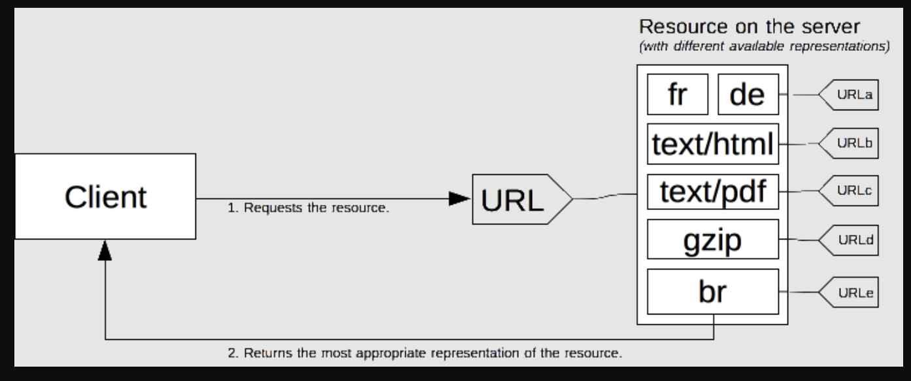
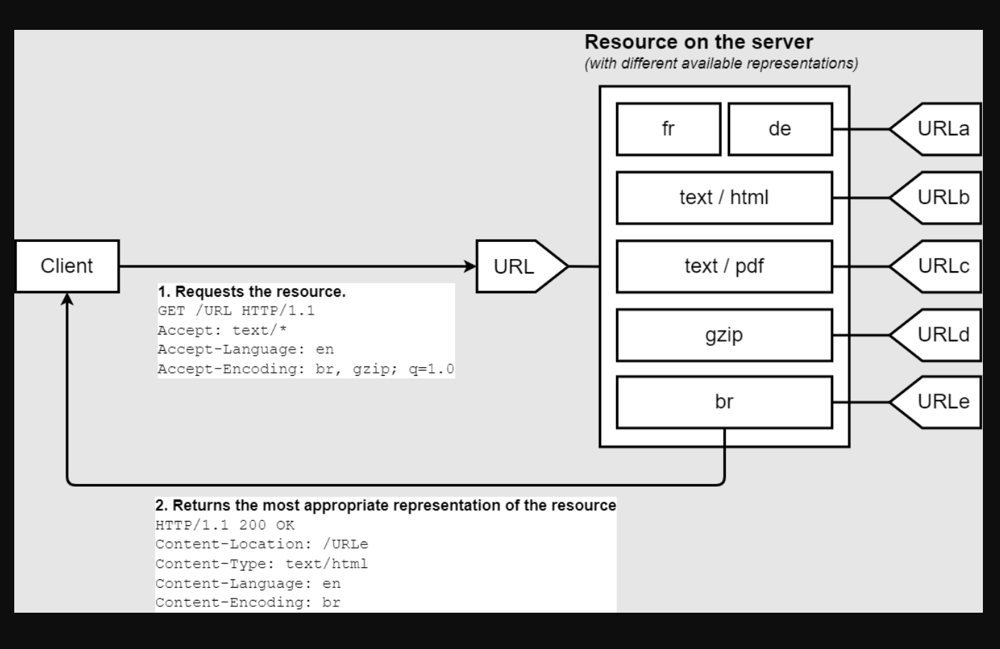
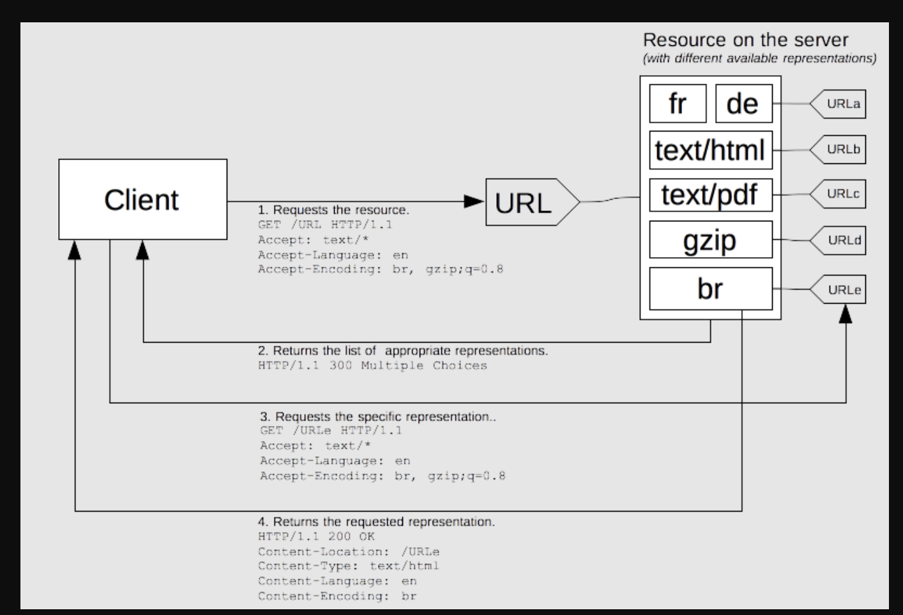

# 内容协商

Content negotiation

https://developer.mozilla.org/zh-CN/docs/Web/HTTP/Content_negotiation

在HTTP协议中，内容协商是这样一种机制，通过为同一URI指向的资源提供不同的展示形式，可以使用用户代理选择与用户需求相适应的最佳匹配（例如，文档使用的自然语言，图片的格式，或者内容编码形式）。

## 基本原则

一个请求可以对于多种展现形式，各种展现形式共享一个特定URL。需要继续协商确定返回那种展现形式。

最佳展现形式的选取可以通过两种实现：

1. 客户端设置特定的HTTP首部（又称为服务端驱动型内容协商机制或主动协商机制）；这时标准方式
2. 服务器返回300（Multiple Choices）或者406（Not Acceptable）状态码（又称为代理驱动型协商机制后者响应式协商机制）；这种方式一般用作备选方案。

随着时间的推移，也有其他一些内容协商的提案被提出来，比如透明协商以及Alternates首部。

但它们都没有后的人们的认可而别遗弃。

## 服务端驱动型

返回最佳适配

## 代理驱动型

返回一堆、让用户自己选？？？需要多次请求

