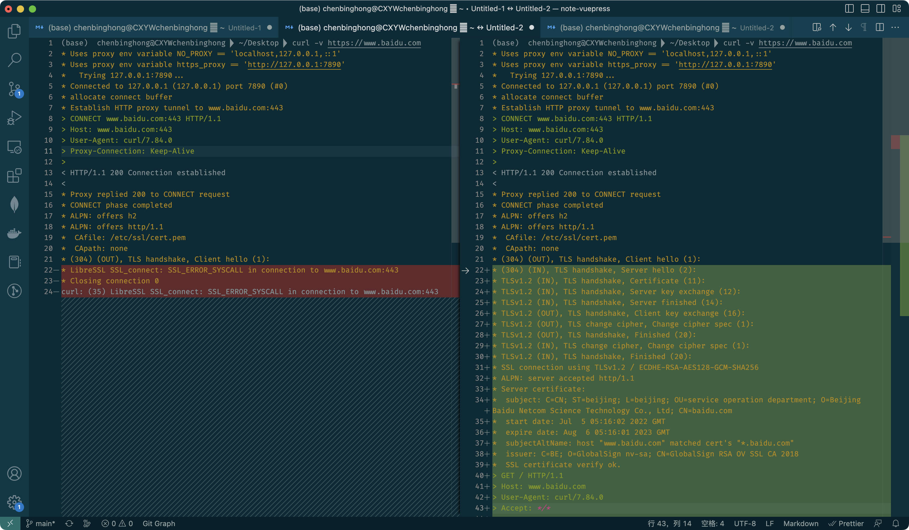

# 开代理后上不了网

开了代理后，上不了网，关闭后就可以

于是使用`curl`测试

```sh
curl -v https://www.baidu.com
```

比较分析了后，发现开代理会导致 TLS 握手 Client Hello 都通不过



访问百度报错：

```sh
* (304) (OUT), TLS handshake, Client hello (1):
* LibreSSL SSL_connect: SSL_ERROR_SYSCALL in connection to www.baidu.com:443
* Closing connection 0
curl: (35) LibreSSL SSL_connect: SSL_ERROR_SYSCALL in connection to www.baidu.com:443
```

不开代理，上不了外网，换了一个节点。就好了。

访问google报错：

```sh
* (304) (OUT), TLS handshake, Client hello (1):
* error:02FFF036:system library:func(4095):Connection reset by peer
* Closing connection 0
curl: (35) error:02FFF036:system library:func(4095):Connection reset by peer
```

成功访问百度记录：

```sh
curl -v https://www.baidu.com
* Uses proxy env variable NO_PROXY == 'localhost,127.0.0.1,::1'
* Uses proxy env variable https_proxy == 'http://127.0.0.1:7890'
*   Trying 127.0.0.1:7890...
* Connected to 127.0.0.1 (127.0.0.1) port 7890 (#0)
* allocate connect buffer
* Establish HTTP proxy tunnel to www.baidu.com:443
> CONNECT www.baidu.com:443 HTTP/1.1
> Host: www.baidu.com:443
> User-Agent: curl/7.84.0
> Proxy-Connection: Keep-Alive
>
< HTTP/1.1 200 Connection established
<
* Proxy replied 200 to CONNECT request
* CONNECT phase completed
* ALPN: offers h2
* ALPN: offers http/1.1
*  CAfile: /etc/ssl/cert.pem
*  CApath: none
* (304) (OUT), TLS handshake, Client hello (1):
* (304) (IN), TLS handshake, Server hello (2):
* TLSv1.2 (IN), TLS handshake, Certificate (11):
* TLSv1.2 (IN), TLS handshake, Server key exchange (12):
* TLSv1.2 (IN), TLS handshake, Server finished (14):
* TLSv1.2 (OUT), TLS handshake, Client key exchange (16):
* TLSv1.2 (OUT), TLS change cipher, Change cipher spec (1):
* TLSv1.2 (OUT), TLS handshake, Finished (20):
* TLSv1.2 (IN), TLS change cipher, Change cipher spec (1):
* TLSv1.2 (IN), TLS handshake, Finished (20):
* SSL connection using TLSv1.2 / ECDHE-RSA-AES128-GCM-SHA256
* ALPN: server accepted http/1.1
* Server certificate:
*  subject: C=CN; ST=beijing; L=beijing; OU=service operation department; O=Beijing Baidu Netcom Science Technology Co., Ltd; CN=baidu.com
*  start date: Jul  5 05:16:02 2022 GMT
*  expire date: Aug  6 05:16:01 2023 GMT
*  subjectAltName: host "www.baidu.com" matched cert's "*.baidu.com"
*  issuer: C=BE; O=GlobalSign nv-sa; CN=GlobalSign RSA OV SSL CA 2018
*  SSL certificate verify ok.
> GET / HTTP/1.1
> Host: www.baidu.com
> User-Agent: curl/7.84.0
> Accept: */*
>
* Mark bundle as not supporting multiuse
< HTTP/1.1 200 OK
< Accept-Ranges: bytes
< Cache-Control: private, no-cache, no-store, proxy-revalidate, no-transform
< Connection: keep-alive
< Content-Length: 2443
< Content-Type: text/html
< Date: Sat, 11 Feb 2023 01:53:04 GMT
< Etag: "588603eb-98b"
< Last-Modified: Mon, 23 Jan 2017 13:23:55 GMT
< Pragma: no-cache
< Server: bfe/1.0.8.18
< Set-Cookie: BDORZ=27315; max-age=86400; domain=.baidu.com; path=/
<
<!DOCTYPE html>
```

成功访问google：

```sh
curl -v https://www.google.com
* Uses proxy env variable NO_PROXY == 'localhost,127.0.0.1,::1'
* Uses proxy env variable https_proxy == 'http://127.0.0.1:7890'
*   Trying 127.0.0.1:7890...
* Connected to 127.0.0.1 (127.0.0.1) port 7890 (#0)
* allocate connect buffer
* Establish HTTP proxy tunnel to www.google.com:443
> CONNECT www.google.com:443 HTTP/1.1
> Host: www.google.com:443
> User-Agent: curl/7.84.0
> Proxy-Connection: Keep-Alive
>
< HTTP/1.1 200 Connection established
<
* Proxy replied 200 to CONNECT request
* CONNECT phase completed
* ALPN: offers h2
* ALPN: offers http/1.1
*  CAfile: /etc/ssl/cert.pem
*  CApath: none
* (304) (OUT), TLS handshake, Client hello (1):
* (304) (IN), TLS handshake, Server hello (2):
* (304) (IN), TLS handshake, Unknown (8):
* (304) (IN), TLS handshake, Certificate (11):
* (304) (IN), TLS handshake, CERT verify (15):
* (304) (IN), TLS handshake, Finished (20):
* (304) (OUT), TLS handshake, Finished (20):
* SSL connection using TLSv1.3 / AEAD-CHACHA20-POLY1305-SHA256
* ALPN: server accepted h2
* Server certificate:
*  subject: CN=www.google.com
*  start date: Jan 31 10:22:08 2023 GMT
*  expire date: Apr 25 10:22:07 2023 GMT
*  subjectAltName: host "www.google.com" matched cert's "www.google.com"
*  issuer: C=US; O=Google Trust Services LLC; CN=GTS CA 1C3
*  SSL certificate verify ok.
* Using HTTP2, server supports multiplexing
* Copying HTTP/2 data in stream buffer to connection buffer after upgrade: len=0
* h2h3 [:method: GET]
* h2h3 [:path: /]
* h2h3 [:scheme: https]
* h2h3 [:authority: www.google.com]
* h2h3 [user-agent: curl/7.84.0]
* h2h3 [accept: */*]
* Using Stream ID: 1 (easy handle 0x13000c600)
> GET / HTTP/2
> Host: www.google.com
> user-agent: curl/7.84.0
> accept: */*
>
< HTTP/2 302
< location: https://www.google.com.hk/url?sa=p&hl=zh-CN&pref=hkredirect&pval=yes&q=https://www.google.com.hk/&ust=1676082422481917&usg=AOvVaw0qTAO6OILxbhtBCG0OGQC_
< cache-control: private
< content-type: text/html; charset=UTF-8
< p3p: CP="This is not a P3P policy! See g.co/p3phelp for more info."
< date: Sat, 11 Feb 2023 02:26:32 GMT
< server: gws
< content-length: 372
< x-xss-protection: 0
< x-frame-options: SAMEORIGIN
< set-cookie: 1P_JAR=2023-02-11-02; expires=Mon, 13-Mar-2023 02:26:32 GMT; path=/; domain=.google.com; Secure
< set-cookie: AEC=ARSKqsL-9YJV-fbs4iEVyT6nzkN4FgbUmZPpomVctvVUtESZvN_sRjDSYg; expires=Thu, 10-Aug-2023 02:26:32 GMT; path=/; domain=.google.com; Secure; HttpOnly; SameSite=lax
< set-cookie: NID=511=cNZsOdDREqI7VMQylDL9yOMF0ACubZlLzMld0nsGqyniJ4p9ZtybOG2E773Xxbb_eugr85qe8taq7wpgrTh0GeWMmUNu0VcSbj0cPk7UKZ64ajg59aB4y4Wo_MNmPOV3rIryRfrxFrZmpGnCDt75s7fYJBlAPNeAsc7iringJyQ; expires=Sun, 13-Aug-2023 02:26:32 GMT; path=/; domain=.google.com; HttpOnly
< alt-svc: h3=":443"; ma=2592000,h3-29=":443"; ma=2592000
<
<HTML><HEAD><meta http-equiv="content-type" content="text/html;charset=utf-8">
<TITLE>302 Moved</TITLE></HEAD><BODY>
<H1>302 Moved</H1>
The document has moved
<A HREF="https://www.google.com.hk/url?sa=p&amp;hl=zh-CN&amp;pref=hkredirect&amp;pval=yes&amp;q=https://www.google.com.hk/&amp;ust=1676082422481917&amp;usg=AOvVaw0qTAO6OILxbhtBCG0OGQC_">here</A>.
</BODY></HTML>
* Connection #0 to host 127.0.0.1 left intact
```

