# 缓存

https://juejin.cn/post/7016593221815910408

## 304

1. 浏览器请求资源时首先命中资源的Expires和Cache-Control，Expires受限于时间，如果修改了本地时间，可能会造成缓存失效，可以通过Cache-Control:max-age指定最大生命周期，状态仍返回200，但不会请求数据，在浏览器中能明显看到 from cache 字样
2. 强缓存失效，进入协商缓存阶段，首先验证ETag，ETag可保证每一个资源是唯一的，资源变化都会导致ETag变化。服务器根据客户端上送的If-None-Match值来判断是否命中缓存
3. 协商缓存Last-Modifie d/If-Modified-Since阶段，客户端第一次请求资源时，服务器返回的header中会加上Last-Modified，Last-Modified是一个时间标识，表示该资源的最后修改时间。再次请求资源时，request请求头中会包含If-Modified-Since，该值为缓存之前返回的Last-Modified。服务器收到If-Modified-Since后，会根据资源的最后修改时间判断是否命中缓存

## 浏览器缓存机制 强制缓存 & 协商缓存

浏览器于服务器通信的方式为应答模式：浏览器发起HTTP请求---服务器响应请求。那么浏览器第一次向服务器发起请求后拿到请求结果，会根据响应报文中HTTP头的缓存标识，决定是否缓存结果，是则将请求结果和缓存标识存入浏览器缓存中，简单的过程如下图：

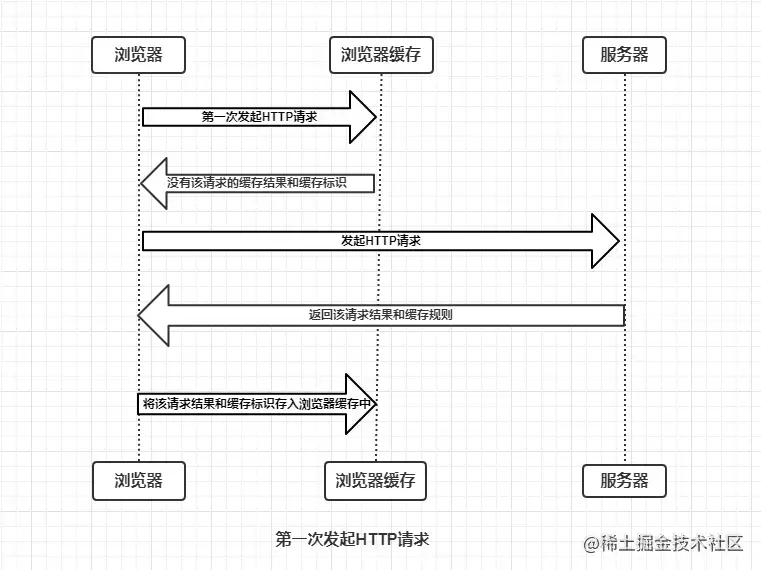

由上图我们知道：

- 浏览器每次发起请求，都会现在浏览器缓存中查找该请求的结果以及缓存标识
- 浏览器每次拿到返回的请求结果都会 将该请求结果和缓存标识存入浏览器缓存中

以上两点确保了每次请求的缓存存入于读取

现在需要理解浏览器缓存的使用规则，为方便理解，根据是否需要向服务器重新发起HTTP请求将缓存过程分为两个部分：

- 强制缓存
- 协商缓存

### 强制缓存

向浏览器缓存查找结果，并根据结果的缓存规则来决定是否使用缓存的过程。当浏览器向服务器发起请求时，服务器会将缓存规则放入HTTP响应报文的HTTP头中和请求结果一起返回给浏览器，控制强制缓存的字段分别时 Expires 和 Cache-Control，其中Cache-Control优先级比Expires高

强制缓存的情况主要有三种（暂不分析协商缓存过程）：

1. 不存在该缓存结果和缓存标识，强制缓存失效，则直接向服务器发起请求（根第一次发起请求一致）
2. 存在该缓存结果和缓存标识，但结果已失效，则强制缓存失效，使用协商缓存
3. 存在该缓存结果和缓存标识，切结果未失效，则强制缓存生效，直接返回该结果

### 协商缓存

强制缓存失效后，浏览器携带缓存标识向服务器发起请求，由服务器根据缓存标识决定是否使用缓存的过程，同样协商缓存的标识也是在响应报文的HTTP头中和请求结果一起返回给浏览器的，控制协商缓存的字段有：Last-Modify/If-Modify-Since和Etag/If-None-Match，其中Etag/If-None-Match的优先级比Last-Modified/If-Modified-Since高，协商缓存主要有以下两种情况：

1. 协商缓存生效，返回304
2. 协商缓存失效，返回200和请求结果

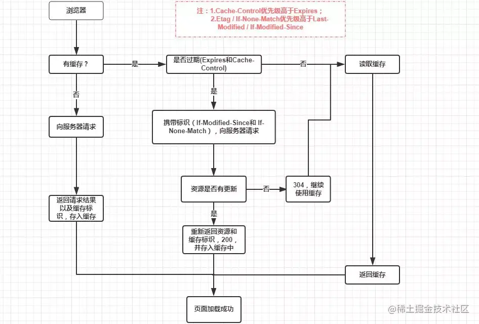

更深入：

https://juejin.cn/post/6992843117963509791

# 彻底理解浏览器的缓存机制

## 概述

浏览器的缓存机制（HTTP缓存机制），是根据HTTP报文的缓存标识进行的，所以在分析浏览器缓存机制之前，我们先使用图文简单介绍一下HTTP报文，分两种：

1. HTTP请求（Request）报文，报文格式为：请求行 - HTTP头（通用信息头，请求头，实体头） - 请求报文主体（只有POST才有报文主体），如下图：

   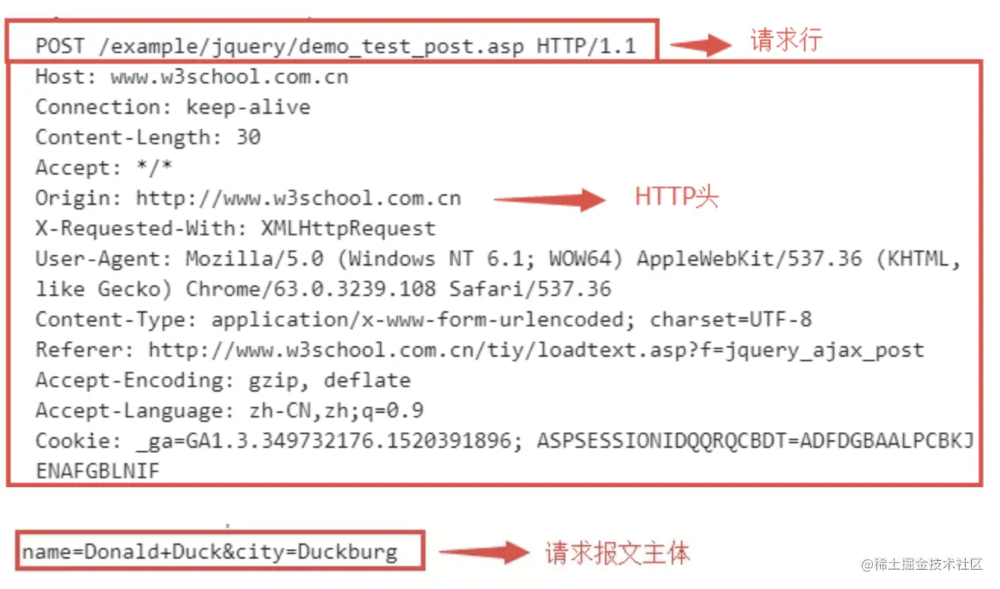

2. HTTP响应（Response）报文，报文格式为：状态行-HTTP头（通用信息头，响应头，实体头）-响应报文主体，如下图

   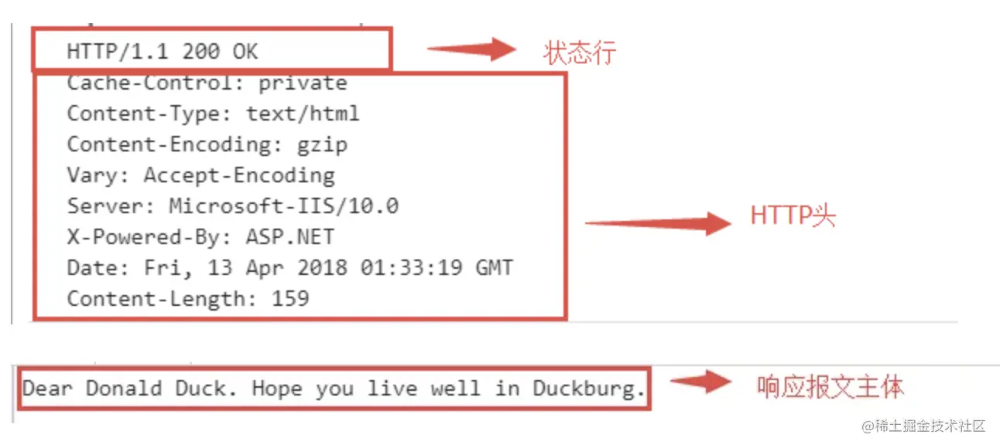

注：

通用信息头指的是请求和响应报文都支持的头域，分别是：

- Cache-Control
- Connection
- Date
- Pragma
- Transfer-Encoding
- Upgrade
- Via

实体头则是实体信息的实体头域，分别是：

- Allow
- Content-Base
- Content-Encoding
- Content-Language
- Content-Length
- Content-Location
- Content-MD5
- Content-Range
- Content-Type
- Etag
- Expires
- Last-Modified
- Extension-header

这里只是为了方便，将通用信息头，响应头/请求头，实体头都归为HTTP头。

## 为什么需要浏览器缓存？

通过HTTP协议，客户端和浏览器建立连接需要时间，而大的响应需要在客户端和服务端之间进行多次往返通信才能获得完整的响应，这拖延了浏览器可以使用和处理内容的时间。增加了访问服务器的数据和资源成本，因此利用浏览器缓存的机制重用以前获取的数据是性能优化时需要考虑的。

### 缓存过程分析

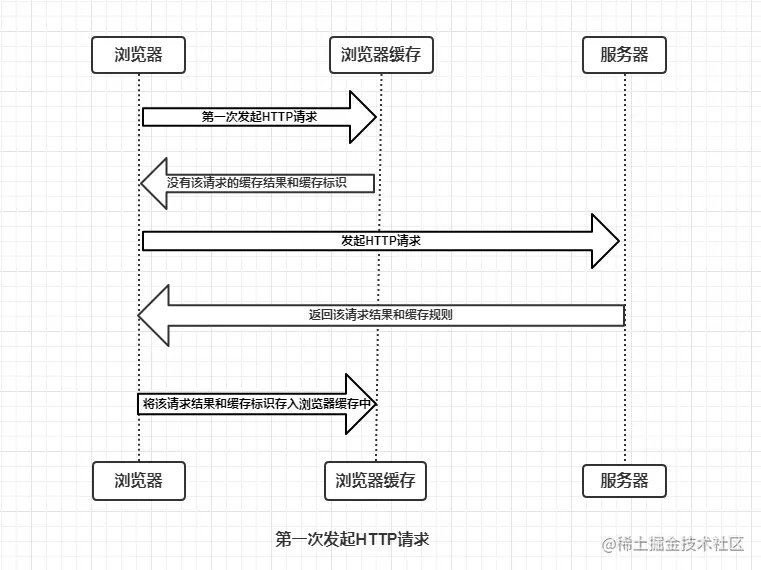

由上图可知：

- 浏览器每次发起请求，都会先在浏览器缓存中查找该请求的结果以及缓存标识
- 浏览器每次拿到返回的请求结果都会将结果和缓存标识存入浏览器缓存中

### 强制缓存

浏览器决定是否命中缓存的过程

主要有三种情况（暂不分析协商缓存过程）：

1. 不存在该缓存结果和标识，直接向浏览器发起请求（跟第一次发起请求一致），如下图：

   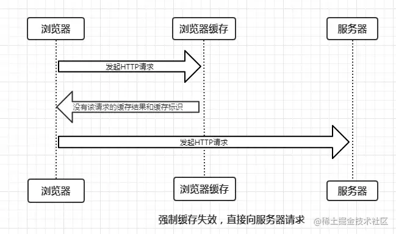

2. 存在缓存结果和标识，但已失效，则使用协商缓存（暂不分析），如下图：

   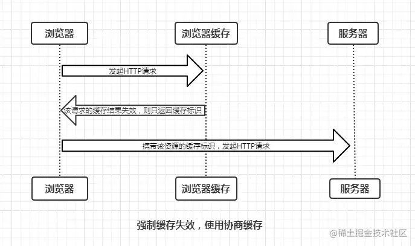

3. 存在缓存结果和标识，且结果未失效，强制缓存生效，直接返回结果，如下图：

   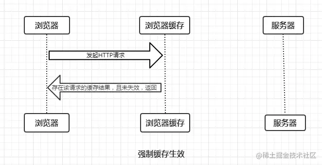

强制缓存的缓存规则是什么？

浏览器向服务器发起请求时，服务器会将缓存规则放入HTTP响应报文的HTTP头中和请求结果一起返回给浏览器，控制强制缓存的字段分别是 **Expires**和**Cache-Control**，其中**Cache-Control**优先级比**Expires**高。

#### Expires

Expires是HTTP/1.0控制网页缓存的字段，其值为服务器返回该请求结果缓存到期时间，即再次发起请求时，如果客户端的时间小于Expires的值，直接使用缓存结果。

Expires是HTTP/1.0的字段，但是现在浏览器默认使用HTTP/1.1，那么在HTTP/1.1中网页缓存还是由Expires控制？

到了HTTP/1.1，Expires已经被Cache-Control替代，因为在Expires控制缓存的原理是使用客户端的时间与服务端返回的时间做对比，那么如果客户端与服务端的时间因为某些原因（例如时区不同、客户端和服务端有一方的时间不准确）发生误差，那么强制缓存则会直接失效，这样的话强制缓存存在的则毫无意义，那么Cache-Control又是如何控制的呢？

#### Cache-Control

在HTTP/1.1中，Cache-Control是最重要的规则，主要用于控制网页缓存，主要取值：

- public: 所有内容都将被缓存（客户端和代理服务器都可缓存）；
- private: 所有内容只有客户端可以缓存，Cache-Control都默认值；
- no-cache: 客户端缓存内容，但是是否使用缓存则需要经过协商缓存来验证决定；
- no-store: 所有内容都不会被缓存，即不使用强制缓存，也不使用协商缓存；
- max-age=xxx(xxx is numeric): 缓存内容将在xxx秒后失效

接下来，我们直接看一个例子，如下：

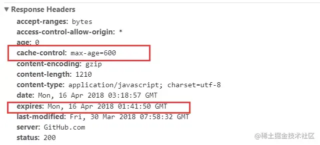

由上面的例子我们可以知道：

- HTTP响应报文中expires的时间值，是一个绝对值
- HTTP响应报文中Cache-Control为max-age=600，是一个相对值

由于Cache-Control的优先级比expires高，那么直接根据Cache-Control的值进行缓存，意思是说在600秒内再次发起该请求，则会直接使用缓存结果，强制缓存生效。

注：在无法确定客户端的时间是否与服务端端时间同步的情况下，Cache-Control相比于expires是更好的选择，所以同时存在时，只有Cache-Control生效。

浏览器的缓存放在哪里？如何在浏览器中判断强制缓存是否有效？

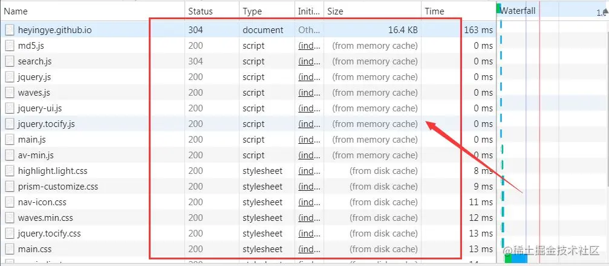

上图中，状态码为灰色的请求则表示使用了强制缓存，请求对应的size值则表示该缓存存放的位置，分别为 from memory cache 和 from disk cache。

那么 from memory cache 和 from disk cache 又分别代表了什么呢？什么时候会使用 from disk cache，什么时候会使用 from memory cache呢？

from memory cache 表示使用内存中的缓存，from disk cache 则表示使用硬盘中的缓存，浏览器读取缓存的顺序为 memory -> disk。

from disk cache 和 from memory cache 可以同时存在着？

我们需要了解内存缓存（from memory cache）和硬盘缓存（from disk cache），如下：

- 内存缓存（from memory cache）：内存缓存具有两个特点：分别是快速读取和时效性；
  - 快速读取：内存缓存会将编译解析后的文件，直接存入该进程的内存中，占据该进程一定的内存资源，以方便下次运行使用时快速读取。
  - 时效性：一旦该进程关闭，则该进程的内存则会清空。
- 硬盘缓存（from disk cache）：硬盘缓存则是直接将缓存写入硬盘文件中，读取缓存需要对该缓存存放的硬盘文件进行I/O操作，然后重新解析该缓存内容，读取复杂，速度比内存缓存慢。

在浏览器中，浏览器会在js和图片等文件解析执行后直接存入内存缓存中，那么当刷新页面时只需直接从内存缓存中读取（from memory cache）；而css文件则会存入硬盘文件中，所以每次渲染页面都需要从硬盘中读取缓存（from disk cahce）。

### 协商缓存

强制缓存失效后，浏览器向服务器发起请求，由服务器决定是否命中缓存的过程

主要有以下两种情况：

协商缓存生效，返回304，如下：

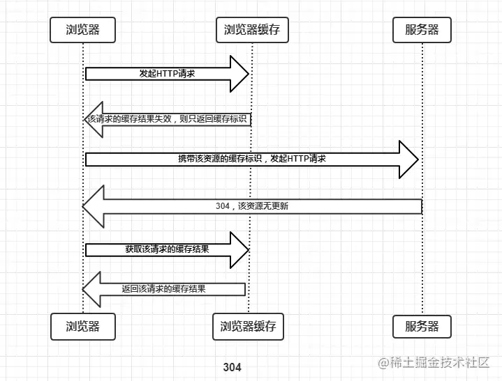

304

协商缓存失效，返回200和请求结果，如下：

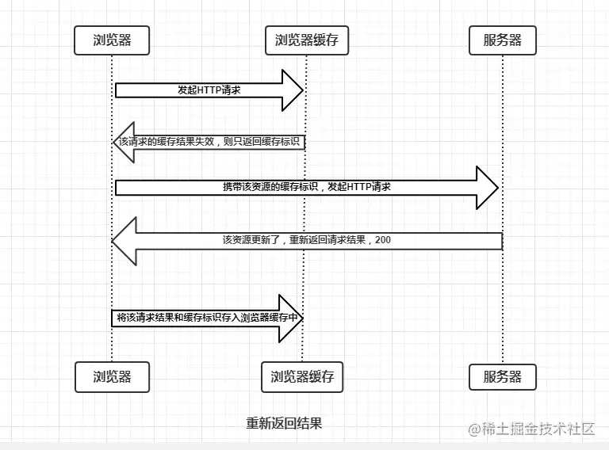

200

同样，协商缓存的标识也是在响应报文的HTTP头中和请求结果一起返回给浏览器的，控制协商缓存的字段分别有：

- Last-Modified / If-Modified-Since
- Etag / If-None-Match 优先级更高

#### Last-Modified / If-Modified-Since

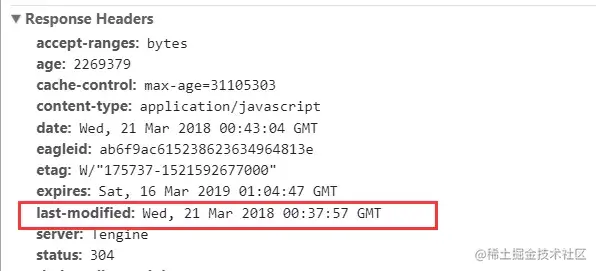

Last-Modified 是服务器响应报文头返回，客户端得到后会记录下来，再次请求会带上

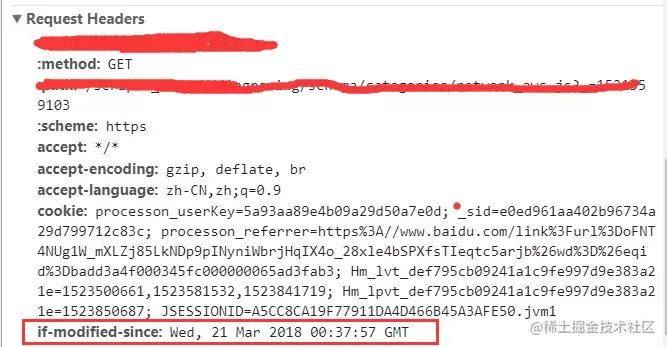

If-Modified-Since 是客户端请求报文头带上

#### Etag / If-None-Match

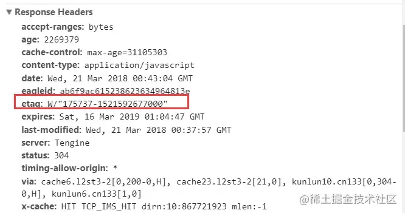

Etag是服务器响应请求时，返回当前资源文件的一个唯一标识（由服务器生成）

##### Etag 工作原理

服务器在第一次返回响应的时候设置了缓存的时间120s，假设浏览器在这120s后再次请求服务器相同的资源，首先，浏览器会检查本地缓存并找到之前的响应，不幸的是，这个响应现在已经“过期”，无法再使用。此时，浏览器也可以直接发出新请求，获取新的完整响应，但是这样做效率较低，因为如果资源未被更改过，我们就没有理由再去下载与缓存中已有的完全相同的字节。

于是就到了Etag发挥作用的时候了，通常服务器生成并返回在Etag中的验证码，常常是文件内容的哈希值或者某个其他指纹码。客户端不必了解指纹码如何生成，只需要在下一个请求中将其发送给服务器（浏览器默认会添加）：如果指纹码仍然一致，就说明资源未被修改，服务器会返回304 Not Modified，这样我们就可以跳过下载，利用已缓存的资源，并且该资源会继续缓存120s。

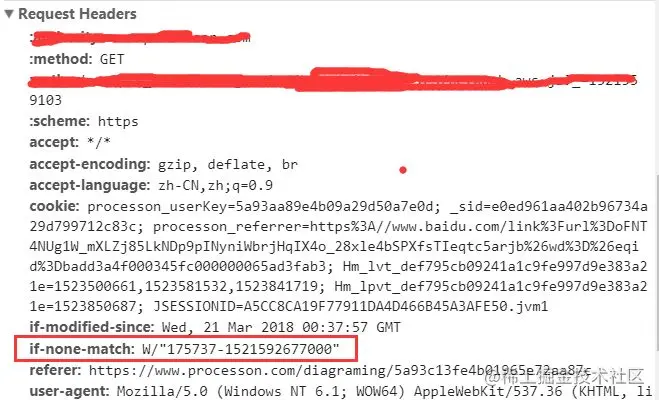

If-None-Match是客户端再次发起请求时，携带上次请求返回的唯一标识Etag值，通过此字段告诉服务器该资源上次请求返回的唯一标识值。服务器收到请求后，发现该请求头中含有If-None-Match，则会根据该字段值与该资源在服务器的Etag值做对比，一致则返回304，代表资源无更新，继续使用缓存文件；不一致则重新返回资源文件，状态码为200。

注：Etag / If-None-Match 优先级高于 Last-Modified / If-Modified-Since，同时存在则只有 Etag / If-None-Match 生效。

## 总结

浏览器缓存分为 **强制缓存** 和**协商缓存**，强制缓存优先于协商缓存进行。

- 若强制缓存（Expires和Cache-Control，Cache-Control优先级高于Expires）生效则直接使用缓存
- 若不生效则进行协商缓存（Last-Modified / If-Modified-Since和Etag / If-None-Match，其中Etag / If-None-Match的优先级高于Last-Modified / If-Modified-Since），协商缓存由服务器决定是否使用缓存
- 若协商缓存失效，那么代表该请求的缓存失效，重新获取请求结果，再存入缓存中；生效返回304，继续使用缓存

