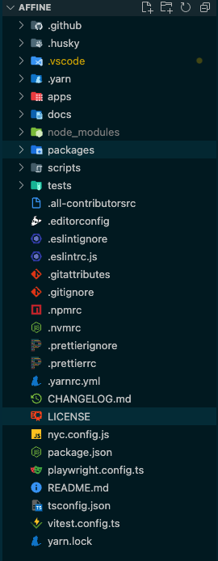

是什么、克隆下载、目录结构

## 是什么


## 克隆

```sh
git clone https://github.com/toeverything/AFFiNE.git
```

## 目录结构



```sh
fp -d 1
🌸 AFFiNE 🌸
├─ .github
│   ├─ actions
│   ├─ deployment
│   ├─ ISSUE_TEMPLATE
│   ├─ workflows
│   ├─ auto_assign.yml
│   ├─ CLA.md
│   └─ CODEOWNERS
├─ .husky
│   └─ pre-commit
├─ .yarn
│   ├─ cache
│   ├─ patches
│   ├─ plugins
│   ├─ releases
│   └─ install-state.gz
├─ apps
│   ├─ desktop
│   ├─ electron
│   ├─ server
│   └─ web
├─ docs
│   ├─ contributing
│   ├─ building-desktop-client-app.md
│   ├─ BUILDING.md
│   ├─ CODE_OF_CONDUCT.md
│   ├─ CONTRIBUTING.md
│   ├─ contributor-add.md
│   ├─ jobs.md
│   └─ types-of-contributions.md
├─ packages
│   ├─ cli
│   ├─ component
│   ├─ debug
│   ├─ env
│   ├─ i18n
│   ├─ octobase-node
│   ├─ templates
│   └─ workspace
├─ scripts
│   ├─ module-resolve
│   ├─ vitest
│   ├─ bump-blocksuite.sh
│   └─ notify.mjs
├─ tests
│   ├─ fixtures
│   ├─ libs
│   ├─ parallels
│   ├─ unit
│   └─ tsconfig.json
├─ .all-contributorsrc
├─ .editorconfig
├─ .eslintignore
├─ .eslintrc.js
├─ .gitattributes
├─ .gitignore
├─ .npmrc
├─ .nvmrc
├─ .prettierignore
├─ .prettierrc
├─ .yarnrc.yml
├─ CHANGELOG.md
├─ LICENSE
├─ nyc.config.js
├─ package.json
├─ playwright.config.ts
├─ README.md
├─ tsconfig.json
├─ vitest.config.ts
└─ yarn.lock
```

playwright.config.ts

vitest.config.ts
