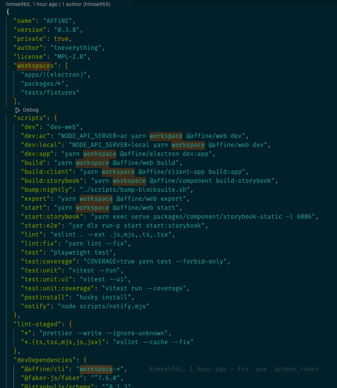
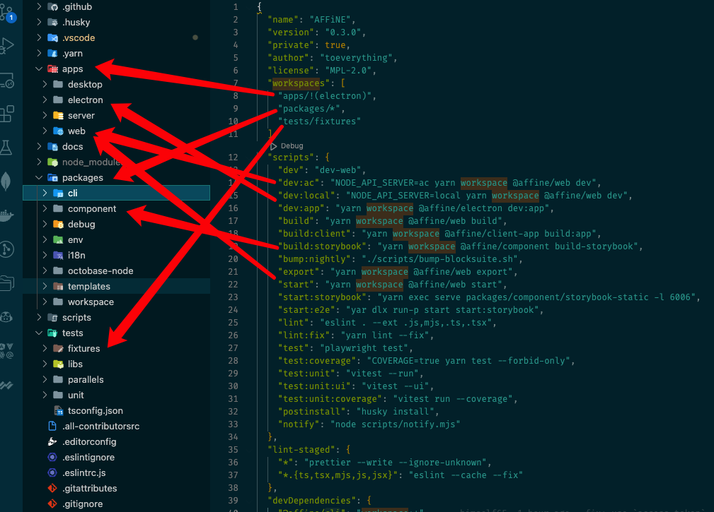
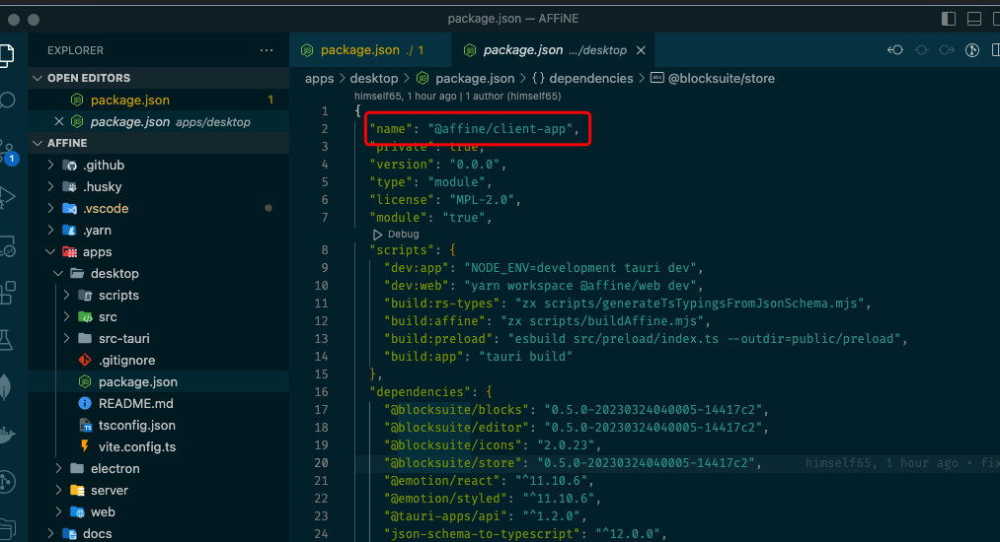

安装、package.json配置

## 安装

npm 安装包错

```sh
npm i

npm ERR! Unsupported URL Type "workspace:": workspace:*
```

pnpm 也不行

[https://stackoverflow.com/questions/69220042/npm-err-unsupported-url-type-workspace-workspace](https://stackoverflow.com/questions/69220042/npm-err-unsupported-url-type-workspace-workspace)

I was able to fix this issue by using `yarn` instead of `npm`.

## package.json 配置

```json
{
  "name": "AFFiNE",
  "version": "0.3.0",
  "private": true,
  "author": "toeverything",
  "license": "MPL-2.0",
  "workspaces": [
    "apps/!(electron)",
    "packages/*",
    "tests/fixtures"
  ],
  "scripts": {
    "dev": "dev-web",
    "dev:ac": "NODE_API_SERVER=ac yarn workspace @affine/web dev",
    "dev:local": "NODE_API_SERVER=local yarn workspace @affine/web dev",
    "dev:app": "yarn workspace @affine/electron dev:app",
    "build": "yarn workspace @affine/web build",
    "build:client": "yarn workspace @affine/client-app build:app",
    "build:storybook": "yarn workspace @affine/component build-storybook",
    "bump:nightly": "./scripts/bump-blocksuite.sh",
    "export": "yarn workspace @affine/web export",
    "start": "yarn workspace @affine/web start",
    "start:storybook": "yarn exec serve packages/component/storybook-static -l 6006",
    "start:e2e": "yar dlx run-p start start:storybook",
    "lint": "eslint . --ext .js,mjs,.ts,.tsx",
    "lint:fix": "yarn lint --fix",
    "test": "playwright test",
    "test:coverage": "COVERAGE=true yarn test --forbid-only",
    "test:unit": "vitest --run",
    "test:unit:ui": "vitest --ui",
    "test:unit:coverage": "vitest run --coverage",
    "postinstall": "husky install",
    "notify": "node scripts/notify.mjs"
  },
  "lint-staged": {
    "*": "prettier --write --ignore-unknown",
    "*.{ts,tsx,mjs,js,jsx}": "eslint --cache --fix"
  },
  "devDependencies": {
    "@affine/cli": "workspace:*",
    "@faker-js/faker": "^7.6.0",
    "@istanbuljs/schema": "^0.1.3",
    "@perfsee/sdk": "^1.5.1",
    "@playwright/test": "^1.32.1",
    "@testing-library/react": "^14.0.0",
    "@types/eslint": "^8.21.3",
    "@types/node": "^18.15.11",
    "@typescript-eslint/eslint-plugin": "^5.57.0",
    "@typescript-eslint/parser": "^5.57.0",
    "@vitejs/plugin-react": "^3.1.0",
    "@vitest/coverage-istanbul": "^0.29.8",
    "@vitest/ui": "^0.29.8",
    "eslint": "^8.37.0",
    "eslint-config-prettier": "^8.8.0",
    "eslint-plugin-import": "^2.27.5",
    "eslint-plugin-prettier": "^4.2.1",
    "eslint-plugin-react": "^7.32.2",
    "eslint-plugin-simple-import-sort": "^10.0.0",
    "eslint-plugin-unused-imports": "^2.0.0",
    "fake-indexeddb": "4.0.1",
    "got": "^12.6.0",
    "happy-dom": "^8.9.0",
    "husky": "^8.0.3",
    "lint-staged": "^13.2.0",
    "msw": "^1.2.1",
    "nanoid": "^4.0.2",
    "nyc": "^15.1.0",
    "prettier": "^2.8.7",
    "react": "^18.2.0",
    "react-dom": "^18.2.0",
    "serve": "^14.2.0",
    "typescript": "^5.0.2",
    "vite": "^4.2.1",
    "vite-plugin-istanbul": "^4.0.1",
    "vitest": "^0.29.8",
    "vitest-fetch-mock": "^0.2.2"
  },
  "packageManager": "yarn@3.5.0",
  "resolutions": {
    "y-indexeddb@^9.0.9": "patch:y-indexeddb@npm%3A9.0.9#./.yarn/patches/y-indexeddb-npm-9.0.9-6bd9b26461.patch"
  }
}
```

workspace相关的





个人理解，应为涉及到引用自己写的其他package，需要配置下目录（workspace）

@affine/client-app 是 apps/desktop

